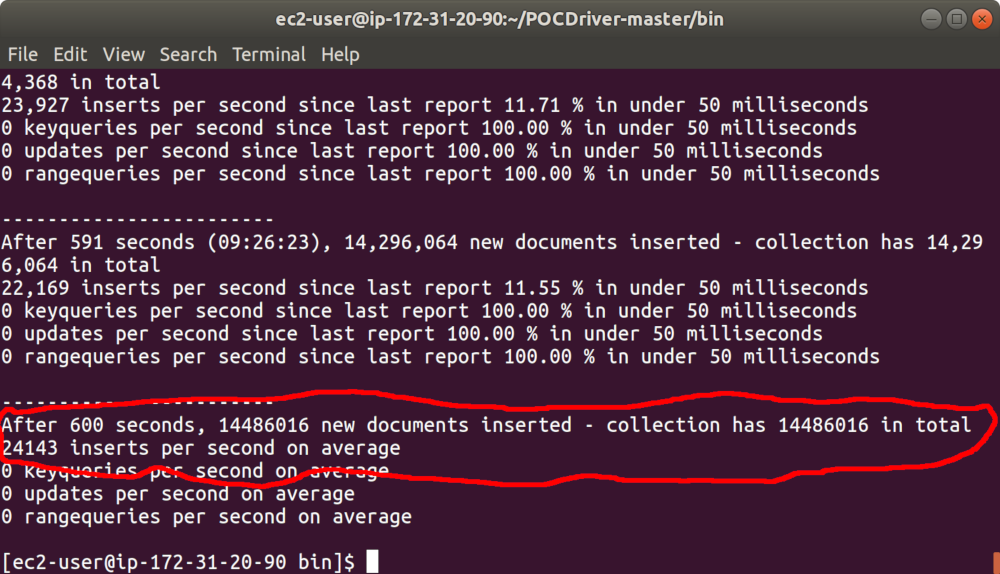

# INGEST-RATE

__Ability to ingest X records in Y seconds with replication enforced for at least 2 copies of the data, for safety and redundancy (average record size of Z KB)__

__SA Maintainer__: [Paul Done](mailto:paul.done@mongodb.com) <br/>
__Time to setup__: 30 mins <br/>
__Time to execute__: 15 mins <br/>


---
## Description

This proof shows how MongoDB can achieve the ingest rate shown in the following table, when deployed as 3 node Replica-Set (with backup enabled), using an Atlas M40 cluster tier size (which has 4 vCPUs per replica):

|                            | Small Records | Medium Records | Large Records |
|----------------------------|---------------|----------------|---------------|
|Document size (KB)          |             1 |             10 |            50 |
|Number of secondary indexes |             3 |              6 |             8 |
|Ingest rate per second      |        20,000 |          3,500 |           460 |

The MongoDB [POCDriver](https://github.com/johnlpage/POCDriver) is used for injecting the load and is run from an AWS 'm4.xlarge' instance (which has 4 vCPUs). Note, higher ingestion rates can of course be achieved, primarily by increasing the number of 'database CPUs' employed, using a higher Atlas tier (e.g. an M50), using and increasing Provisioned IOPS for the Atlas instance, and/or by Sharding (results have not been computed for any such configurations). Also note, for the larger records, a greater rate of records can be ingested than shown by running the load injector from multiple client machines, because a much higher ratio of time is spent during load generation and network transfer phases, rather than actual database ingestion (again such results have not been computed for this here).


---
## Setup
__1. Configure Laptop__
* Ensure MongoDB version 3.6+ is already installed your laptop, mainly to enable the Mongo Shell and other MongoDB command line tools to be used (no MongoDB databases will be run on the laptop for this proof)

__2. Configure Atlas Environment__
* If using standard remote demo environment, use this doc and skip these instructions. https://docs.google.com/document/d/1cWyqMbJ_cQP3j7S4FJQhjRRiKq9WPfwPG6BmJL2bMvY/edit
* Log-on to your [Atlas account](http://cloud.mongodb.com) (using the MongoDB SA preallocated Atlas credits system) and navigate to your SA project
* In the project's Security tab, choose to add a new user called __main_user__, for this user select __Add Default Privileges__ and in the __Default Privileges__ section add the roles __readWriteAnyDatabase__ and __clusterMonitor__ (make a note of the password you specify)
* Create an __M40__ based 3 node replica-set in a single AWS region of your choice with default storage settings and with __backup enabled__.

__3. Configure AWS Environment__
* Using your MongoDB 'Solution Architects' [AWS pre-existing account](https://wiki.corp.mongodb.com/display/10GEN/SA+AWS+Access+-+Updated+Nov+2020), log on to the [AWS console](http://sa.aws.mongodb.com/) and near the top right hand side of the AWS Console, __change the region__ to match the same AWS region as you created the Atlas cluster in
* Launch (create) a new EC2 instance with the following settings (use defaults settings for the rest of the fields):
  * __AMI Type__: Amazon Linux 2 AMI (HVM), SSD Volume Type
  * __Instance Type__: m4.xlarge
  * __Add Tags__: _be sure to set the 3 specific tags ('Name', 'owner', 'expire-on','purpose') on your instance as per the [MongoDB AWS Usage Guidelines](https://wiki.corp.mongodb.com/display/DEVOPSP/AWS+Reaping+Policies)_ to avoid your instance from being prematurely reaped
  * __Security Group__: Create a new security group which has an inbound rule to allow SSH only on port 22 from source 0.0.0.0/0
* When prompted, choose to use your existing key pair or create a new key pair (typically named similar to 'firstname.lastname'). If creating a new key pair, be sure to click the button to __Download Key Pair__ and store the key somewhere safe on your laptop.
*  Once the AWS instance is running, find it in the AWS Console __instances__ list, select it, and in the description section near the bottom of the AWS Console locate the __IPv4 Public IP__ field and make a note of its value
* Now go to the __Atlas Console__ and in the Security tab, add a new __IP Whitelist__ entry for the IP address you just captured, to allow the AWS instance to connect to your Atlas cluster

__4. Configure POC Driver__
* In the AWS Console __instances__ list select your AWS instance, press the __Connect button__ and follow the instructions to SSH into this instance from a new terminal window on your laptop
* In this SSH terminal session, run the following commands to update the system and to install __Java__ and __Maven__ (Maven will pull Java in automatically as a dependency):
  ```bash
  sudo yum -y update
  sudo yum -y install maven
  java -version
  mvn -version
  ```
* In the same SSH terminal session, download, unpack and build the MongoDB POCDriver project JAR (Java 'executable') from GitHub as follows:
  ```bash
  wget https://github.com/johnlpage/POCDriver/archive/master.zip
  unzip master.zip
  cd POCDriver-master
  mvn clean package
  cd bin
  ls POCDriver.jar 
  ```
* In the Atlas console, for the cluster click the __...__ option and select __Command Line Tools__, scroll down to the __Set Up Diagnostics__ section and copy the command line for __mongostat__. Then in a new terminal on your laptop paste in and run this command, first replacing __PASSWORD__ with the main_user's password you configured earlier. This enables you to monitor the cluster's processed operations in the background, once the load injection is running (also ensure your current laptop IP address is added to the Atlas whitelist). Also, be sure to use some of the Atlas built-in monitoring views to monitor the database cluster's health, once the load injection is running.
* In the Atlas console, for the database cluster you deployed, click the __Connect button__, select __Connect Your Application__, and for the __latest Java version__  copy the __Connection String Only__ - make a note of this MongoDB URL address to be used later

    
---
## Execution

From the AWS instance SSH terminal/shell, inside the  __~/POCDriver*/bin__ folder, run the POCDriver load generator against the Atlas cluster using the relevant one of the commands below. Running this will erase the existing load test database collection if it already exists (-e) and will __run the test for 10 minutes duration__ (-d 600). 
  ```bash
  # 1KB inserted records
  java -jar POCDriver.jar -c "XXXXXX" -t 4 -e -d 600 -f 25 -a 5:5 --depth 2 -x 3
  # 10KB inserted records
  java -jar POCDriver.jar -c "XXXXXX" -t 4 -e -d 600 -f 234 -a 20:20 --depth 2 -x 6
  # 50KB inserted records
  java -jar POCDriver.jar -c "XXXXXX" -t 4 -e -d 600 -f 1692 -a 10:10 --depth 2 -x 8
  ```
&nbsp;&nbsp;&nbsp;__Note__: For whichever command you run above, first replace __XXXXXX__ with the SRV connection address you recorded earlier (and specify the main_user's password in this URL). 

&nbsp;&nbsp;&nbsp;__Tip 1__: If you want to __see an example of a generated document__ for one of these generated records (and its size), instead of executing an actual load injection run, run the same command again but suffixed with __-p__. For example:
  ```bash
  java -jar POCDriver.jar -c "XXXXXX" -t 4 -e -d 600 -f 25 -a 5:5 --depth 2 -x 3 -p
  ```
&nbsp;&nbsp;&nbsp;__Tip 2__: If you want to understand how the other parameters influence both the record size and how the load injection is run, see the main [POCDriver readme](https://github.com/johnlpage/POCDriver) or run the following from the command line:
  ```bash
  java -jar POCDriver.jar -h
  ```
&nbsp;&nbsp;&nbsp;__Tip 3__: If you to run the the POCDriver for a longer duration, change the value of the __-d__ parameter (in seconds):
   
 
---
## Measurement

When the POCDriver completes its injection run, it produces an output summery displaying the average rate of documents inserted per second for the whole run, similar to the example shown below.



You can also prove the injection rate using other external measurement techniques. For example you can manually start a timer at the beginning of the injection run, and stop the timer at the end of the run, and then connect to the database and view the total amount of documents inserted into the collection during the completed injection run.

