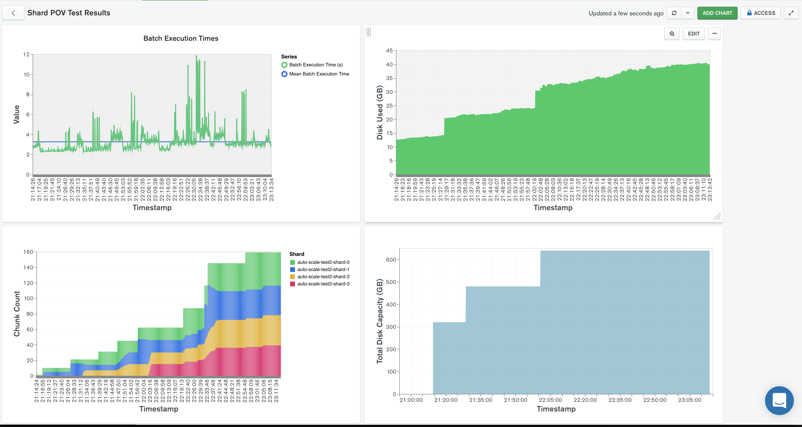
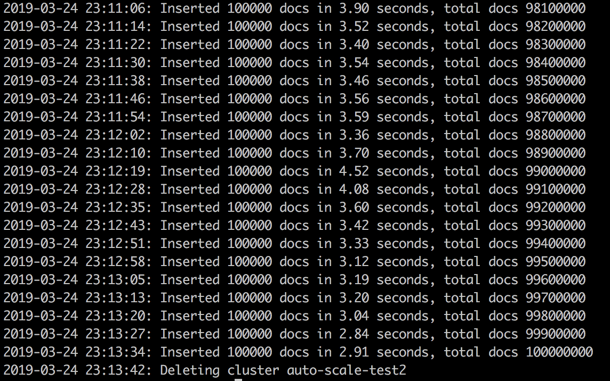
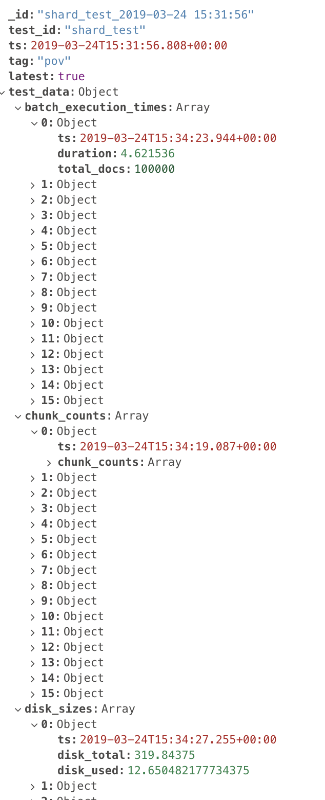
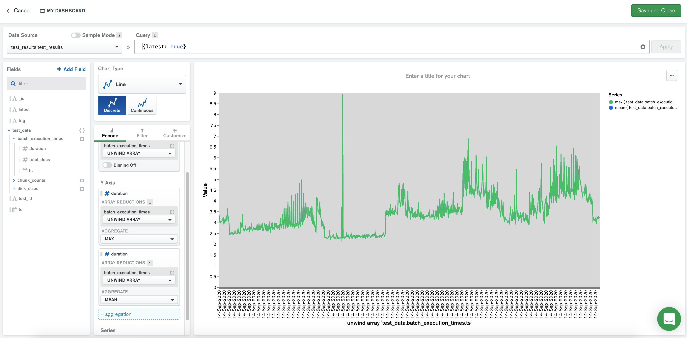
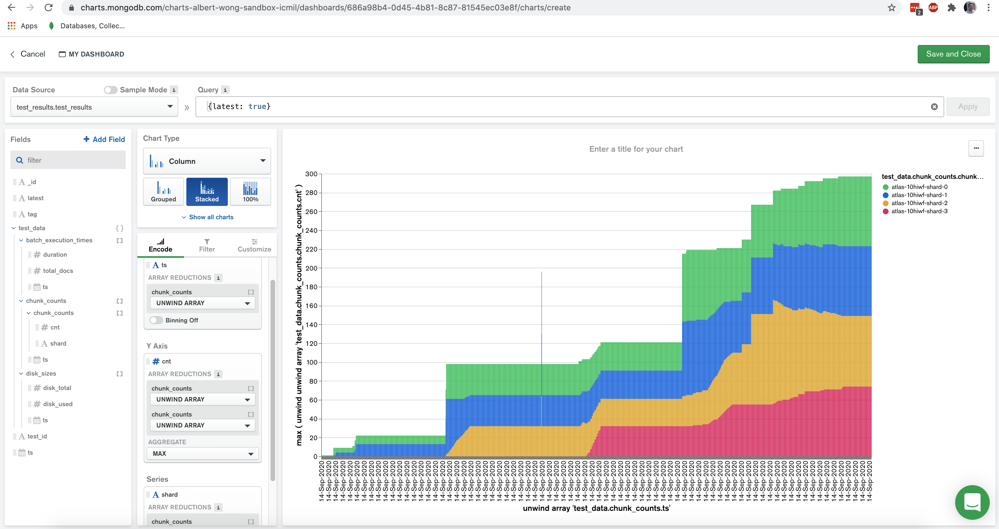
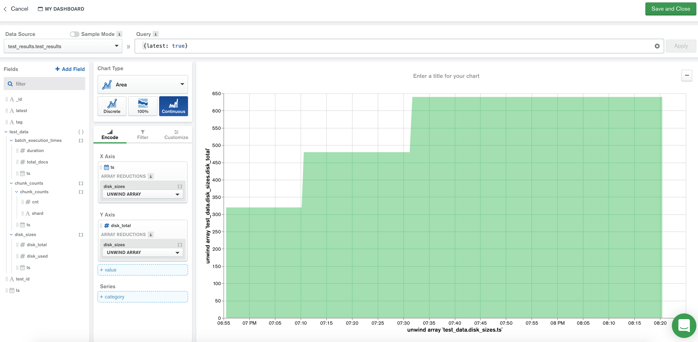
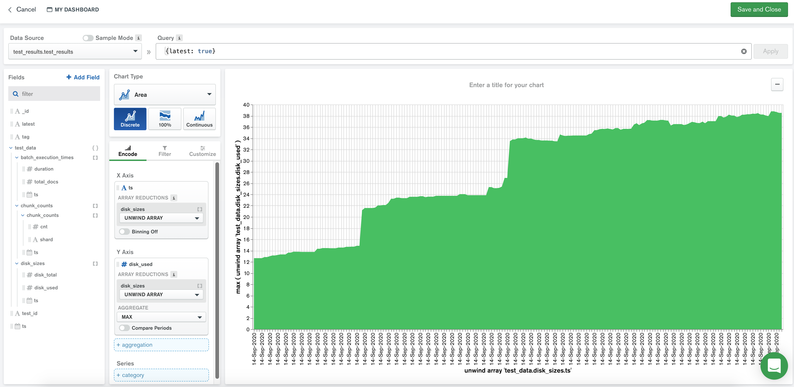

# SCALE-OUT

__Ability to scale out over time to support increasing data volumes and usage, without requiring database or application downtime__

__SA Maintainer__: [James Osgood](mailto:james.osgood@mongodb.com) <br/>
__Time to setup__: 30 mins <br/>
__Time to execute__: 120 mins <br/>


---
## Description

This proof shows how a MongoDB cluster can be scaled out by adding shards dynamically at runtime while the cluster is still under sustained load. The output of the proof is a MongoDB Atlas Charts dashboard showing how various metrics change over time, such as storage capacity, when more shards are dynamically added to the cluster, without database or application downtime.



<br/>
The test can be run in 2 ways. Both methods use the API to collect statistics from the cluster and also write back the results to a MongoDB Collection in the target cluster. 

#### Method 1. Automatically

In this mode, a Python script uses the MongoDB Atlas [API](https://docs.atlas.mongodb.com/api/) to drive everything. The sequence is

* Create a 2 shard cluster
* Wait for the cluster to be provisioned
* Start a steady load, inserting batches of 100,000 simple documents with a 1 second think time between each batch
* After a number of iterations, scale the cluster by adding further shards to go to 3 shards, then 4 shards.

The test will take about 2 hours and insert 1 billion documents overall. Test results are also written back to the cluster in the test_results database

__Once the test completes the cluster needs to be manually deleted from the Atlas UI__

#### Method 2. Load generation only

In this mode, a Python script injects load and only uses Atlas API to collect statistics about the cluster. Cluster creation, and then scaling by adding shards, is controlled manually. Once started, the load / collection will run until the script is manually stopped.


---
## Setup
__1. Create AWS Environment__
* Using your MongoDB 'Solution Architects' [AWS pre-existing account](https://wiki.corp.mongodb.com/display/DEVOPSP/How-To%3A+Access+AWS+Accounts), log on to the [AWS console](http://sa.aws.mongodb.com/) and near the top right hand side of the AWS Console, __change the region__ to match the same AWS region as you intend to subsequently create the Atlas cluster in
* Launch (create) a new EC2 instance with the following settings (use defaults settings for the rest of the fields):
  * __AMI Type__: Amazon Linux 2 AMI (HVM), SSD Volume Type
  * __Instance Type__: m4.xlarge
  * __Add Tags__: _be sure to set the 3 specific tags ('Name', 'owner', 'expire-on') on your instance as per the [MongoDB AWS Usage Guidelines](https://wiki.corp.mongodb.com/display/DEVOPSP/AWS+Reaping+Policies)_ to avoid your instance from being prematurely reaped
  * __Security Group__: Create a new security group which has an inbound rule to allow SSH only on port 22 from source 0.0.0.0/0
* When prompted, choose to use your existing key pair or create a new key pair (typically named similar to 'firstname.lastname'). If creating a new key pair, be sure to click the button to __Download Key Pair__ and store the key somewhere safe on your laptop.
*  Once the AWS instance is running, find it in the AWS Console __instances__ list, select it, and in the description section near the bottom of the AWS Console locate the __IPv4 Public IP__ field and make a note of its value

__2. Configure Atlas Environment__
* Log-on to your [Atlas account](http://cloud.mongodb.com) (using the MongoDB SA preallocated Atlas credits system) and navigate to your SA project
* As MongoDB Atlas clusters are created under a specific Atlas Organization and Project,  go to your __Account__ settings and in the [Organizations](https://cloud.mongodb.com/v2#/account/organizations) tab, ensure you have the Organization [created](https://docs.atlas.mongodb.com/tutorial/manage-organizations/#create-an-organization) to be used in this proof and then for this Organization, __create__ a new __Project__ (or re-use an existing Project) and make a record of the project name.
* Navigate to the project you are using and go to the API Keys tab on the [Access Management](https://docs.atlas.mongodb.com/configure-api-access#manage-programmatic-access-to-a-project) page.  
* __Generate__ a new __Programmatic API Key__ (record the public and private keys ready for subsequent use). Create the key with the 'Project Owner' permission as it needs permissions to create a cluster.
* Back in the project's Security tab, choose to add a new user called __main_user__, and for __User Privileges__ specify __Atlas admin__ (make a note of the password you specify)
* In the project's Security tab, add a new __IP Whitelist__ for your laptop's current IP address
* In the project's Security tab, add a new __IP Whitelist__ for AWS instance created earlier using the the AWS instance's _IPv4 Public IP_ you'd made a note of (this __must__ be done here in addition to the same IP being added to the _Public API Whitelist_ earlier)


__3. Configure The Main Proof Scripts In The AWS Environment__
* In the AWS Console __instances__ list select your AWS instance, press the __Connect button__ and follow the instructions to SSH into this instance from a new terminal window on your laptop
* In this SSH terminal session, run the following commands to update the system and to install __Python3__:
  ```bash
  sudo yum -y update
  sudo yum -y install python3
  python3 --version
  ```
* In the SSH session, run the following commands to download and install the PIP Python package manager:
  ```bash
  curl -O https://bootstrap.pypa.io/get-pip.py
  python3 get-pip.py --user
  vi .bash_profile
     (change the PATH line to following to ensure '/.local/bin' is first on the path and then save [:wq]):
     PATH=$HOME/.local/bin:$HOME/bin:$PATH
  source .bash_profile
  ```
* In the SSH session, install the Python MongoDB Driver and other required Python Library:
  ```bash
  pip3 install --user pymongo dnspython requests configparser
  ```

* Keep the existing SSH session terminal open, and then in a new terminal/shell on your laptop (i.e. NOT in the existing SSH session), from the root folder of this proof (the folder containing 'run-rest.py'), use Secure Copy (SCP) to copy the Python scripts and supporting files to the AWS Instance. For example run the following two file copy commands (first changing the _pem_ file path/name and target the _DNS name_ of the AWS instance to the same values you used to connect an SSH session to the AWS instance, earlier):
  ```bash
  scp -i "pathto/first.last.pem" atlas.properties.template Makefile MongoDBAtlasHelper.py run_test.py ec2-user@ec2-3-8-149-146.eu-west-2.compute.amazonaws.com:~/
  ```
* Back in the existing SSH session terminal, copy `atlas.properties.template` to `atlas.properties` and then edit this `atlas.properties` file and fill in the fields' values to match your Atlas environment:
    * For the API Public Key use the public key of the API key just created
    * For the API Private Key use the private key of the API key just created
    * Use the _main\_user_ user and its password you created and recorded earlier 
    * Use the Atlas project name you recorded earlier
    * Provide a name for the new Atlas cluster that you want to be subsequently created
    * Provide a region for the new Atlas cluster that you want to be subsequently created

    
---
## Execution

#### 1. Automated Cluster Provisioning Execution

* In the SSH session, run the following to provision an initial 2-shard Atlas cluster, to inject load continuously, recording metrics to a collection, and to gradually add additional shards dynamically, over time:
  ```bash
  make automatic
  ```

The test will log all progress to the console - should take 2 hours


   
#### 2. Manual Cluster Provisioning Execution

* In the Atlas console, for the project you identified during _Setup_, provision a cluster in a single AWS region of your choice with the following settings:
  - Number Shards: 2
  - Number Replicas per Shard: 3
  - Tier: M40
  - Storage Size: 160 (auto-expand enabled)
  - Provisioned IOPS: Enabled - 480 IOPS
* Once the cluster is started, run the following command to start just load generation and statistics capture parts of the scripts (i.e. the script does not attempt to provision a cluster first and add shards to the cluster dynamically over time):
  ```
  make manual
  ```
Ideally, allow the test to run for 15 minutes before increasing the shard count, and allow 20 minutes after initiating a shard count increase for the system to settle.

---
## Measurement

The result from each test run is stored in a single document in the datbase collection at _test_results.test_results_ in the actual cluster that was provisioned and scaled. Each test run document has a form similar to the following:



In the Atlas console, for the database cluster you deployed, click the __Connect button__, select __Connect with the Mongo Shell__, and in the __Run your connection string in your command line__ section copy the connection command line. The from a terminal/shell, execute the _Mongo Shell_ command you just copied (and specifying the _main\_user_ password when prompted), for example:
  ```
  mongo "mongodb+srv://auto-scale-test-a.mobcdengodb.net/test" --username main_user
  ```
History is kept but you can always find the last test run results (ie. the latest document) via the Mongo Shell by running the following:
  ```js
  use test_results
  db.test_results.find({latest: true}).pretty()
  ```
The 3 main sub-document sections (each containing an array of sub-documents) are...

&nbsp;&nbsp;_batch\_execution\_times_:
  ```
  ts - timestamp
  duration - time taken to insert batch of 100000 documents in seconds
  total_docs - total number of docs inserted so far
  ```
&nbsp;&nbsp;_chunk\_counts_:
  ```
  ts - timestamp
  chunk_counts - array of chunk counts per shard
  ```
&nbsp;&nbsp;_disk\_sizes_:
  ```
  ts - timestamp
  disk_total - sum of total disk size across shards (GB)
  disk_used - sum of disk used across shards (GB)
  ```
The easiest way to visualise these result metrics to show how they change as the cluster is scaled out is to use MongoDB Atlas Charts. In the Atlas Console, from the left-hand menu, click the __Charts__ option. You will create charts  showing that as the cluster is scaled out, response times will stay roughly constant. Plot graphs based on the following screenshots, using `{latest: true}` as the filter:

* __Batch execution time over time__ - to show that the time to insert 100,000 documents stays roughly the same across the tests. Note: There will be spikes in the graphs when:
    * a new shard is added as the balancer redistributes chunks
    * the chunk counts per shard increase and the balancer has to run

    

* __Chunk counts over time__ - to visualise a graph that shows the balancer running when shards are added or the data size grows

    
    
* __Total disk size__ - to show the storage capacity of the database cluster growing when a shard is added
    
    

* __Total disk used__ - to show that data is continuously being ingested into the database and the total data size is increasing over time

    

So in summary, these graphs will show that, with data being continuously ingested into the database (hence the data size is growing), by scaling out the cluster horizontally (adding new shards over time), the cluster's capacity increases (total storage available) without increasing the response time of the client application's insert operations (i.e. response times stay roughly constant).

# __NOW DELETE THE CLUSTER THAT WAS AUTOMATICALLY CREATED__

Delete the cluster from the Atlas UI


