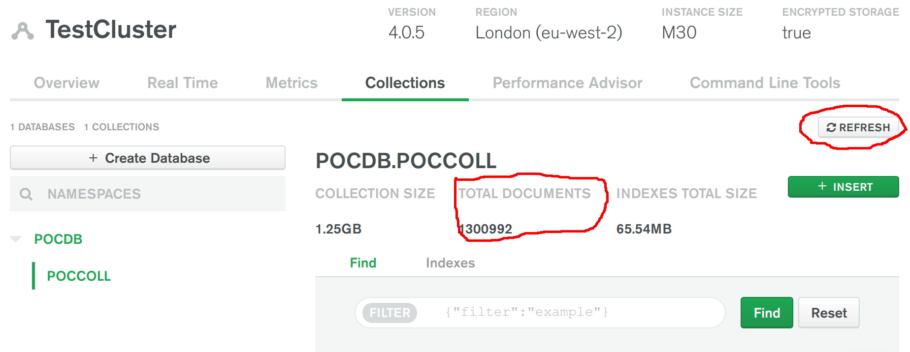

# MIGRATABLE

__Ability to deploy a database on-prem and then quickly migrate to a public cloud provider with less than 1 minute of scheduled application downtime required__

__SA Maintainer__: [Christian Kurze](mailto:christian.kurze@mongodb.com) <br/>
__Time to setup__: 90 mins <br/>
__Time to execute__: 30 mins <br/>


---
## Description

This proof shows how MongoDB can rapidly migrate data from on-prem MongoDB clusters to Atlas with no data loss and only seconds of application availability interruption.

This proof leverages a single-node replica-set in AWS and migrates its data into an Atlas cluster running in AWS. The application writing into the source database, and later into the Atlas cluster, will be simulated by using the POCDriver.

---
## Setup
__1. Configure Atlas Environment__
* Log-on to your [Atlas account](http://cloud.mongodb.com) (using the MongoDB SA preallocated Atlas credits system) and navigate to your SA project
* In the project's Security tab, choose to add a new user called __main_user__, for this user select __Add Default Privileges__ and in the __Default Privileges__ section add the roles __readWriteAnyDatabase__ and __clusterMonitor__ (make a note of the password you specify)
* Create an __M30__ based 3 node replica-set in a single AWS region of your choice with default storage settings (backup can be disabled). 
* In order to see the two CIDR blocks that need to be opened in the firewall of the source cluster, click on the __... button__ right next to your new cluster and choose __Migrate Data to this Cluster__. Hit __I'm ready to migrate__ and make a note of the two CIDR blocks. Don't actually attempt the migration, just close the dialog box instead.
* In the Atlas console, for the database cluster you deployed, click the __Connect button__, select __Connect Your Application__, and for the __latest Java version__  copy the __Connection String Only__ - make a note of this MongoDB URL address to be used later

__2. Configure AWS Environment__
* Using your MongoDB 'Solution Architects' [AWS pre-existing account](https://wiki.corp.mongodb.com/display/DEVOPSP/How-To%3A+Access+AWS+Accounts), log on to the [AWS console](http://sa.aws.mongodb.com/) and near the top right hand side of the AWS Console, __change the region__ to match the same AWS region as you created the Atlas cluster in
Console
* ADVANCED (ignore this and just use the default VPC): Select the __VPC__ service, choose one of the existing VPCs (or create one) and make a note of the __VPC ID__, then for this VPC's Subnets, select one of the existing Subnets (or create a new one) and make a note of the values of the __Subnet ID__ field and the __IPv4 CIDR__ field
* Select the __EC2__ service and launch (create) __TWO__ new EC2 instances with the following settings (use defaults settings for the rest of the fields):
  * __AMI Type__: Amazon Linux 2 AMI (HVM), SSD Volume Type
  * __Instance Type__: m4.xlarge
  * __Network__: _use VPC ID recorded from previous step_
  * __Subnet__: _use Subnet ID recorded from previous step_
  * __Add Storage__: 50 GB
  * __Add Tags__: _be sure to set the 3 specific tags ('Name', 'owner', 'expire-on') on your instance as per the [MongoDB AWS Usage Guidelines](https://wiki.corp.mongodb.com/display/DEVOPSP/AWS+Reaping+Policies)_ to avoid your instance from being prematurely reaped
  * __Security Group__: Create a new security group which has the following inbound rules:
    * SSH on port 22 from source 0.0.0.0/0
    * CustomTCP on port 27017 from the CIDR block of your AWS VPC Subnet that these VM instances will be part of, which you noted earlier (e.g. 172.32.0.0/20)
    * 2x CustomTCP on port 27017 from the CIDR blocks of the live migration tool, which you noted earlier (e.g. 52.56.155.160/32, 35.176.204.43/32)
* When prompted, choose to use your existing key pair or create a new key pair (typically named similar to 'firstname.lastname'). If creating a new key pair, be sure to click the button to __Download Key Pair__ and store the key somewhere safe on your laptop.
*  Once both the AWS instances are running, find them in the AWS Console __instances__ list, and for each, select it, and in the description section near the bottom of the AWS Console locate the __IPv4 Public IP__ field and make a note of its value
* Now go to the __Atlas Console__ and in the Security tab, add 2 new __IP Whitelist__ entries for the 2 IP addresses you just captured, to allow these two new AWS instances to connect to your Atlas cluster

__3. Configure POC Driver__
* In the AWS Console __instances__ list select your first AWS instance, press the __Connect button__ and follow the instructions to SSH into this instance from a new terminal window on your laptop
* In this SSH terminal session, run the following commands to update the system and to install __Java__ and __Maven__ (Maven will pull Java in automatically as a dependency):
  ```bash
  sudo yum -y update
  sudo yum -y install maven
  java -version
  mvn -version
  ```
* In the same SSH terminal session, download, unpack and build the MongoDB POCDriver project JAR (Java 'executable') from GitHub as follows:
  ```bash
  wget https://github.com/johnlpage/POCDriver/archive/master.zip
  unzip master.zip
  cd POCDriver*
  mvn clean package
  cd bin
  ls POCDriver.jar 
  ```

__4. Configure Source MongoDB ReplicaSet__
* In the AWS Console __instances__ list select your second AWS instance, press the __Connect button__ and follow the instructions to SSH into this instance from a new terminal window on your laptop
* In this SSH terminal session, create a new file opening it with an editor 
  ```bash
  sudo vi /etc/yum.repos.d/mongodb-enterprise.repo
  ```

* Add the following content to the file, save and exit the editor (this follows the MongoDB docs for [installing MongoDB on AMI](https://docs.mongodb.com/manual/tutorial/install-mongodb-enterprise-on-amazon/))
  ```
  [mongodb-enterprise]
  name=MongoDB Enterprise Repository
  baseurl=https://repo.mongodb.com/yum/amazon/2/mongodb-enterprise/4.0/$basearch/
  gpgcheck=1
  enabled=1
  gpgkey=https://www.mongodb.org/static/pgp/server-4.0.asc
  ```

* Run the command to install the latest version of MongoDB Enterprise
  ```bash
  sudo yum -y update
  sudo yum install -y mongodb-enterprise
  ```

*  In the AWS console, find this second running __instance__ again, select it, and in the description section near the bottom of the AWS Console locate the __Public DNS (IPv4)__ field and make a note of its value

* Configure the VM's hostname to be the public hostname by running the following command (using the public hostname you copied in the previous step):
  ```bash
  sudo hostnamectl set-hostname YOUR-PUBLIC-DNS-NAME.compute.amazonaws.com
  ```

* Configure MongoDB to use the ReplicaSet ```rsMigration``` by editing the file _/etc/mongod.conf_ and changing the fields __bindIp__ and __replSetName__ (and uncomment __replicaton:__):
  ```
  ...
    bindIp: 0.0.0.0 
  ...
  replication:
    replSetName: rsMigration
  ...
  ```

* Start the MongoDB server: 
  ```bash
  sudo systemctl start mongod.service
  ```

* From the VM terminal, initialize the single server replica set using the Mongo Shell:
  ```bash
  echo "rs.initiate()" | mongo
  echo "rs.config()" | mongo
  ```

* Validate that the Mongo Shell can connect to the public hostname of the MongoDB single server replica set and then exit the Shell (using the public hostname you copied in the previous earlier)
  ```bash
  mongosh --host rsMigration/YOUR-PUBLIC-DNS.compute.amazonaws.com:27017
  ```
    
---
## Execution

__1. Generate Sample Data in the Source Cluster__

From the AWS instance SSH command line, inside the  __~/POCDriver*/bin__ folder, run the POCDriver load generator against the single-node replica set using the commands below. Running this will erase the existing load test database collection if it already exists (-e) and will __run the test for 1 minute duration__ (-d 60). This ensures, we have some example data in our source cluster. This will generate about 900MB of data.
  ```bash
  java -jar POCDriver.jar -c "mongodb://YOUR-PUBLIC-DNS.compute.amazonaws.com:27017/?gssapiServiceName=mongodb&replicaSet=rsMigration" -t 1 -e -d 60 -f 25 -a 5:5 --depth 2 -x 3
  ```


&nbsp;&nbsp;&nbsp;__Tip__: If you want to understand how the parameters influence both the record size and how the load injection is run, see the main [POCDriver readme](https://github.com/johnlpage/POCDriver) or run the following from the command line:
  ```bash
  java -jar POCDriver.jar -h
  ```

__2. Initiate Live Migration and Restart the POCDriver to point to the Destination Cluster__

From the Atlas Console go to your cluster, hit the __... button__ and choose __Migrate Data to this Cluster__. Acknowledge the initial screen by hitting __I'm ready to migrate__.

Put the following values into the fields:
* _Hostname_: Host & port of the primary of your replica set: YOUR-PUBLIC-DNS.compute.amazonaws.com:27017
* _Username/Password_: We did not configure authentication in our source cluster, so leave these fields empty
* _Is SSL enabled?_: Keep to NO
* _Clear any existing data on your target cluster?_: As the cluster is empty, it can be kept to NO

Start to check the parameters by hitting the __Validate__ button. If the validation fails, double-check the hostname setting of the EC2 instance as well as the security group configuration to allow the migration tool to access the MongoDB AWS VM instance

Hit __Start Migration__ and the test data is copied into the destination cluster. In the cluster overview you can see the progress of the migration. Once the initial sync is completed, the replication lag will indicate how much data still has to be migrated. 

During the initialization phase, restart the POC Driver. __This time without the -e option__ (otherwise the POCDriver will try to empty the existing collection). This will load additional data into the existing MongoDB single server replica set on the AWS instance, and is used to show the live migration capabilities. In order to demonstrate properly, also limit the number of operations per second to 100 (```-q 100```). Otherwise, it will take a bit longer to catch up, depending on the network bandwidth (replace XXXXXX with the same value you used earlier).
  ```bash
  java -jar POCDriver.jar -c "mongodb://YOUR-PUBLIC-DNS.compute.amazonaws.com:27017/?gssapiServiceName=mongodb&replicaSet=rsMigration" -t 1 -d 600 -q 100 -f 25 -a 5:5 --depth 2 -x 3
  ```

In the Atlas cluster __Metrics | Collections__ tab, check the size of the _POCDB.POCCOLL_ database collection and keep hitting refresh to show the collection count is increasing due to the ongoing Live Migration process tailing the oplog of the source cluster (the source cluster is still receiving insert workload from the POCDriver).

Back in the Atlas __Cluster Overview__ wait for the initial sync to finish and for the replication lag to be shown as close to zero (e.g. just a few seconds)

__START THE STOPWATCH__

Stop the running _POCDriver_ process in the laptop's terminal window (but do NOT close the terminal window)

In the Atlas console, hit __Start Cutover__. 

Back in the laptop's terminal window, change the _XXXXXX_ parameter below, for the _POCDriver_, to now point to the target Atlas cluster and start it running again:
  ```bash
  java -jar POCDriver.jar -c "mongodb://atlas-DNS:27017/?gssapiServiceName=mongodb&replicaSet=rsMigration" -t 1 -d 600 -f 25 -a 5:5 --depth 2 -x 3
  ```

__STOP THE STOPWATCH__


---
## Measurement

After the restart of the POCDriver that is now targeting the Atlas cluster, in the Atlas cluster's __Metrics | Collections__ tab, check again the size of the _POCDB.POCCOLL_ database collection and keep hitting refresh to show the collection count is increasing again, this time due to the fact that the POCDriver is now ingesting data directly into the migrated Atlas database cluster.

Record the elapsed STOPWATCH time between starting it and stopping it, which should indicate that less than a minute of scheduled downtime was required.



