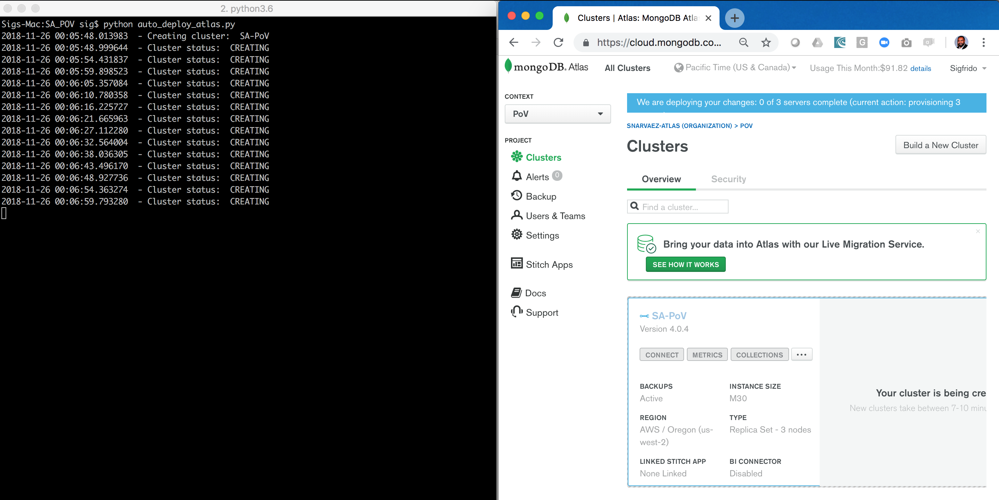
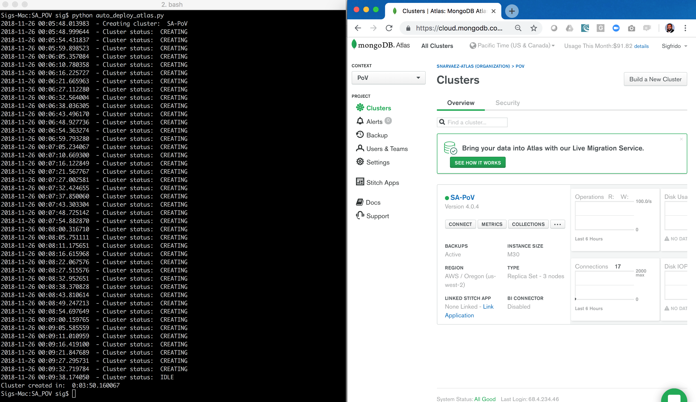

# AUTO-DEPLOY

__Ability to automate the deployment & configuration of a production ready database cluster, which is ready and live within X minutes of invoking a single command__

__SA Maintainer__: [Sig Narváez](mailto:sig.narvaez@mongodb.com) <br/>
__Time to setup__: 30 mins <br/>
__Time to execute__: 15 mins <br/>


---
## Description

This proof shows how MongoDB Atlas, as a Database-as-a-Service (DBaaS), can deploy a production-ready cluster to a public cloud provider of choice within a matter of minutes, and that the ease of use and quality of the service is at least on a par with “native/proprietary” managed database service versions of RDBMS databases (e.g. Amazon RDS, SQL Azure, Aurora) and NoSQL databases (e.g. DynamoDB, CosmosDB).

Deploying a production-ready cluster requires __expertise__ and __strict adherence__ to an [operations checklist](https://docs.mongodb.com/manual/administration/production-checklist-operations/) alongside __security hardening and certification__, for provisioning each cluster that an organization requires as part of their Software Delivery Lifecycle (e.g. for development, testing, production, etc.). Additionally, __every time__ a cluster change is required for maintenance, upscale, downscale or configuration change reasons, further error prone and time consuming work is required, whilst trying to still adhere to these strict guidelines and whilst also trying to minimise scheduled downtime.

This proof uses a Python script to perform the database cluster automated provisioning and should __take between 5 to 10 minutes to complete__, depending on the underlying cloud provider and the size and complexity of the cluster.

---
In case you need to have Technical Deep Dive(TDD) on this RC, have a look on this other [repository](https://github.com/cassianobein/mongodb-atlas-api-resources), it contains all MongoDB API resources in a [Postman](https://www.postman.com/downloads/) collection so we can easily create and demonstrate any use cases your customer might want. 

---
## Setup
__1. Configure Laptop__
* Ensure your laptop can run __Python 3__ - please follow the installation steps for your operating system and version as described in the [Python setup and usage guide](https://docs.python.org/3/using/index.html)
* Ensure the Python library __requests__ is installed, e.g.:
  ```bash
  pip3 install requests 
  ```

__2. Configure Atlas Environment__
* Log-on to your [Atlas account](http://cloud.mongodb.com) (using the MongoDB SA preallocated Atlas credits system) and navigate to your SA project
* As MongoDB Atlas clusters are created under a specific Atlas Organization and Project,  go to your __Account__ settings and in the [Organizations](https://cloud.mongodb.com/v2#/account/organizations) tab, ensure you have the Organization [created](https://docs.atlas.mongodb.com/tutorial/manage-organizations/#create-an-organization) to be used in this proof and then for this Organization, __create__ a new __Project__ (or re-use an existing Project) and make a record of the project name.
* Navigate to the project you are using and go to the API Keys tab on the [Access Management](https://docs.atlas.mongodb.com/configure-api-access#manage-programmatic-access-to-a-project) page.  
* __Generate__ a new __Programmatic API Key__ (record the public and private keys ready for subsequent use). Create the key with the 'Project Owner' permission as it needs permissions to create a cluster. Make sure the IP of your laptop (or from where the API will be invoked) is added to the API whitelist entry.
* Navigate to the new/existing Atlas __Project__, then select the __Settings__ option from the left hand menu and record the value of the __Project ID__ field ready for subsequent use.


---
## Execution

__1. Configure Python Provisioning Script__
* Overwrite the following variables in the [auto_deploy_atlas.py](auto_deploy_atlas.py) python script file on your local filesystem, with the values of your Atlas API Public Key, Private Key and Project ID.
  ```
  apiPublicKey  = "ATLAS-API-PUBLIC-KEY"
  apiPrivateKey = "ATLAS-API-PRIVATE-KEY"
  projectId     = "ATLAS-PROJECTID"
  ```
* __OPTIONAL__: The Atlas API will receive a payload that describes the cluster configuration (e.g. instance size, cloud provider, etc.). The default script settings will result in a standard M30 cluster on AWS in the US_WEST_2 region with backup enabled and encrypted EBS volumes, as described in the payload below. You can optionally alter some or all of these settings in the script, to suit a different configuration, if you do not want to go with the defaults (for more information, see the [request body parameters](https://docs.atlas.mongodb.com/reference/api/clusters-create-one/#request-body-parameters) documentation):
  ```json
  data = {
    "name" : clusterName,
    "clusterType" : "REPLICASET",
    "mongoDBMajorVersion": "4.0",
    "numShards" : 1,
    "providerSettings" : {
      "providerName" : "AWS",
      "regionName" : "US_WEST_2",
      "instanceSizeName" : "M30",
      "encryptEBSVolume" : True
    },
    "replicationFactor" : 3,
    "providerBackupEnabled": True,
    "autoScaling" : { "diskGBEnabled" : True }
  }
  ```

__2. Provision The Database Cluster Using The Python Script__
* Run the Python script as follows from a terminal / command line on your laptop (ensure it is marked as executable first):
  ```bash
  ./auto_deploy_atlas.py
  ```
* The script will invoke the Atlas API to start the cluster creation. The cluster will stay in __CREATING__ status throughout the creation process. During this phase the Python script will poll every 5 seconds until the cluster status changes to __IDLE__.

__3. Show The Cluster Deployment Status Via The MongoDB Atlas UI__
* While the script is executing, place the terminal and the Atlas window (showing the cluster being created) side-by-side (this is a great time for the SA to perform discovery regarding challenges with manually provisioning clusters or changing their configuration without downtime)




---
## Measurement

When finished, the cluster status reported by the script changes from __CREATING__ to __IDLE__ and the script will report the total creation time, similar to the example shown below.
  ```
  ./auto_deploy_atlas.py
  2018-11-26 00:05:48.013983  - Creating cluster:  SA-PoV
  2018-11-26 00:05:48.999644  - Cluster status:  CREATING
  ...
  2018-11-26 00:09:32.719784  - Cluster status:  CREATING
  2018-11-26 00:09:38.174050  - Cluster status:  IDLE
  Cluster created in:  0:03:50.160067
  ```

The Atlas UI will also change to notify the user that the cluster is now created and ready for access, similar to the example shown below.



