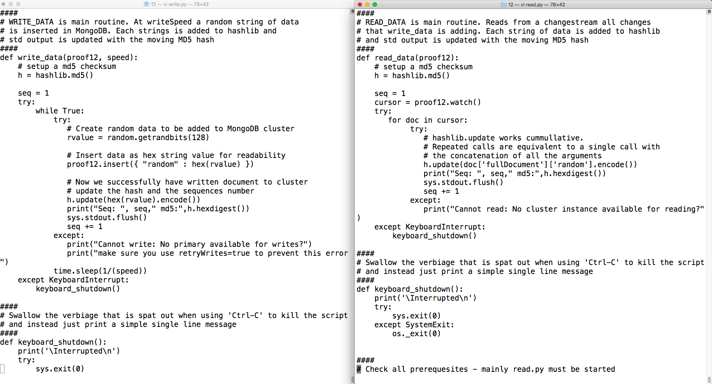
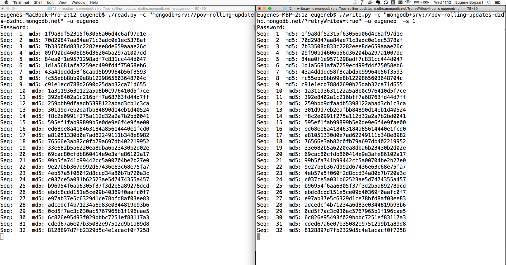
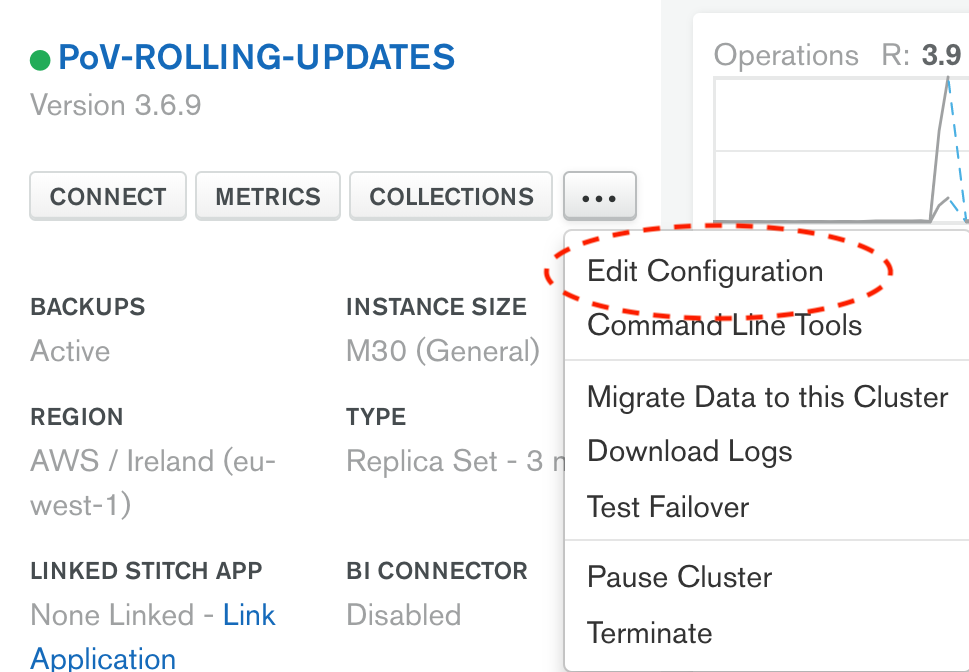
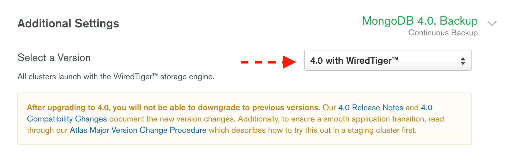

# ROLLING-UPDATES

__Ability to apply patches (eg. to address bugs or security issues) without requiring scheduled downtime for the database or consuming applications__

__SA Maintainer__: [Eugene Bogaart](mailto:eugene@mongodb.com) <br/>
__Time to setup__: 15 mins <br/>
__Time to execute__: 15 mins <br/>


---
## Description

This proof shows how MongoDB Atlas, as a Database-as-a-Service (DBaaS), can be upgraded/patched without scheduled downtime. In a matter of minutes an upgrade is rolled out without application and loss of service being incurred.

Upgrades and patches are complex, and with most relational databases, typically requires scheduled downtime and deep expertise. MongoDB is designed to be upgraded and patched dynamically without compromising database availability.

This proof uses 2 Python scripts to perform an equal number of reads and writes on the database cluster. The _writer script_ generates random data and adds the data to the cluster. After each inserted record a moving MD5 hash is generated and listed on the standard output. The _reader script_ reads all the inserted data and also reads and lists MD5 hash.

During the execution, you will trigger a major version upgrade of the Atlas cluster. Minor upgrades occur automatically and therefore it would be challenging to test on demand, hence why this test shows the proof by applying a major upgrade. Both output windows should display corresponding MD5 hash values before, during and after the upgrade, to demonstrate that no data had been dropped or read twice. Feel free to study both scripts side by side.




---
## Setup
__1. Configure Laptop__
* Ensure your laptop can run __Python 3__ - please follow the installation steps for your operating system and version as described in the [Python setup and usage guide](https://docs.python.org/3/using/index.html) 
* Ensure the Python __srvlookup__ and __dns.resolver__ libraries are installed, e.g:
  ```bash
  pip3 install srvlookup dnspython
  ```

__2. Configure Atlas Environment__
* Log-on to your [Atlas account](http://cloud.mongodb.com) (using the MongoDB SA preallocated Atlas credits system) and navigate to your SA project
* In the project's Security tab, choose to add a new user called __main_user__, and for __User Privileges__ specify __Read and write to any database__ (make a note of the password you specify)
* In the Security tab, add a new __IP Whitelist__ for your laptop's current IP address
* Create an __M10__ based 3 node replica-set in a single cloud provider region of your choice and importantly __specify the MongoDB version as e.g. 4.4__ (just not the newest version! Otherwise there is nothing to update)
* In the Atlas console, for the database cluster you deployed, click the __Connect button__, select __Connect Your Application__, and for the __latest Python version__  copy the __Connection String Only__ - make a note of this MongoDB URL address to be used later


---
## Execution
In order to execute this correctly the __read.py script__ must be started before the __writ.py script__.  If not, the __MD5__ hashes are different.

__1. Open two terminal/shell windows on a laptop__

Show these two window side by side

__2. In the right window start the reader script: read.py__

Its usage is shown below. Provide the connection string and username/password that were established in the Setup.
  ```bash
  ./read.py -h
  usage: read.py [-h] -c CONNECTION [-u USERNAME] [-p PASSWORD]
  ```
Example:
  ```bash
  ./read.py -c "mongodb+srv://testcluster-abcd.mongodb.net" -u main_user
  ```

__3. In the left window start the reader script: write.py__

The usage is shown below
  ```bash
  ./write.py -h
  usage: write.py [-h] -c CONNECTION [-u USERNAME] [-p PASSWORD] [-s WRITESPEED]
  ```
Example:
  ```bash
  ./write.py -c "mongodb+srv://testcluster-abcd.mongodb.net" -u main_user -s 3
  ```

Now your read and write scripts are running check that the sequence number on each side have matching MD5 hashes. If not then the read.py process was not started before the write.py. A sample screenshot is shown below:



__4. Upgrade you Atlas cluster.__

Via the Atlas console, upgrade your Atlas cluster (the upgrade process will subsequently take a few minutes) and then constantly check the output in the the two script windows again. To upgrade a cluster in Atlas console select __...__ and select __Edit Configuration__. Change the version from 3.6 to 4.0 and __Apply Changes__ as follows:

&nbsp;&nbsp;_Edit Cluster:_&nbsp;&nbsp;

<br/>
<br/>

&nbsp;&nbsp;_Change Version:_&nbsp;&nbsp;

<br/>
<br/>

&nbsp;&nbsp;_Apply Changes:_&nbsp;&nbsp;

<br/>
<br/>

<blockquote>
NOTES: The 'write.py' script uses an insert speed of 2 records per second which is reasonable maximum when using a remote laptop, while using Python and writing to a terminal. If you would like to do the same test with higher write speeds (__-s__ param) then you could use redirection of standard output to a file. This will allow for 4 to 5 records to be added per second. With a VM instance running in the same cloud provider region as the Atlas cluster, an even greater write speed can be achieved due to reduction of network latency. The 'write.py' script automatically adds 'retryWrites=True' to the MongoDB URL enabling writes to still be fulfilled when the primary is stepped down during the upgrade process.
</blockquote>


---
## Measurement

When the Atlas UI reports that the upgrade is finished, carefully compare the output in both windows to ensure the hashes of the two corresponding sequenced items match perfectly. This indicates that no writes were lost during the upgrade and all writes were subsequently read with no duplicate reads, during the upgrade. Also ensure no exceptions were shown in either window, around the time that the upgrade occurred, thus indicating that the upgrade happened seamlessly. The output will be similar to the example screenshot below:


If some corresponding sequence numbers do not show the same MD5 hash, then the __read.py__ process was not started before the __write.py__

If either the writer or reader would miss a data element, during the version upgrade, then (i) the sequence would be out of sync or (ii) the MD5 hash will be different. 

_NOTE:_ The __read.py__ and __write.py__ script will run forever, or until killed with __CTRL-C__

