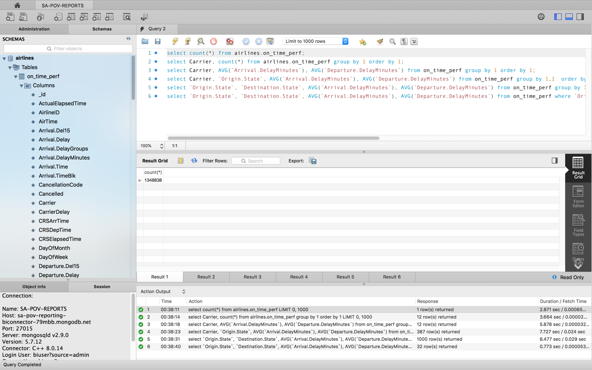
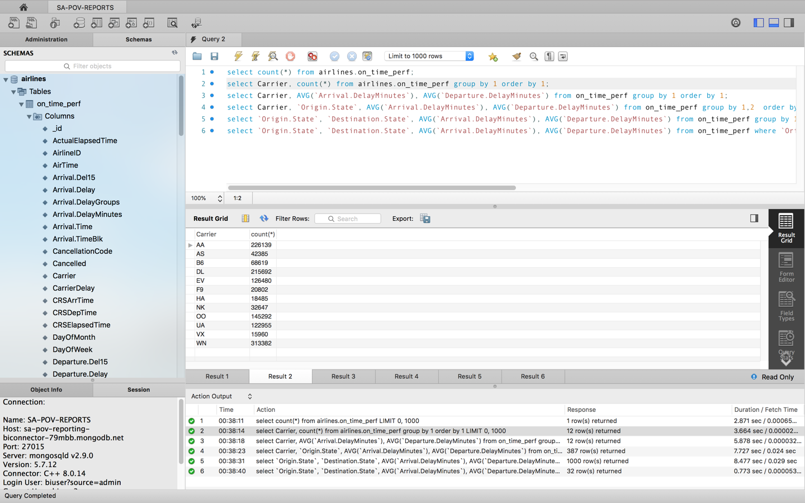
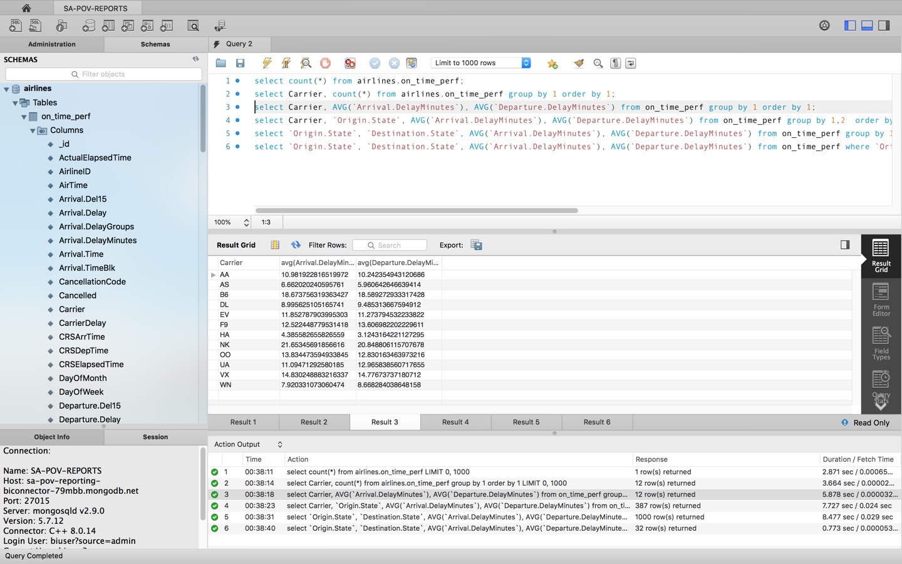
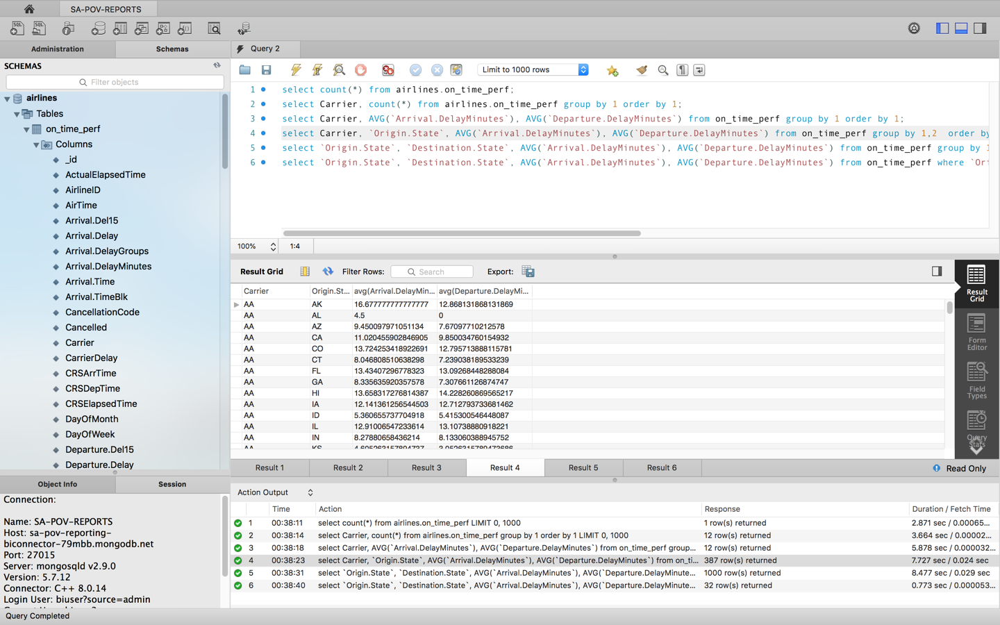
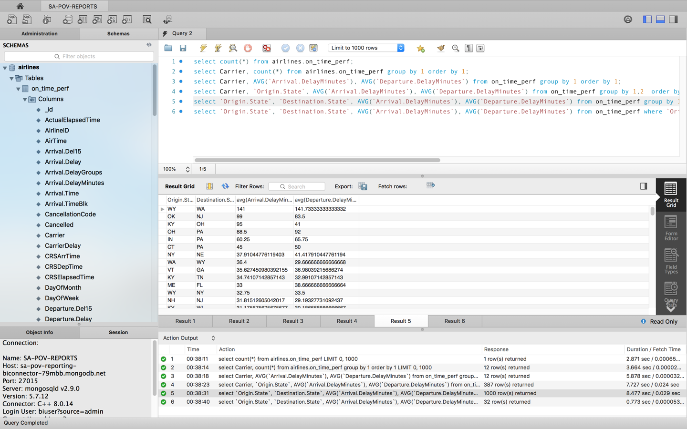
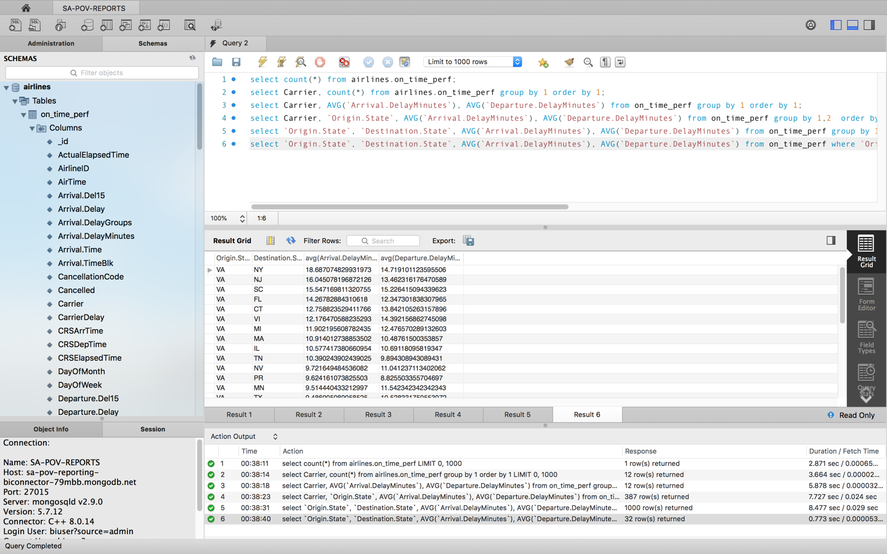

# REPORTING

__Ability to easily expose data to business analysts using common SQL/ODBC based BI & Reporting tools__

__SA Maintainer__: [Gary Taylor](mailto:gary.taylor@mongodb.com) <br/>
__Time to setup__: 60 mins <br/>
__Time to execute__: 30 mins <br/>


---
## Description
This proof shows how the BI Connector can be used to enable MongoDB stored data to be queried from any SQL/ODBC based reporting tool.

A simple custom bash shell script will be used to load 3 months of [U.S. Airline On-Time Performance Data](https://www.transtats.bts.gov/ontime/) (~1.3 Million records) into the MongoDB database.  The data's original form is Comma-Separted-Values (CSV) format and will be loaded and processed by the _mongoimport_ command.  As the data is loaded by _mongoimport_ it will be **shaped** slightly into richer documents than just a flat document by using _"--fieldFile"_ and _"--columnsHaveTypes"_ options (see: [mongoimport manual](https://docs.mongodb.com/manual/reference/program/mongoimport/)). At the end of the loading process, indexes will be added to improve subsequent query performance.

The airline carriers in the report data are: Alaska Airlines (AS), American Airlines (AA) ,Delta Air Lines (DL), ExpressJet Airlines (EV), Frontier Airlines (F9), Hawaiian Airlines (HA), JetBlue Airways (B6), SkyWest Airlines (OO), Southwest Airlines (WN), Spirit Airlines (NK), United Airlines (UA) and Virgin America (VX). 

Once the data is loaded into the MongoDB database a SQL/ODBC based reporting tool (the _MySQL Workbench_ in this case) will be connected to the database, via the BI Connector, to show how some typical SQL commands can be successfully executed against the MongoDB stored data, with ease.


---
## Setup
__1. Configure Laptop__
* Ensure MongoDB version 3.6+ is already installed your laptop, mainly to enable MongoDB command line tools to be used (no MongoDB databases will be run on the laptop for this proof)

__2. Configure Atlas Environment__
* Log-on to your [Atlas account](http://cloud.mongodb.com) (using the MongoDB SA preallocated Atlas credits system) and navigate to your SA project
* In the project's Security tab, choose to add a new user called __biuser__, and for __User Privileges__ specify __Read and write to any database__ (make a note of the password you specify)
* Create an __M20__ based 3 node replica-set in a single cloud provider region of your choice and __ensure you enable the BI Connector option__ (found under the **Additional Settings** dropdown when creating the cluster), and declare the following BI Connector settings:
    - __Schema Sample Size__: 1500
    - __Sample Refresh Interval__: 300
* In the Security tab, add a new __IP Whitelist__ for your laptop's current IP address
* Once the cluster has been fully provisioned, in the Atlas console, click the **... (*ellipsis*)**, select **Command Line Tools**, under **Data Import and Export Tools** select the **mongoimport** and select  **Copy** and record this MongoDB URL address somewhere on your local laptop (a portion of this connection string will subsequently be needed to load data via and then run the tests)
* For the database cluster you deployed, click the __Connect button__, select __Connect with the Mongo Shell__, and in the __Run your connection string in your command line__ section copy the connection command line - make a note of this connection command line to be used later
* For the database cluster you deployed and shown in the Atlas console, click the **Connect button**, select **Connect Your Business Intelligence Tool** then record the **Hostname**, **Port** and **User** displayed on your local laptop as you will need them later to when configuring the BI tool

__3. Configure Load Script and Upload Test Data__
* Before running a bash script to import data, open a terminal/shell in the base directory for this proof and edit the file __.atlas_env__ (run `ls -a` to see the file) which has the following content to match the settings for your Atlas environment:
  ```
  MONGO_IMPORT_HOST="<Your Atlas Host string>"
  MONGO_SHELL_HOST="<Your Mongo Shell string>"
  USER="<Your Atlas Username>"
  PASS="<Your Atlas Password>
  ```

  - Replace the **MONGO_IMPORT_HOST** variable's value with just a portion of the __mongoimport__ command line you recorded earlier, specifically the value of the __--host__ parameter, for example: 
  ```
  TestCluster-shard-0/testcluster-shard-00-00-abcde.mongodb.net:27017,testcluster-shard-00-01-abcde.mongodb.net:27017,testcluster-shard-00-02-abcde.mongodb.net:27017
  ```

* Replace the **MONGO_SHELL_HOST** variable's value with this host portion of the Mongo Sell URL that you saved earlier (i.e. the host part of the Short SRV connection string), for example:
  ```
  testcluster-abcde.mongodb.net
  ```

* The **USER** and **PASS** variables in the file need to be set to  **biuser** and the associated password you created earlier.

* Via the same terminal/shell, again __in the base directory for this proof__ (this should be the parent folder of the _PERFORMANCE\_DATA_ folder), run the following script to load the CSV data into the Atlas cluster using the _.atlas\_env_ you've just specified (note, this may __take around 1 hour__ to load all the data into the Atlas cluster)
  ```bash
  ./import_data.sh
  ```

&nbsp;&nbsp;&nbsp;&nbsp;You can verify the data loaded by going to your Atlas cluster and view it in the data explorer (via **Collections Tab**) - the **number of documents** loaded will be: **1,348,838** and there will be **8 total indexes** on "**airlines.on_time_perf**".


__4. Install and Configure the MongoDB ODBC Driver and DSN and the BI Tool__

The 1.0.16 edition of ODBC Manager included with the MongoDB ODBC driver is not compatible with macOS Catalina. If you are on Catalina, download and install the latest version (1.0.19) of ODBC manager. http://www.odbcmanager.net/index.php 

* [Download](https://github.com/mongodb/mongo-bi-connector-odbc-driver/releases) and install the latest MongoDB ODBC Driver the operating system you are installing for (assumes MacOS for your installation).
   
* Create a MongoDB DSN by following the [online MongoDB instructions](https://docs.mongodb.com/bi-connector/current/tutorial/create-system-dsn/).  __Note:__ You only need to do steps: 1, 2, 3, 4, 5 and 8 from the MacOS steps. You should NOT do the optional steps. 

* [Download](https://dev.mysql.com/downloads/workbench/) and install the MySQL Workbench (Community) for MacOS for testing, or Linux equivalent (the current GA version is 8.0.15)

* Configure the MySQL Workbench to use the MongoDB ODBC DSN following these [instructions](https://docs.atlas.mongodb.com/tutorial/connect-bic-workbench/) using the BI Connector values saved earlier for (**Hostname, Port, Username**). **Note:** The version of MySQL Workbench shown in the MongoDB documentation will be different than the version you installed, however the steps you need to follow are still the same

    
---
## Execution

We will use the MySQL Workbench to run typical SQL queries to show the seamless integration of the tool with the MongoDB data

* Start MySQL Workbench and select the connection you just configured

* In the SQL Query Editor window, paste and execute (by clicking on the lightning bolt icon) the following SQL query to test that data can be retrieved:

  ```sql
  select count(*) from airlines.on_time_perf;
  select Carrier, count(*) from airlines.on_time_perf group by 1 order by 1;
  select Carrier, AVG(`Arrival.DelayMinutes`), AVG(`Departure.DelayMinutes`) from airlines.on_time_perf group by 1 order by 1;
  select Carrier, `Origin.State`, AVG(`Arrival.DelayMinutes`), AVG(`Departure.DelayMinutes`) from airlines.on_time_perf group by 1,2  order by 1,2;
  select `Origin.State`, `Destination.State`, AVG(`Arrival.DelayMinutes`), AVG(`Departure.DelayMinutes`) from airlines.on_time_perf group by 1, 2 order by 3 desc, 4 desc;
  select `Origin.State`, `Destination.State`, AVG(`Arrival.DelayMinutes`), AVG(`Departure.DelayMinutes`) from airlines.on_time_perf where `Origin.State` = 'VA' group by 1, 2 order by 3 desc, 4 desc;
  ```

 
---
## Measurement

Run each of the following set of queries below checking that the results are shown as similar to the screenshots, as well as checking the # of records (documents) returned and how long the query took. 

**Note 1**: A [screencast](vid/SA-POV-REPORTING-MySQL-WorkBench-Measurement-Capture.mov) has also been prerecorded showing the live execution for the queries in the MySQL Workbench

**Note 2**: The default limit on the number of documents (records) to return is set to 1000 for this session

#### QUERY 1: 

&nbsp;&nbsp;__Query to run__: *How many documents (records) are in the on_time_perf table?*
  ```sql
  select count(*) from airlines.on_time_perf;
  ```



#### QUERY 2: 

&nbsp;&nbsp;__Query to run__: *What is the distribution of carriers across the data-set, sorted in ascending order by carrier?*
  ```sql
  select Carrier, count(*) from airlines.on_time_perf group by 1 order by 1;
  ```



#### QUERY 3: 

&nbsp;&nbsp;__Query to run__: *What is the average arrival delay and average departure delay by carrier across the data-set sorted in ascending order by carrier?*
  ```sql
  select Carrier, AVG(`Arrival.DelayMinutes`), AVG(`Departure.DelayMinutes`) from airlines.on_time_perf group by 1 order by 1;
  ```



#### QUERY 4: 

&nbsp;&nbsp;__Query to run__: *What is the average arrival delay and average departure delay by carrier based on the flight's origin state across the data-set sorted in ascending order by carrier then origin state?*
  ```sql
  select Carrier, `Origin.State`, AVG(`Arrival.DelayMinutes`), AVG(`Departure.DelayMinutes`) from airlines.on_time_perf group by 1,2  order by 1,2;
  ```



#### QUERY 5: 

&nbsp;&nbsp;__Query to run__: *What is the average arrival delay and average departure delay based on the flight's origin state and destination state across the dataset sorted in descending order by arrival delay then departure delay?*
  ```sql
  select `Origin.State`, `Destination.State`, AVG(`Arrival.DelayMinutes`), AVG(`Departure.DelayMinutes`) from airlines.on_time_perf group by 1, 2 order by 3 desc, 4 desc;
  ```




#### QUERY 6: 

&nbsp;&nbsp;__Query to run__: *What is the average arrival delay and average departure delay based on the flights originating in Virginia (VA) going to any other state across the data-set sorted in descending order by arrival delay then departure delay?*
  ```sql
  select `Origin.State`, `Destination.State`, AVG(`Arrival.DelayMinutes`), AVG(`Departure.DelayMinutes`) from airlines.on_time_perf where `Origin.State` = 'VA' group by 1, 2 order by 3 desc, 4 desc;
  ```



