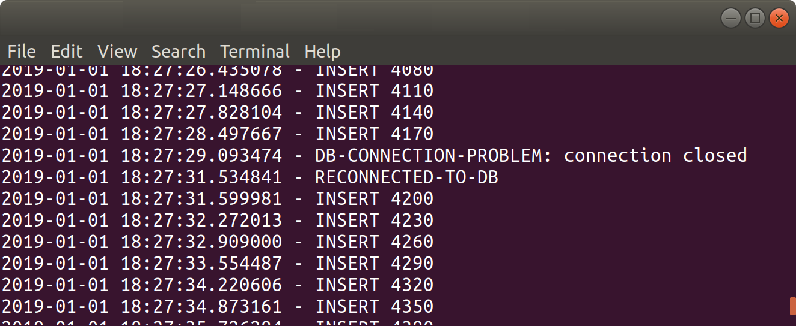

# AUTO-HA

__Ability for database to automatically recover from host machine failure, for a single region/DC, within X seconds, without requiring human intervention__

__SA Maintainer__: [Paul Done](mailto:paul.done@mongodb.com) <br/>
__Time to setup__: 15 mins <br/>
__Time to execute__: 15 mins <br/>


---
## Description
This proof shows that when the primary of a MongoDB Atlas database cluster replica-set fails, another member of the replica set is automatically promoted to primary and the client application's MongoDB driver detects this primary host change and automatically fails over, all __within 4 seconds__. In other words, when a server failure occurs, the application automatically recovers service with less than 4 seconds of downtime incurred. 

For this proof, two separate Python applications is run, one to continuously insert documents with increasing integer val field to and the other to read the latest document from the database collection _AUTO_HA.records_. When the application detects a failure to perform an operation, it outputs the failure occurrence (with timestamp information) before trying to continue with the inserts or reads. During the proof, the Atlas __Test Failover__ function is used to induce a host failure for the replica-set primary. For self-managed setups the host failure can be induced by manually killing the mongod process. Using this procedure, you can view how long the application incurs downtime before being automatically failed over to the recovered replica-set's new primary. The proof also shows how MongoDB's __retryable writes__ and __retryable readss__ capability can additionally be employed, to minimise the impact of any temporary failover downtime on the client application.


---
## Setup
__1. Configure Laptop__
* Ensure MongoDB version 3.6+ is already installed your laptop, mainly to enable MongoDB command line tools to be used (no MongoDB databases will be run on the laptop for this proof)
* Ensure __Python 3__ is installed and install required Python libraries:
  ```bash
  pip3 install pymongo dnspython
  ```
__2. Configure Atlas Environment__
* Log-on to your [Atlas account](http://cloud.mongodb.com) (using the MongoDB SA preallocated Atlas credits system) and navigate to your SA project
* In the project's Security tab, choose to add a new user called __main_user__, and for __User Privileges__ specify __Read and write to any database__ (make a note of the password you specify)
* Create an __M10__ based 3 node replica-set in a single cloud provider region of your choice with default settings
* In the Security tab, add a new __IP Whitelist__ for your laptop's current IP address
* In the Atlas console, for the database cluster you deployed, click the __Connect button__, select __Connect Your Application__, and for the __latest Python version__  copy the __Connection String Only__ - make a note of this MongoDB SRV URL address to be used later


---
## Execution

* From two separate terminals/shells, execute the two Python scripts to start continuously inserting and reading records into and from the Atlas deployed database collection __AUTO_HA.records__, specifying the parameter for mongodb URI (include retryWrites and retryReads equal to false in the URL you provide here), e.g.:
  ```bash
  ./continuous-insert.py 'mongodb+srv://<username>:<password>@testcluster-abcd.mongodb.net?retryWrites=false'
  ```
  and
  ```bash
  ./continuous-read.py 'mongodb+srv://<username>:<password>@testcluster-abcd.mongodb.net?retryReads=false'
  ```

* View the terminal/shell output of the Python scripts to check it has successfully connected to the Atlas database and is reporting that records are being inserted and read

* From the Atlas console, select the __.../Test Failover__ option to force a failure of the replica-set primary server; the Atlas console will then show a dialog similar to the following:


* Back in the terminal/shell continuous output, keep visually scanning the output looking for when a failure is reported by the client application, from which you will be able to determine how long the client application is unable to write to the database, before being automatically failed over. _Note_: Atlas __may take a few minutes__ before it schedules the primary failure action to be invoked on the database cluster.

* Once the failure is shown in the output, terminate the running Python applications (_Ctrl-C_)

* Restart the Python application again, this time providing an additional __retry__ parameter, to instruct the application to employ MongoDB's __retryable writes__ capability, e.g.:
  ```bash
    ./continuous-insert.py 'mongodb+srv://<username>:<password>@testcluster-abcd.mongodb.net/?retryWrites=true' retry
  ```
  and
  ```bash
    ./continuous-read.py 'mongodb+srv://<username>:<password>@testcluster-abcd.mongodb.net/?retryReads=true' retry
  ```

* Again, use the Atlas console's __Test Failure__ feature, but this time notice that when Atlas reports that failover has been successfully completed, the Python application's output does not report any connection problems or service disruption.


---
## Measurement

After using the Atlas console's __Test Failure__ feature (when the _retryable writes_ feature is not employed), look for connection error data similar to the following in the Python application's console output:
  ```
  2019-01-01 18:27:27.148666 - INSERT 4110
  2019-01-01 18:27:27.828104 - INSERT 4140
  2019-01-01 18:27:28.497667 - INSERT 4170
  2019-01-01 18:27:29.093474 - DB-CONNECTION-PROBLEM: connection closed
  2019-01-01 18:27:31.534841 - RECONNECTED-TO-DB
  2019-01-01 18:27:31.599981 - INSERT 4200
  2019-01-01 18:27:32.272013 - INSERT 4230
  2019-01-01 18:27:32.909000 - INSERT 4260
  ```



By calculating the difference in time between the last reported _INSERT_ occurrence before the _DB-CONNECTION-PROBLEM_ event and the first reported _INSERT_ occurrence following the _RECONNECTED-TO-DB_ you can see how long the application was unable to perform insert operations against the Atlas database during failover. In this example output you can see the application incurred an outage of 3.2 seconds before automatically recovering.

