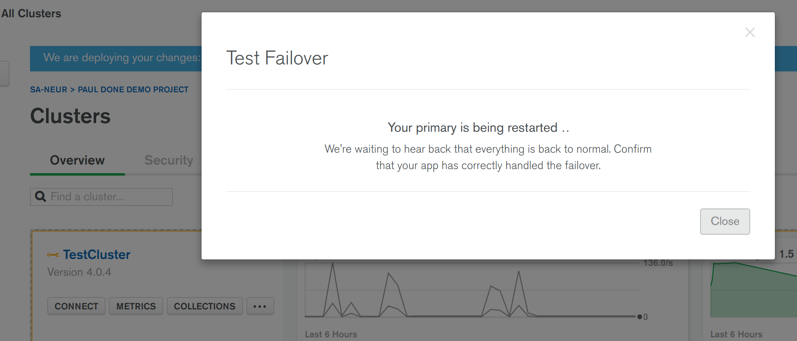
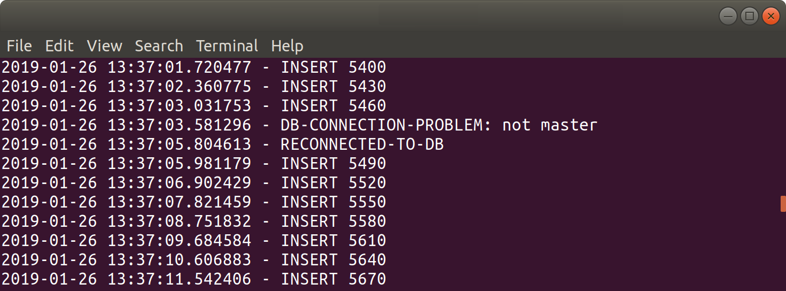

# MULTI-REGION-HA

__Ability to deploy a distributed database across 3 or more cloud-regions or data-centres, with automated failover, for maximum high availability__

__SA Maintainer__: [Paul Done](mailto:paul.done@mongodb.com) <br/>
__Time to setup__: 15 mins <br/>
__Time to execute__: 15 mins <br/>


---
## Description
This proof shows that a MongoDB Atlas database cluster can be deployed across 3 separate cloud regions, for maximum high availability, and when the primary of the cluster's replica-set fails in one region, another member of the replica set, in a different region, is automatically promoted to primary and the client application's MongoDB driver detects this primary host change and automatically fails over. This provides extra resiliency protection for a database cluster that may otherwise just be deployed across 3 availability zones in just a single cloud region, and thus be vulnerable to a complete failure of the region rather than just a failure of one of its availability zones. _Note_: Just like the _AUTO-HA_ proof, failover should occur in less than 4 seconds, even when deployed across multiple regions, rather than just across multiple availability zones in the same region.

For this proof, a Python application is run to continuously insert randomly generated documents into the database collection _test.records_. When the application detects a failure to perform an operation, it outputs the failure occurrence (with timestamp information) before trying to continue with the inserts. During the proof, the Atlas __Test Failover__ function is used to induce a host failure for the replica-set primary. Using this procedure, you can view how long the application incurs downtime before being automatically failed over to the recovered replica-set's new primary in a different region. The proof also shows how MongoDB's __retryable writes__ capability can additionally be employed, to minimise the impact of any temporary failover downtime on the client application.


---
## Setup
__1. Configure Laptop__
* Ensure MongoDB version 3.6+ is already installed your laptop, mainly to enable MongoDB command line tools to be used (no MongoDB databases will be run on the laptop for this proof)
* Ensure your laptop can run __Python 3__ and then install the MongoDB Python Driver library, __pymongo__, e.g.:
  ```bash
  pip3 install pymongo
  ```

__2. Configure Atlas Environment__
* Log-on to your [Atlas account](http://cloud.mongodb.com) (using the MongoDB SA preallocated Atlas credits system) and navigate to your SA project
* In the project's Security tab, choose to add a new user called __main_user__, and for __User Privileges__ specify __Read and write to any database__ (make a note of the password you specify)
* Create an __M10__ based 3 node replica-set, setting the __Select Multi-Region and Replication Options__ toggle to __YES__ and placing each 1 of the 3 replicas in different regions of your choice (e.g. _London, Ireland, Frankfurt_)
* In the Security tab, add a new __IP Whitelist__ for your laptop's current IP address
* In the Atlas console, for the database cluster you deployed, click the __Connect button__, select __Connect Your Application__, and for the __latest Python version__  copy the __Connection String Only__ - make a note of this MongoDB URL address to be used later


---
## Execution
* From a terminal/shell, execute the Python script to start continuously inserting records into the Atlas deployed database collection __test.records__, specifying the 3 parameters for the username (*main_user*) plus the password and hostname from the Atlas URI string you recorded earlier, e.g.:
  ```bash
  ./continuous-insert.py main_user mypsswd testcluster-abcd.mongodb.net
  ```

* View the terminal/shell output of the Python script to check it has successfully connected to the Atlas database and is reporting that records are being inserted

* From the Atlas console, select the __.../Test Failover__ option to force a failure of the replica-set primary server; the Atlas console will then show a dialog similar to the following:



* Back in the terminal/shell continuous output, keep visually scanning the output looking for when a failure is reported by the client application, from which you will be able to determine how long the client application is unable to write to the database, before being automatically failed over. _Note_: Atlas __may take a few minutes__ before it schedules the primary failure action to be invoked on the database cluster.

* Once the failure is shown in the output, terminate the running Python application (_Ctrl-C_)

* Restart the Python application again, this time, providing an additional __retry__ parameter, to instruct the application to employ MongoDB's __retryable writes__ capability, e.g.:
  ```bash
  ./continuous-insert.py main_user mypsswd testcluster-abcd.mongodb.net retry
  ```

* Again, use the Atlas console's __Test Failure__ feature, but this time notice that when Atlas reports that failover has been successfully completed, the Python application's output does not report any connection problems or service disruption.


---
## Measurement

After using the Atlas console's __Test Failure__ feature (when the _retryable writes_ feature is not employed), look for connection error data similar to the following in the Python application's console output:
  ```
  2019-01-26 13:37:01.720477 - INSERT 5400
  2019-01-26 13:37:02.360775 - INSERT 5430
  2019-01-26 13:37:03.031753 - INSERT 5460
  2019-01-26 13:37:03.581296 - DB-CONNECTION-PROBLEM: not master
  2019-01-26 13:37:05.804613 - RECONNECTED-TO-DB
  2019-01-26 13:37:05.981179 - INSERT 5490
  2019-01-26 13:37:06.902429 - INSERT 5520
  2019-01-26 13:37:07.821459 - INSERT 5550
  ```



By calculating the difference in time between the last reported _INSERT_ occurrence before the _DB-CONNECTION-PROBLEM_ event and the first reported _INSERT_ occurrence following the _RECONNECTED-TO-DB_ you can see how long the application was unable to perform insert operations against the Atlas database during failover. In this example output you can see the application incurred an outage of 2.5 seconds before automatically recovering.

