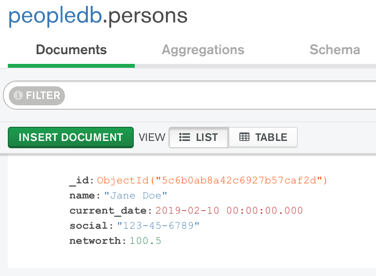

# SCHEMA

__Ability to enforce data quality rules mandating the presence of specific fields and their data types in all records__

__SA Maintainer__: [Ryan Vander Zanden](mailto:rvz@mongodb.com) <br/>
__Time to setup__: 15 mins <br/>
__Time to execute__: 15 mins <br/>


---
## Description
This proof shows how MongoDB can enforce data quality rules mandating the presence of specific fields and their data types in all records. Schema validation rules are defined using one of the following two mechanisms:

* a schema validation syntax based on a [MongoDB-specific](https://docs.mongodb.com/manual/core/schema-validation/) specification
* a schema validation syntax based on the [JSON Schema](http://json-schema.org/) specification

The JSON Schema approach is the recommended approach to use nowadays and is the syntax used for this proof. This proof defines some simple validation rules for _persons_ records, regarding field types, names and specific values, and then provides various tests to prove that the validation rules are being enforced correctly.


---
## Setup
__1. Configure Laptop__
* Ensure MongoDB version 3.6+ is already installed your laptop, mainly to enable MongoDB command line tools to be used (no MongoDB databases will be run on the laptop for this proof)
* [Download](https://www.mongodb.com/download-center/compass) and install Compass on your laptop

__2. Configure Atlas Environment__
* Log-on to your [Atlas account](http://cloud.mongodb.com) (using the MongoDB SA preallocated Atlas credits system) and navigate to your SA project
* In the project's Security tab, choose to add a new user called __main_user__, and for __User Privileges__ specify __Atlas admin__ (make a note of the password you specify)
* Create an __M10__ based 3 node replica-set in a single cloud provider region of your choice with default settings
* In the Security tab, add a new __IP Whitelist__ for your laptop's current IP address
* For the deployed database cluster, in the Atlas console, click the __Connect button__, select __Connect With MongoDB Compass__ and click the __Copy__ button to copy the connection string
* Launch Compass and when prompted select to use the __MongoDB Connection String__ detected from the clipboard, fill in the __Password__ field and then click the __Connect__ button

__3. Define The Schema Validation Rules For A Collection Using Compass__
* In Compass choose to __Create Database__ and define a new database called __SCHEMA__ and a new collection called __persons__ and then navigate to this new database collection
* Press __Validation__ tab 
* For the dropdown options, select __Error__ from the _Validation Action_ dropdown and select __Strict__ from the _Validation Level_ dropdown
* Paste the following JSON in the editor window, to mandate that when a new person record is added, the person's _networth_ must be greater than _100_ and the field _current\_date_ must be a _date_ [type](https://docs.mongodb.com/manual/reference/bson-types/):
  ```json
  {
    "ssn": {
      "$exists": false
    },
    "networth": {
      "$gt": 100
    },
    "current_date": {
      "$type": 9
    }
  }
  ```

* Press the _Update_ button to save the schema rules and then also press the _View As Rule Builder_ button to show what the added rules look like in a more graphical view


---
## Execution

_Note: Ignore any preexisting documents in the collection that may also be for the person 'Jane Doe'_

### TEST 1: Test the validation rules with a new document
* Using Compass, for the _SCHEMA.persons_ collection, navigate to the __Documents__ tab, press the __ADD DATA__ button, select the __Insert Document__ option, within popup window select the other view (_per field_ bullet-point entries) and enter the following elements without changing default data types before pressing the __INSERT__ button:
  ```
      name:"Jane Doe"  
      current_date:"2019-02-10"  
      ssn:"123-45-6789"  
      networth: "99.50"  
  ```

&nbsp;&nbsp;&nbsp;__RESULT 1__: When attempting to insert the document, Compass should show the error __Document failed validation__ - this is because the document fails most of the rules, especially due to the fact that some of the data types should not be strings

### TEST 2: Test the validation rules with explicit data types
* Whilst the current invalid document is showing, make the changes inline to the document to match the following, ensuring you specify the data types as shown, before pressing the __INSERT__ button again:
  ```
      name:"Jane Doe"                       string  
      current_date:"2019-02-10"             date  
      ssn:"123-45-6789"                     string  
      networth: "99.50"                     double  
  ```
  
&nbsp;&nbsp;&nbsp;__RESULT 2__: When attempting to insert the document, Compass should show the error __Document failed validation__ - this is because the document fails some of the rules, especially due to the fact that the _networth_ field's value is not greater than _100_
 
### TEST 3: Test the validation rules with corrected data values
* Whilst the current invalid document is showing, make the changes inline to the document to match the following, altering the value of the _networth_ field as shown, before pressing the __INSERT__ button again:
  ```
      name:"Jane Doe"                       string  
      current_date:"2019-02-10"             date  
      ssn:"123-45-6789"                     string  
      networth: "100.50"                    double  
  ```

&nbsp;&nbsp;&nbsp;__RESULT 3__: When attempting to insert the document, Compass should show the error __Document failed validation__ - this is because the document fails one of remaining rules, due to the fact that the _ssn_ field's name is invalid (one of the rules states a field with this name should not exist)
 
### TEST 4: Test the validation rules with corrected field names
* Whilst the current invalid document is showing, make the changes inline to the document to match the following, altering the name of the _ssn_ field to _social_ as shown:
  ```
      name:"Jane Doe"                       string  
      current_date:"2019-02-10"             date  
      social:"123-45-6789"                  string  
      networth"100.50"                      double  
  ```

* Press Insert button

&nbsp;&nbsp;&nbsp;__RESULT 4__: This time the new document is accepted and saved because it is valid, passing all the validation rules that were defined for it


---
## Measurement
The document should be accepted by the MongoDB database as valid, once the content matches that shown in the screenshot below:



