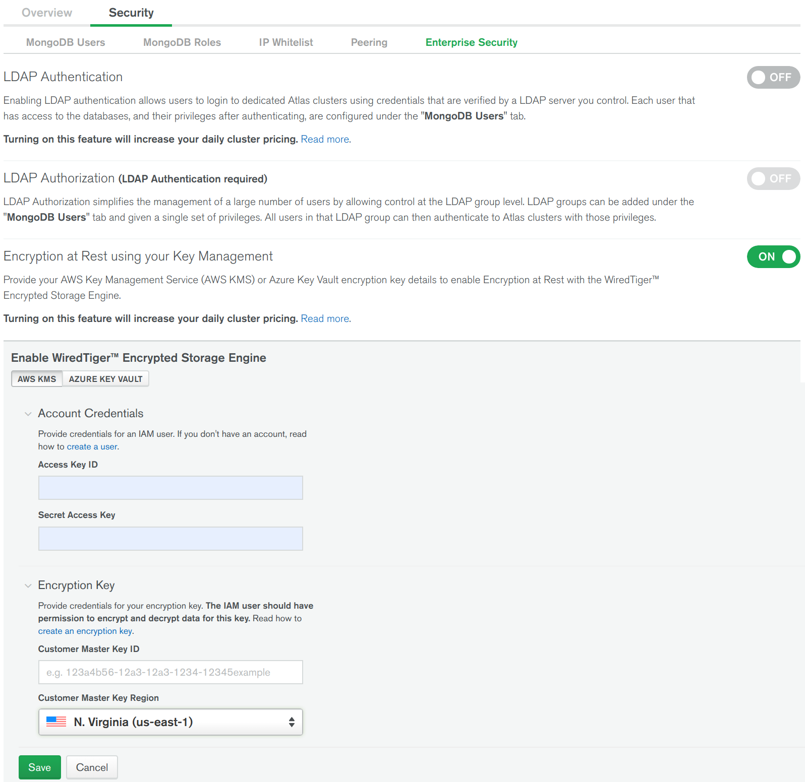
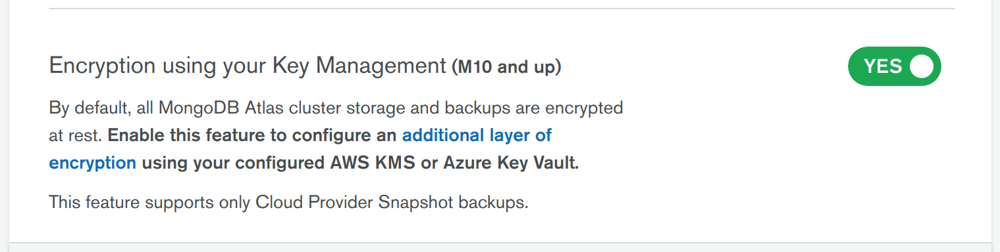
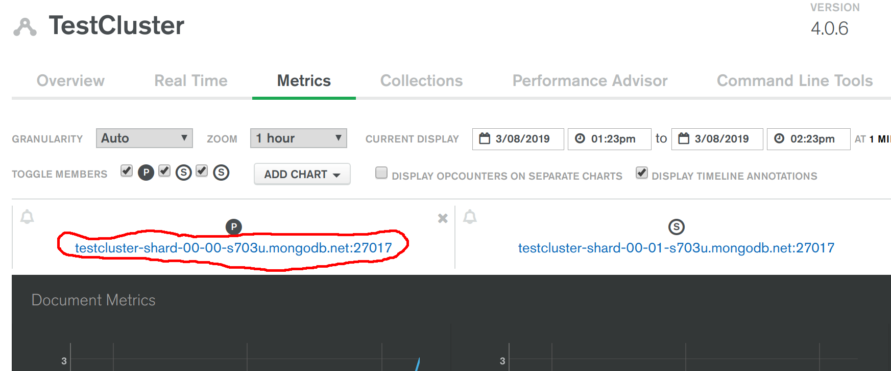

# ENCRYPTION

__Ability to provide end-to-end encryption for sensitive data (in-flight & at-rest)__

__SA Maintainer__: [Mayur Nagarsheth](mailto:mayur.nagarsheth@mongodb.com) <br/>
__Time to setup__: 30 mins <br/>
__Time to execute__: 30 mins <br/>


---
## Description

This proof shows how a MongoDB database can encrypt data both at rest (stored in data files) and in-flight (over networks) in Atlas. 

For encryption of data at rest, the proof focuses on using a self-managed version of MongoDB to show that business data can be extracted from the storage engine's data files, when the database has not been enabled with the encrypted storage engine, but when configured with the encrypted storage engine enabled, no business data can be extracted from the data files. It is not possible to allow users access to a database's data files when run by Atlas, because Atlas is a Database-as-a-Service, so no such concept of accessing raw data files \[rightly\] exists. Therefore, after proving encryption at rest with a standalone MongoDB database, we will then just show the Atlas configuration tooling for enabling encrypted storage.

For encryption of in-flight / over-the-wire network data between Atlas clusters and clients, we simply use the [OpenSSL](https://www.openssl.org/) standard client tool to connect to a remote secured Atlas cluster and inspect the output of _openssl_, which will indicate that the server is configured with [TLS](https://en.wikipedia.org/wiki/Transport_Layer_Security) and is presenting a server certificate to the client.


---
## Setup
__1. Configure Atlas Environment__
* Log-on to your [Atlas account](http://cloud.mongodb.com) (using the MongoDB SA preallocated Atlas credits system) and navigate to your SA project
* In the project's Security tab, choose to add a new user called __main_user__, and for __User Privileges__ specify __Read and write to any database__ (make a note of the password you specify)
* Create an __M10__ based 3 node replica-set in a single cloud provider region of your choice with default settings
* In the Security tab, add a new __IP Whitelist__ for your laptop's current IP address

__2. Configure MongoDB On Local Laptop__
* Install [MongoDB Enterprise](https://www.mongodb.com/download-center/enterprise) version 3.6+ on your laptop (important: __the Community version CANNOT be used for this proof__)
* Create the default directory for running _mongod_ locally (also ensure the OS user has the rights to access the directory):
  `mkdir -p /data/db` or MacOS Catalina `mkdir -p ~/data/db` because most of the MacOS main partitions are read only. 

---
## Execution

__TEST 1. Prove Use of Encryption At Rest With MongoDB Self-Managed__
* From a terminal/shell, start _mongod_ running locally with its default settings (the database will start without using encrypted storage):
  
  `mongod` or MacOS Catalina `mongod --dbpath ~/data/db`
  
* From a new terminal/shell, run the Mongo Shell against the local database and create a couple of sample records in the database collection _test.persons_, then shut down the server to ensure the changes are written to normal WiredTiger data files on disk (rather than just being persisted in the journal on disk):
  ```js
  mongo
  use test
  db.persons.insert({name: "Reginald", location: "London"})
  db.persons.insert({name: "Alice", location: "New York"})
  db.persons.find()
  // Should show result similar to following:
  // { "_id" : ObjectId("5c82610872cc525f266505e3"), "name" : "Reginald", "location" : "London" }
  // { "_id" : ObjectId("5c82610872cc525f266505e4"), "name" : "Alice", "location" : "New York" }
  use admin
  db.shutdownServer()
  exit
  ```

* From a terminal/shell, run the Unix _strings_ command to inspect the contents of the WiredTiger collection files, showing the _printable characters (non-binary) that these files contain - look in the result output for strings such as _Reginald_, _Alice_, _London_, _New York_, __proving that the database's data has NOT been encrypted__:
  ```bash
  find /data/db -name "collection*.wt" | xargs strings
  ```

* Optionally you can also look for specific strings, e.g. _New York_, by running a command similar to:
  ```bash
  find /data/db -name "collection*.wt" | xargs strings | grep "New York"
  ```

* Now delete all the existing data (the mongod's WiredTiger data files):
  ```bash
  rm -rf /data/db/*
  ```

* Generate a base64 encoded keyfile with the required permissions ready to be used by WiredTiger as the _master key_ for use with WiredTiger's process for encrypting data files:
  ```bash
  openssl rand -base64 32 > /data/db/mongodb-keyfile
  chmod 600 /data/db/mongodb-keyfile
  ```
&nbsp;&nbsp;NOTE: For production systems, using a [Key Manager](https://docs.mongodb.com/manual/tutorial/configure-encryption/#key-manager) to secure key access, via the KMIP protocol, is strongly recommended (Atlas uses such a secure key management service for this reason)

* From the existing terminal/shell, that was used to previously run _mongod_, start the _mongod_ process again, but this time with the parameters telling WiredTiger to encrypt its data files and the master key to use:
  ```bash
  mongod --enableEncryption --encryptionKeyFile /data/db/mongodb-keyfile
  ```

* From a different terminal/shell, run the Mongo Shell again, creating the sample records in the database collection _test.persons_ and then shut down the server again, to ensure the changes are written to disk (this time the data files should be encrypted):
  ```js
  mongo
  use test
  db.persons.insert({name: "Reginald", location: "London"})
  db.persons.insert({name: "Alice", location: "New York"})
  db.persons.find()
  // Should show result similar to following:
  // { "_id" : ObjectId("5c82610872cc525f266505e3"), "name" : "Reginald", "location" : "London" }
  // { "_id" : ObjectId("5c82610872cc525f266505e4"), "name" : "Alice", "location" : "New York" }
  use admin
  db.shutdownServer()
  exit
  ```

* From a terminal/shell, run the test again to view the textual content of the WiredTiger collection files - this time the results should NOT contain raw and visible data such as _Reginald_, _Alice_, _London_, _New York_, __proving that the databases' data files HAVE been encrypted__:
  ```bash
  find /data/db -name "collection*.wt" | xargs strings
  find /data/db -name "collection*.wt" | xargs strings | grep "Reginald"
  find /data/db -name "collection*.wt" | xargs strings | grep "New York"
  ```

__DEMO. Show Encryption At Rest Option Available in Atlas__


Note: We are not actually using KMS details below in this POV. Screenshot is provided to showcase customers and prove that Atlas provides same ecnryption that this POV demonstrated on your remote machine. 

When configuring Atlas to use the WiredTiger encrypted storage engine, we can't access the underlying files to prove they are encrypted. Users don't have access to the underlying cluster data files, because Atlas is a managed service which maximises the security of all aspects of a deployed cluster. However, it is useful to show where the encrypted storage engine is configured, in the Atlas console...

When configuring the WiredTiger Encrypted Storage Engine via the Atlas console, users first navigate to the __Security | Advanced__ tab and then provide appropriate cloud provider credentials for accessing the cloud provider's key management service (e.g. AWS Key Management Service, Azure Key Vault), as shown in the screenshot below:



Then, the user selects the __Edit Configuration__ option for the Atlas cluster and enables the encrypted storage engine option, as shown in the screenshot below:


   

__TEST 2. Prove Use of Encryption Over The Wire in Atlas__

In the Atlas Console, click the __Metrics__ button for the deployed cluster and make a copy of the current primary node's full public DNS name and port (e.g. "testcluster-shard-00-00-abcde.mongodb.net:27017"), similar to the server address shown in screenshot below:



From a terminal/shell, issue the following __openssl__ command to connect to the remote Atlas cluster member and print out whether the remote service is using TLS/SSL, its particular version and also details about the server certificate associated with the Atlas cluster member (replace the server address with the one you just copied in the previous step):
  ```bash
  openssl s_client -connect testcluster-shard-00-00-abcde.mongodb.net:27017 -showcerts -state
  ```

If the Atlas server is configured to use TLS, the output of the _openssl_ command should indicate this and provide various details about how the network traffic to/from this server is secured, in an output similar to that shown below:
  ```
    CONNECTED(00000003)
    SSL_connect:before SSL initialization
    SSL_connect:SSLv3/TLS write client hello
    SSL_connect:SSLv3/TLS write client hello
    SSL_connect:SSLv3/TLS read server hello
    depth=2 C = US, O = DigiCert Inc, OU = www.digicert.com, CN = DigiCert Global Root CA
    verify return:1
    depth=1 C = US, O = DigiCert Inc, CN = DigiCert SHA2 Secure Server CA
    verify return:1
    depth=0 C = US, ST = New York, L = New York, O = "MongoDB, Inc.", OU = Cloud SRE, CN = *.mongodb.net
    verify return:1
    SSL_connect:SSLv3/TLS read server certificate
    SSL_connect:SSLv3/TLS read server certificate request
    SSL_connect:SSLv3/TLS read server done
    SSL_connect:SSLv3/TLS write client certificate
    SSL_connect:SSLv3/TLS write client key exchange
    SSL_connect:SSLv3/TLS write change cipher spec
    SSL_connect:SSLv3/TLS write finished
    SSL_connect:SSLv3/TLS write finished
    SSL_connect:SSLv3/TLS read server session ticket
    SSL_connect:SSLv3/TLS read change cipher spec
    SSL_connect:SSLv3/TLS read finished
    ---
    Certificate chain
     0 s:/C=US/ST=New York/L=New York/O=MongoDB, Inc./OU=Cloud SRE/CN=*.mongodb.net
       i:/C=US/O=DigiCert Inc/CN=DigiCert SHA2 Secure Server CA
    -----BEGIN CERTIFICATE-----
    MIIHLDCCBhSgAwIBAgIQDgXZ9ewLO0DAKLDD7uJiXjANBgkqhkiG9w0BAQsFADBN
    -----END CERTIFICATE-----
     1 s:/C=US/O=DigiCert Inc/CN=DigiCert SHA2 Secure Server CA
       i:/C=US/O=DigiCert Inc/OU=www.digicert.com/CN=DigiCert Global Root CA
    -----BEGIN CERTIFICATE-----
    MIIElDCCA3ygAwIBAgIQAf2j627KdciIQ4tyS8+8kTANBgkqhkiG9w0BAQsFADBh
    -----END CERTIFICATE-----
    ---
    Server certificate
    subject=/C=US/ST=New York/L=New York/O=MongoDB, Inc./OU=Cloud SRE/CN=*.mongodb.net
    issuer=/C=US/O=DigiCert Inc/CN=DigiCert SHA2 Secure Server CA
    ---
    Acceptable client certificate CA names
    /C=SE/O=AddTrust AB/OU=AddTrust External TTP Network/CN=AddTrust External CA Root
    /C=US/O=DigiCert Inc/OU=www.digicert.com/CN=DigiCert Global Root CA
    /O=Digital Signature Trust Co./CN=DST Root CA X3
    Client Certificate Types: RSA sign, DSA sign, ECDSA sign
    Requested Signature Algorithms: RSA+SHA512:DSA+SHA512:ECDSA+SHA512:RSA+SHA384:DSA+SHA384:ECDSA+SHA384:RSA+SHA256:DSA+SHA256:ECDSA+SHA256:RSA+SHA224:DSA+SHA224:ECDSA+SHA224:RSA+SHA1:DSA+SHA1:ECDSA+SHA1
    Shared Requested Signature Algorithms: RSA+SHA512:DSA+SHA512:ECDSA+SHA512:RSA+SHA384:DSA+SHA384:ECDSA+SHA384:RSA+SHA256:DSA+SHA256:ECDSA+SHA256:RSA+SHA224:DSA+SHA224:ECDSA+SHA224:RSA+SHA1:DSA+SHA1:ECDSA+SHA1
    ---
    SSL handshake has read 3652 bytes and written 506 bytes
    Verification: OK
    ---
    New, TLSv1.2, Cipher is AES256-GCM-SHA384
    Server public key is 2048 bit
    Secure Renegotiation IS supported
  ```

This output shows that the Atlas cluster is using TLS 1.2 for network communication with clients and is presenting a server certificate. 

If the server was NOT using TLS/SSL, the output of the _openssl_ command would have appeared similar to the following: 
  ```
    CONNECTED(00000003)
    SSL_connect:before SSL initialization
    SSL_connect:SSLv3/TLS write client hello
    SSL_connect:error in SSLv3/TLS write client hello
    write:errno=0
    ---
    no peer certificate available
    ---
    No client certificate CA names sent
    ---
    New, (NONE), Cipher is (NONE)
    Secure Renegotiation IS NOT supported
  ```
 


---
## Measurement

Upon completion of the tests in the _Execution_ section, the tests should have exhibited the following results:

* __TEST 1__: The MongoDB database's storage files contain encrypted data only, which cannot be read without the appropriate security keys
* __TEST 2__: The Atlas cluster is be communicating with clients over TLS version 1.2, and presenting its server certificate to clients

