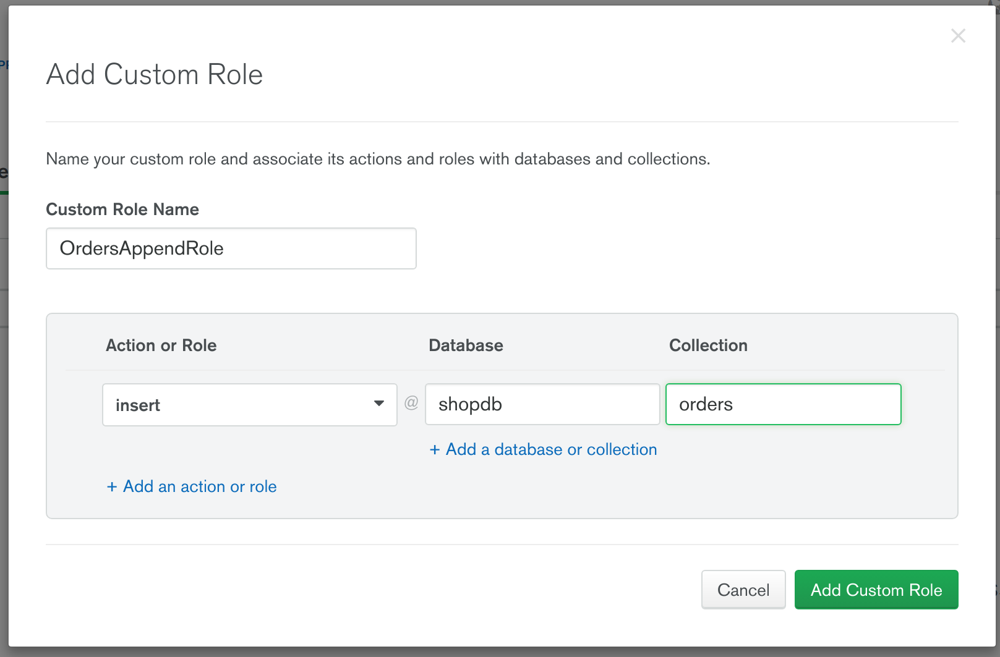
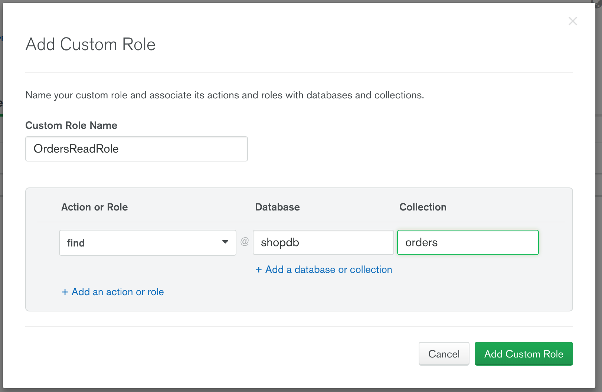
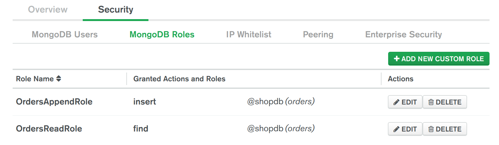
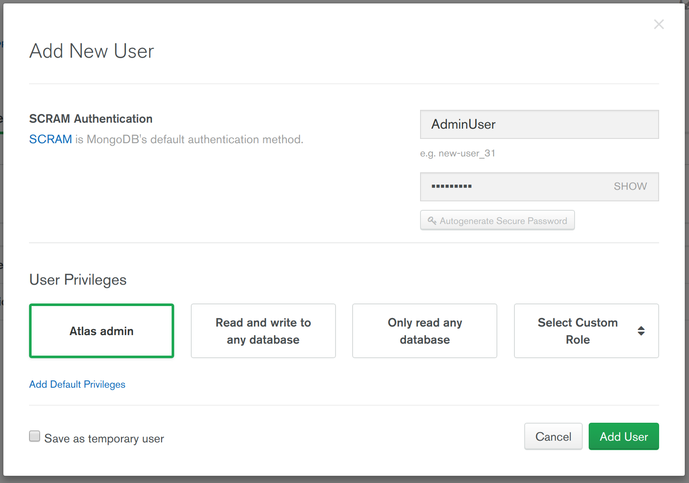
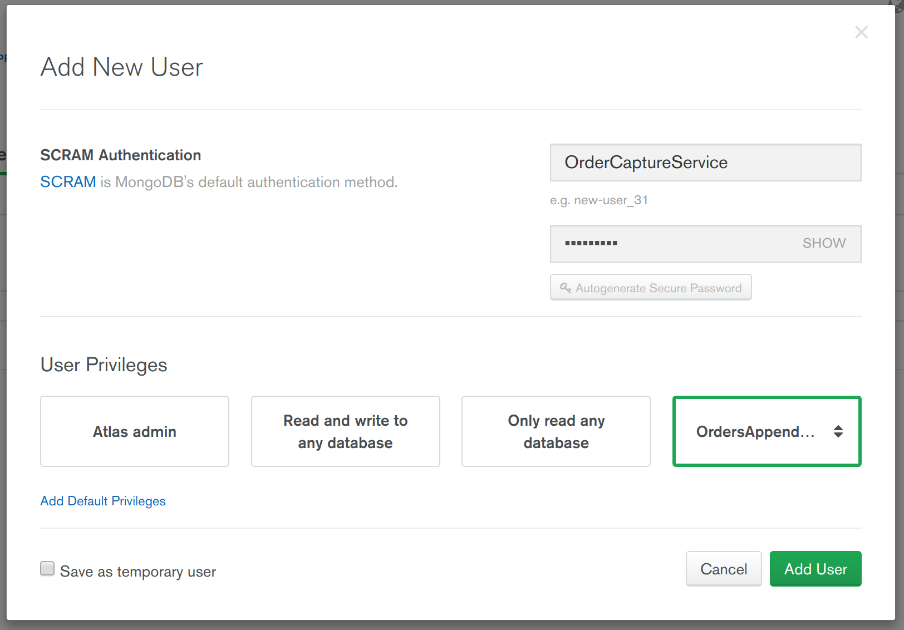
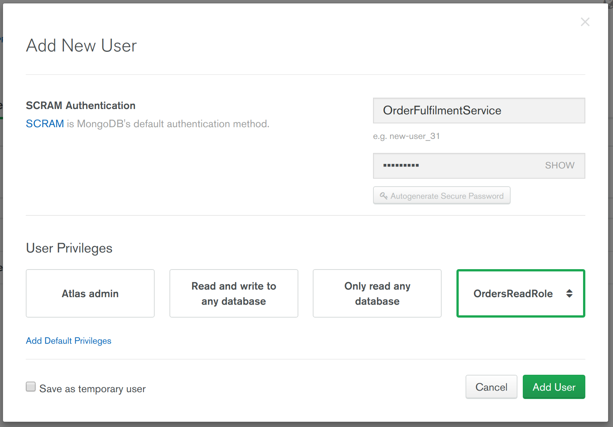
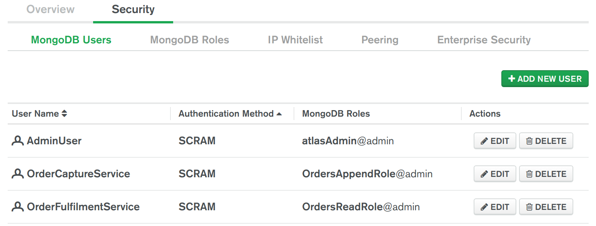

# RBAC

__Ability to apply Role Based Access Controls (RBAC) to enforce which users can and can’t access specific sets of data__

__SA Maintainer__: [Jeegar Ghodasara](mailto:jeegar.ghodasara@mongodb.com) <br/>
__Time to setup__: 15 mins <br/>
__Time to execute__: 30 mins <br/>


---
## Description

This proof shows how MongoDB's Role Based Access Control (RBAC) capabilities can be leveraged to govern and manage the access to a MongoDB database and its collections, based on the functional roles of users and applications within an organization. A MongoDB role grants privileges to perform specific actions on a resource. 

In this proof we will deploy an Atlas cluster which automatically enforces Authentication and then we will define Authorization (RBAC) rules for three specific users for an example eCommerce use case where one microservice is able to take (create) orders but not process (read) them, one microservice is able to process (read) orders but not take (create) orders, and one user is an administrator who has full privileges to perform any operations required on the database.


---
## Setup
__1. Configure Laptop__
* Ensure MongoDB version 3.6+ is already installed your laptop, mainly to enable the Mongo Shell to be used (no MongoDB databases will be run on the laptop for this proof)

__2. Configure Atlas Environment__
* Log-on to your [Atlas account](http://cloud.mongodb.com) (using the MongoDB SA preallocated Atlas credits system) and navigate to your SA project
* In the project's Security tab, add a new __IP Whitelist__ and select to __Use Current IP Address__ to ensure the Mongo Shell, which will run on your laptop later, will be allowed to connect to the cluster
* Create an __M10__ based 3 node replica-set in a single AWS region of your choice with default storage settings
* In the Atlas console, for the database cluster you deployed, click the __Connect button__, select __Connect with the Mongo Shell__, and in the __Run your connection string in your command line__ section copy the connection command line - make a note of this connection command line to be used later

__3. Configure Two New Roles (One For Collection Append-only & One For Collection Read-only)__
* Via the Atlas console's __Security | MongoDB Roles__ create a new role called __OrdersAppendRole__ which will only allow users with this role to insert new records into the database.collection __shopdb.orders__ (users of this role will be unable to read the orders they write or write to any other collection), as shown in the screenshot below:



* Via the Atlas console's __Security | MongoDB Roles__ create a new role called __OrdersReadRole__ which will only allow users with this role to read existing records from the database.collection __shopdb.orders__ (users of this role will be unable to insert or update the orders of this collection and will be unable to access any other collection), as shown in the screenshot below:



&nbsp;&nbsp; The roles summary pages should show the two roles:



__4. Configure Three New Users (One For Administration, One For An Order Capture Microservice & One For An Order Fulfilment Microservice)__
* Via the Atlas console's __Security | MongoDB Users__ create a new user called __AdminUser__ and specify the User Privilege __Atlas admin__ (this admin user will be able to perform all administrative tasks including full access to all database collections), as shown in the screenshot below:



* Via the Atlas console's __Security | MongoDB Users__ create a new user called __OrderCaptureService__ and for User Privileges, choose __Select Custom Role__ and select the role __OrdersAppendRole__ you created earlier (this user will be used as the identity of the order capture microservice and will only be able to insert records into the shopdb.orders collection), as shown in the screenshot below:



* Via the Atlas console's __Security | MongoDB Users__ create a new user called __OrderFulfilmentService__ and for User Privileges, choose __Select Custom Role__ and select the role __OrdersReadRole__ you created earlier (this user will be used as the identity of the order fulfilment microservice and will only be able to read records in the shopdb.orders collection), as shown in the screenshot below:



&nbsp;&nbsp; The users summary pages should show the three users:




---
## Execution
__1. Admin Role Test__
* From a __new__ terminal/shell, execute the Mongo Shell connecting to the deployed Atlas cluster as the __AdminUser__ (change the URL to SRV connection string you captured earlier and specify the password when prompted):
  ```bash
  mongo "mongodb+srv://testcluster-abcde.mongodb.net/test" --username AdminUser
  ```
* In the Shell prove that the admin user has the rights to insert and read any records for any database collection and specifically can create the database.collection __shopdb.orders__:
  ```js
  use testdb
  db.testcoll.insert({a: 1})
  db.testcoll.find()
  // Above command should have result similar to:
  // { "_id" : ObjectId("5c83b27c84a3099cdb8cfa12"), "a" : 1 }

  use shopdb
  show collections
  // Command above should show no collections in the result

  db.createCollection('orders')
  show collections
  // Command above should have result similar to:
  // orders
  ```

__2. Collection Append-only Role Test__
* From a __new__ terminal/shell, execute the Mongo Shell connecting to the deployed Atlas cluster as the __OrderCaptureService__ simulating a microservice connecting to the database (change the URL to SRV connection string you captured earlier and specify the password when prompted):
  ```bash
  mongo "mongodb+srv://testcluster-abcde.mongodb.net/test" --username OrderCaptureService
  ```
* In the Shell prove that the _OrderCaptureService_ user has the rights to insert records into the database.collection __shopdb.orders__ but can't read any of the records (even the ones it has just written):
  ```js
  use shopdb
  show collections
  // Command above should have result similar to:
  // orders

  db.orders.find()
  // Command above should result in an unauthorized error similar to the following:
  // Error: error: {
  //   ...
  //   "codeName" : "Unauthorized",
  //   ...
  // }

  db.orders.insert({order_id: 12345, account_id: 888999, product_id: "WIZZY_WIDGET_KJ_8322", qty: 2})
  // Command above should SUCCESSFULLY EXECUTE

  db.orders.find({order_id: 12345})
  // Command above should result in an unauthorized error similar to the following:
  // Error: error: {
  //   ...
  //   "codeName" : "Unauthorized",
  //   ...
  // }
  ```

__3. Collection Read-only Role Test__
* From a __new__ terminal/shell, execute the Mongo Shell connecting to the deployed Atlas cluster as the __OrderFulfilmentService__ simulating a microservice connecting to the database (change the URL to SRV connection string you captured earlier and specify the password when prompted):
  ```bash
  mongo "mongodb+srv://testcluster-abcde.mongodb.net/test" --username OrderFulfilmentService
  ```
* In the Shell prove that the _OrderFulfilmentService_ user has the rights to read from the database.collection __shopdb.orders__ but can't write new records:
  ```js
  use shopdb
  show collections
  // Command above should have result similar to:
  // orders

  db.orders.find()
  // Above command should SUCCESSFULLY EXECUTE with a result similar to:
  // { "_id" : ObjectId("5c83c52290f34f9f391cb9bb"), "order_id" : 12345, "account_id" : 888999, "product_id" : "WIZZY_WIDGET_KJ_8322", "qty" : 2 }

  db.orders.insert({order_id: 67890, account_id: 555666, product_id: "GNARLY_NAIL_RT_4367", qty: 1})
  // Command above should result in an unauthorized error similar to the following:
  // WriteCommandError({
  //   ...
  //   "codeName" : "Unauthorized",
  //   ...
  // })
  ```

---
## Measurement

Upon completion of the tests in the _Execution_ section, the tests should have exhibited the following results:

* __Admin Role Test__: The authenticated user with _admin_ privileges should have been able to read and write to any database
* __Collection Append-only Role Test__: The authenticated user with _append-only_ privileges on the _shopdb.orders_ collection should have been able to write to the collection but not read from the collection
* __Collection Read-only Role Test__: The authenticated user with _read-only_ privileges on the _shopdb.orders_ collection should have been able to read from the collection but not write to the collection


