# LDAP

__Ability to natively integrate MongoDB with an LDAP/Active-Directory for centralised authentication & access control__

__SA Maintainer__: [Ronán Bohan](mailto:ronan@mongodb.com) <br/>
__Time to setup__: 90 mins <br/>
__Time to execute__: 15 mins <br/>


---
## Description

This proof shows how a MongoDB Atlas cluster can integrate with an LDAP service to support authentication and authorisation.

We will configure a MongoDB Atlas project instance to authenticate and authorise users based on their LDAP group membership (optional instructions to configure a self-managed MongoDB Enterprise Server are also provided via a link in this readme). For users who do not have an existing LDAP server ready to test and accessible via Atlas, we will also provide instructions on how to build a standalone LDAP server on an AWS instance.

Specifically in this proof we will show how two users (Jane and John), who are members of different LDAP groups (Jane is both an admin and a regular user, while John is just a regular user), can be granted access to a MongoDB cluster with different rights based on their LDAP group membership, without either user having to be explicitly defined in the respective MongoDB cluster. We will also show how a nonexistent user (Joe) will not be able to gain access to the cluster. This allows MongoDB Admins to manage user rights in just one place, namely via the LDAP server.

**Notes**:

1. All of the instructions are simple copy and paste operations, with the occasional requirement to input some details, such as a (bind) password. **To complete the prep for this PoV you will need about 30 minutes**. This includes the time to create both the Atlas cluster and the AWS instance, to install an LDAPS server and to configure the Atlas project to use LDAP authentication & authorization.
2. By default following these instructions will build a **public facing** LDAPS server (i.e., accessible to the internet). If you wish to lock this down you can follow the (optional!) *advanced* instructions to connect over a VPC peer. This complicates the proof and is only possible if there are available VPC resources in your AWS account.
3. Also, don't forget to disable LDAP auth and terminate the AWS instances once the proof is complete to avoid incurring additional costs (and a potential security breach!)

#### Some terminology

An LDAP service stores its information in a tree like structure. Each node in the tree has a name, in the form of a key-value pair ('key=value'), which we refer to as the 'Relative Distinguished Name', or `RDN`. Walking from a given node to the root of the tree, appending the relative distinguished names with commas as separators, provides what is known as the full Distinguished Name or simply `DN`. Therefore, much like a FQDN for an internet server, the `DN` consists of various components and has the following form:

```
key1=val1,key2=val2,key3=val3,...
```

The DN uniquely describes the location of a node in the LDAP tree. The RDN can uniquely identify the node if the parent context is known (some RDN's are unique by default for a given LDAP server implementation).

Each node also contains a set of key-value pairs, known as `attributes`, which are based on the entity being stored and its type. These attributes are the properties of that entity. Most attributes are explicitly defined, but some may be derived by the LDAP server depending on how it is configured.

##### LDAP Query Format

As a quick aside, LDAP queries are queries against the LDAP Server to find nodes in the tree and/or the properties of those nodes. These queries are used by tools such as `ldapQuery` or MongoDB configuration settings such as `userToDNMapping` or `queryTemplate` and are written in the following form:

```
baseDN ? attributes ? <type> ? filter
```

  * The `baseDN` specifies the location in the LDAP tree where the search is to start (default: root of the LDAP tree).
  * The `attributes` are the attributes we wish to query for (either explict or derived), e.g. `cn`, `memberOf`, etc (default: all explicit attributes).
  * The `<type>` (default: `base`) can be one of:
    *  `sub`: a sub-tree, recursive search.
    *  `base`: search only the baseDN node.
    *  `one`: search only the immediate children of the baseDN node.
  * The `filter` restricts the search to nodes which contain a matching attribute (default: no filter).

  Note that all sections can be blank, such that `???` is a valid query (this query performs a `base` search from the root of the tree, searching for all (explicit) attributes and performs no filtering.


---
## Setup

### 1. Configure AWS and Local Environments

#### AWS environment

This proof will assume you have an existing AWS environment containing a fully configured LDAP server. _Step 2_ below will provide instructions on how to create a suitable LDAP server in AWS if required. If creating a completely new AWS environment use the MongoDB 'Solution Architects' [AWS pre-existing account](https://wiki.corp.mongodb.com/display/DEVOPSP/How-To%3A+Access+AWS+Accounts). Also for the [Atlas account](http://cloud.mongodb.com) use the MongoDB SA preallocated Atlas credits system and then choose either an existing Atlas project or create a new project to work with.

**Advanced: VPC Peering (Optional!)**

The *default* setup in this PoV will utilize an internet facing LDAPS server. To build a more secure configuration you may (optionally!) choose to connect to your LDAPS server over a peered VPC. See the docs on how to [Set up a Network Peering Connection](https://docs.atlas.mongodb.com/security-vpc-peering/) for details. In brief you will need:

 * A __VPC__ configured with an __internal CIDR block range__ (e.g. 10.0.0.0/16) - this range should __not overlap__ with the CIDR block range you will configure for Atlas later when setting up VPC peering (e.g. for Atlas you could use 172.31.248.0/21)
 * The VPC has its __DNS hostnames__ property __enabled__
 * The VPC contains a __Subnet__ assigned to some or all of the VPC's CIDR block range (e.g. to 10.0.0.0/16)
 * The Subnet has its __Enable auto-assign public IPv4 address__ property __enabled__
 * The VPC has a __Internet Gateway__ created and associated with it
 * The VPC has a __Route Table__ created and associated with it
 * The Route Table should have an entry __0.0.0.0/0__ added and associated with the Internet Gateway

#### Install Compass

[Download](https://www.mongodb.com/download-center/compass) and install Compass on your laptop.

### 2. Locate or Create LDAP Server

The most challenging part of this PoV proof is setting up an LDAP/LDAPS server that's accessible to MongoDB Atlas, as Atlas only supports LDAPS (LDAP over TLS on port 636).

If you don't have access to a suitable server, and because it's quite involved, follow these [instructions](SetupLDAP.md) in order to create an OpenLDAP server running in AWS.

This server supports both LDAP on port 389 and LDAPS on port 636.

The server provides a 'Base DN' as follows:
```
dc=ldap,dc=mongodb,dc=local
```

It also provides an admin user which can be used as the 'bind' user. (A bind user is just a user who can connect to the LDAP server and issue queries and/or update the LDAP tree). The DN for this user is as follows:
```
cn=admin,dc=ldap,dc=mongodb,dc=local
```

We will assume this setup in the proof that follows. If you are using your own LDAP/LDAPS server you will need to adjust these and other properties based on your specific environment.


### 3. Create Users and Groups in LDAP Server

For the purposes of this proof we'll create the following LDAP structure in the scripts later:

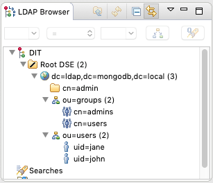

As per the above the base DN (`dc=ldap,dc=mongodb,dc=local`) and the admin user (`cn=admin,dc=ldap,dc=mongodb,dc=local`) already exist, so all that's left to create is:

  * Two organisational structures (effectively folders), each as an `organisationalUnit`:
    * `ou=users,dc=ldap,dc=mongodb,dc=local`
    * `ou=groups,dc=ldap,dc=mongodb,dc=local`
  * Two distinct users under `ou=users`, each as an `inetOrgPerson`:
    * `uid=john,ou=users,dc=ldap,dc=mongodb,dc=local`
    * `uid=jane,ou=users,dc=ldap,dc=mongodb,dc=local`
  * Two distinct groups under `ou=groups`, each as a `groupOfNames`:
    * `cn=admins,ou=groups,dc=ldap,dc=mongodb,dc=local`
    * `cn=users,ou=groups,dc=ldap,dc=mongodb,dc=local`

**Note**: For each entry you will need to supply attributes such as 'common name' `cn`, 'surname' `sn`, etc. Fill these in as appropriate if you're creating this yourself. The one important aspect for this proof is to add the users into specific groups. In particular we will add:

  * `uid=john` as a `member` of the `cn=users` group.
  * `uid=jane` as a `member` of the `cn=users` group and the `cn=admins` group.

We'll be using this to represent the fact that John is a standard user, while Jane is both a standard user and an admin and she will therefore have elevated priviliges.

**Note**: For this proof we will rely on derived attributes, meaning that we just need to update the specific groups with new attributes indicating which user is a member, but the user entities themselves do not need to be updated in any way.

#### Create LDAP hierarchy

To create the entries and populate the `member` attributes as outlined above, follow the instructions [on this page](populateLDAP.md).

To view these entries (or to create them manually) you can connect to the LDAP server from your laptop, using for example [ApacheDirectoryStudio](https://directory.apache.org/studio/). Be sure to bind as the 'admin' user (`cn=admin,dc=ldap,dc=mongodb,dc=local`) using 'Simple Authentication' in order to be able to make modifications. A full description of all the steps required is beyond the scope of this proof.


### 4. Configure MongoDB Atlas for LDAP authN and authZ

_Note: These instructions focus on configuring an Atlas cluster with LDAPS. However, optional instructions are also provided for configuring a self-managed MongoDB Enterprise deployment for use with an LDAP/LDAPS server. You can find these optional instructions [on this page](enterpriseServerSetup.md)_.

#### Create Atlas cluster

In an empty Atlas project, create a single region __M10__ based 3 node replica-set with default settings. Use the same region as your LDAP server.

**Advanced: VPC Peering (Optional!)**

Configure __VPC peering__ for the Atlas project to peer with the AWS VPC that hosts your LDAP server by following the [Atlas online instructions](https://docs.atlas.mongodb.com/security-vpc-peering/) and a [useful online tutorial](https://www.mongodb.com/blog/post/introducing-vpc-peering-for-mongodb-atlas) - the tutorial assumes you have the AWS LDAP's VPC assigned to the CIDR block 10.0.0.0/16 and the Atlas project will be assigned a CIDR block of 172.31.248.0/21. Note: To view your __AWS Account Number__, in the top right-hand part of the AWS console, select the dropdown _Support_ and then selection the option _Support Center_.

If you haven't already done so:

  * Add the Atlas CIDR block for the peered VPC to the firewall rules (AWS security group) on the LDAPS server to allow MongoDB Atlas clusters to connect
  * Add the AWS Security Group to the Atlas IP Whitelist.

#### Enable LDAP Authentication & Authorization in Atlas

**IMPORTANT** *There is a bug in Atlas which means you can only set up LDAP if you have no paused clusters in your project. A ticket has been filed ([MMS-6226](https://jira.mongodb.org/browse/MMS-6226)) but for now please ensure you have NO paused clusters before continuing!*

Navigate to your MongoDB Atlas Project then select the `Security` tab followed by the `Enterprise Security` tab.

Enable both the `LDAP Authentication` and `LDAP Authorization` options via the rockers.

Fill out the following entries (based on the configuration created above):

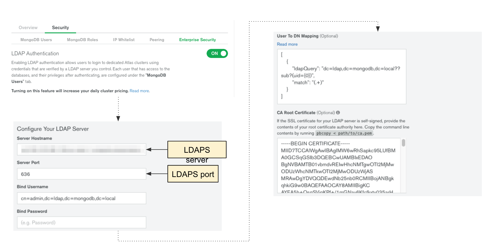

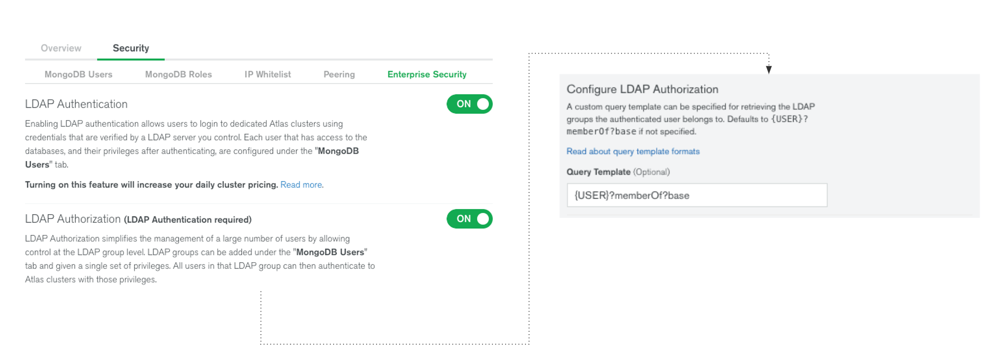

The entries for the 'Configure Your LDAP Server' section are as follows:

| Setting               | Value |
|-----------------------|-------|
| `Server Hostname`     | _FQDN of remote LDAPS server_ |
| `Server Port`         | `636` |
| `Bind Username`       | `cn=admin,dc=ldap,dc=mongodb,dc=local` |
| `Bind Password`       | `<password>` _(Bind Username's password)_ |
| `User To DN Mapping`  | `[{ match : "(.+)", ldapQuery: "ou=users,dc=ldap,dc=mongodb,dc=local??sub?(uid={0})" }]` |
| `CA Root Certificate` | _Contents of the certificate authority (CA) file, e.g. `/etc/ssl/certs/cacert.pem`_ |

**Notes**:

  * Use the fully qualified hostname (`hostname -f`) of your LDAPS server. For a basic config (with no VPC peering) using the *public* hostname; for the advanced config (with VPC peering) use the *internal* hostname.
  * MongoDB Atlas only supports the secure LDAPS protocol, not LDAP, so the port will typically be 636.
  * A bind user is required.
  * We're specifying just a single `User To DN Mapping` rule which matches the entire user provided input (`match: "(.+)"`) and we use an LDAP sub-tree query, starting in the user branch (`ou=users,dc=ldap,dc=mongodb,dc=local`) for entities where the 'uid' matches the match string (`(uid={0})`)
  * The `CA Root Certificate` entry only needs to be provided if the LDAPS server was created using a non-standard certificate authority, which is the case here, so copy the contents of `/etc/ssl/certs/cacert.pem` into the relevant box.

The entries for the 'Configure LDAP Authorization' section are as follows:

| Setting          | Value |
|------------------|-------|
| `Query Template` | `{USER}?memberOf?base` |

**Notes**:

  * Our query template targets the node found via the `User To DN Mapping` rule above and performs a `base` search, i.e., we only look at this node, and retrieve the value of the `memberOf` attribute.
  * As per the above discussion the `memberOf` attribute is typically a derived attribute which is not explicitly defined in that LDAP node. Rather the LDAP server can derive the value by checking which groups this user is a member of by checking the `member` field(s) for each group.

**Validate and Save**

Once all the values are set click the 'Validate and Save' button at the bottom of the screen. Scroll to the top of the page to see the progress banner which states "Please do not refresh the page; we are currently verifying your LDAP server configuration." After a short ~20 second pause (as MongoDB Atlas connects to the LDAP server) the banner should turn green indicating a successful configuration change:

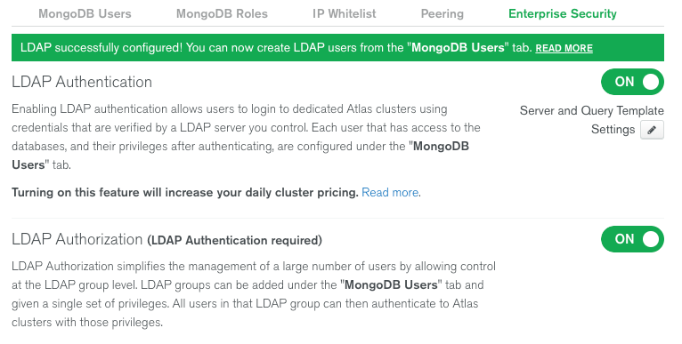

**Note**: If the banner remains blue for an extended period (e.g., for ever) it could mean you have one or more paused clusters in your project. Please unpause ALL clusters before trying the Atlas configuration steps again.

### Create LDAP Roles in Atlas

Switch to the `MongoDB Users` tab within the `Security` tab for your LDAP enabled project.

To add a new LDAP group, click the `Add New User or LDAP Group` button on the top right and select the `LDAP Group` method.

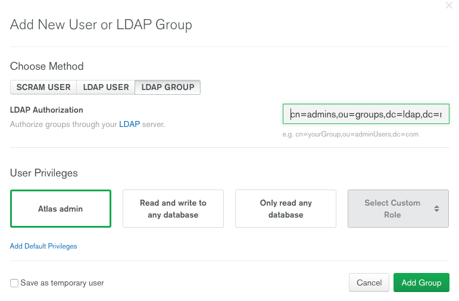

In the `LDAP Authorization` field enter the full DN of the respective LDAP group and select the relevant User Privilege.

For our purposes we will use:

| DN                                                | User Privileges          |
|---------------------------------------------------|--------------------------|
| `cn=admins,ou=groups,dc=ldap,dc=mongodb,dc=local` | `Atlas admin`            |
| `cn=users,ou=groups,dc=ldap,dc=mongodb,dc=local`  | `Only read any database` |

The result should look something like the following:

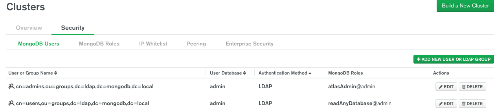


---
## Execution

Our tests involve connecting to the MongoDB Atlas cluster we configured above and proving the following:

  * 'Jane' is an 'admin' user so should be able to perform any operation.
  * 'John' is a 'readOnly' user so can only look at documents.
  * 'Joe' is an unknown user and cannot see anything.

**Note 1**: If something goes wrong when executing these tests you may need to do a little investigation. Best place to start is with the validation tests shown in the Enterprise Server setup instructions: [Test new roles](enterpriseServerSetup.md#test-new-roles)

**Note 2**: The simplest way to connect Compass to your Atlas cluster is:

 - Click the __Connect button__ for the cluster in question in the Atlas UI, select __Connect With MongoDB Compass__, select the option corresponding to your version of Compass in the __Copy the URL Connection string__ section, select `LDAP` as the __Authentication Mechanism__ and then click the __Copy__ button. **Note**: Compass versions up to and including v17.0 do not recognize LDAP connection strings in the copy buffer. See [COMPASS-2909](https://jira.mongodb.org/browse/COMPASS-2909) and [COMPASS-3099](https://jira.mongodb.org/browse/COMPASS-3099). As a workaround select `SCRAM` as the authentication mechanism and change the Authentication method in Compass to `LDAP` in the following step.
 - Launch Compass and when prompted select to use the __MongoDB Connection String__ detected from the clipboard, switch to __LDAP__ Authentication (if not already set), fill in the __Username__ and __Password__ fields, and then click the __Connect__ button.

### 1. Connect as user Jane

i) Using Compass connect to the selected deployment as 'Jane':

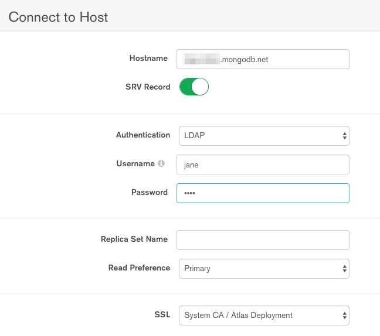

ii) Verify Jane can see all documents:

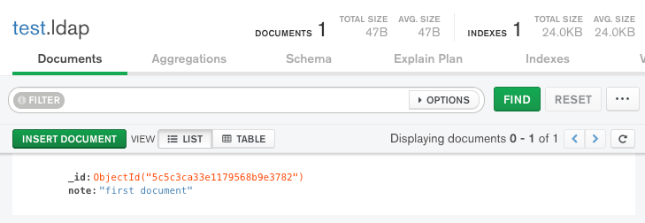

iii) Try to insert a document:

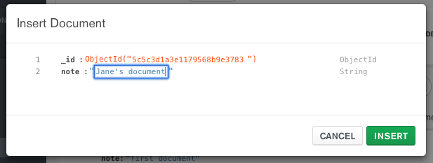

iv) See the result - Jane's new document has been created:

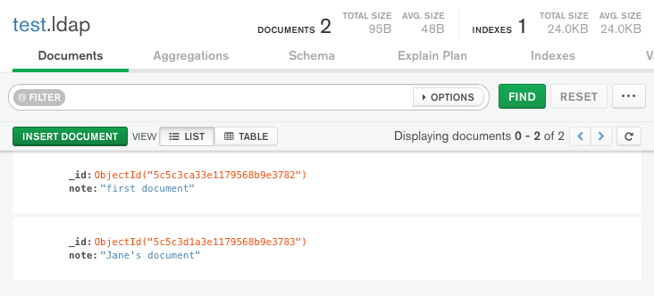

### 2. Connect as user John

i) Using Compass connect to the selected deployment as 'John':

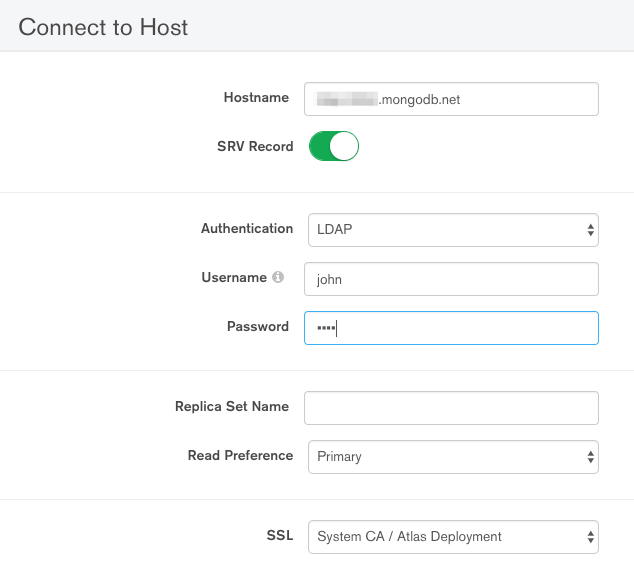

ii) Verify John can see all documents:

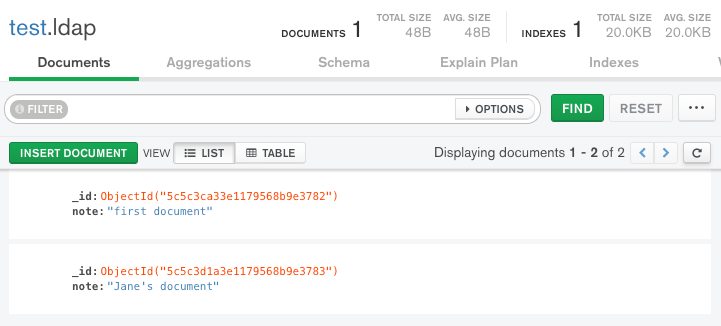

iii) Try to insert a document:

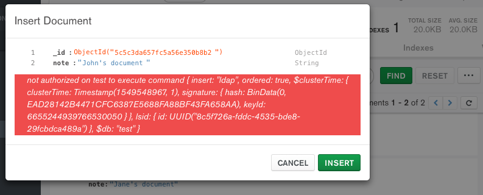

iv) See the result - no new document was created:


### 3. Connect as user Joe

i) Using Compass connect to the selected deployment as 'Joe':

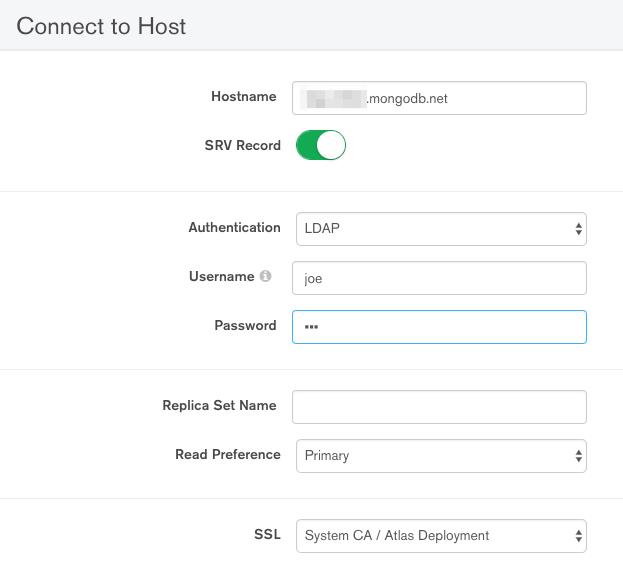

ii) Verify Joe can't log in:

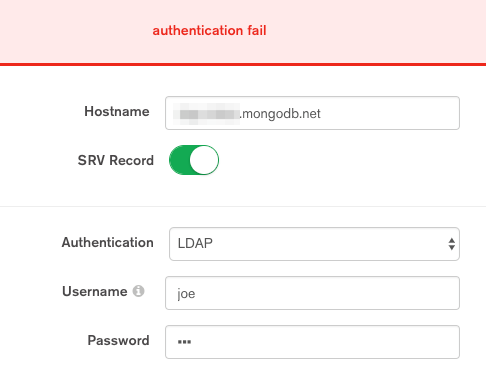


---
## Measurement

We set up our LDAP server with two users (Jane & John) and two groups (admins and users). We also tested with a non-existent user (Joe).

Based on predefined LDAP group membership:

  * Jane is a member of the 'admins' and 'users' groups.
  * John is a member of the 'users' group only.
  * Joe is a nonexistent user.

We configured the following mappings in our MongoDB instances:

  * The LDAP 'admins' group is mapped to the MongoDB 'root' / 'AtlasAdmin' role (for the MongoDB instance / Atlas cluster respectively).
  * The LDAP 'users' group is mapped to the MongoDB 'readAnyDatabase' role.

The tests we ran verified:

  * Jane can connect to the LDAP-enabled MongoDB cluster and has full read/write/admin access to the cluster.
  * John can connect to the LDAP-enabled MongoDB cluster but only has read access.
  * Joe cannot connect to the LDAP-enabled MongoDB cluster.

