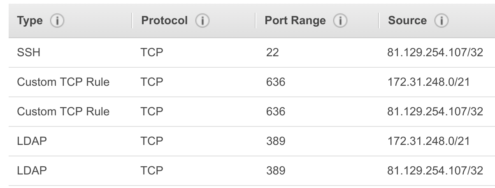

# Setup an LDAPS Server in AWS

## Create AWS Instance

Build your AWS instance in the same region as the Atlas cluster you wish to use.

- A `t2.micro` instance will suffice for demonstration purposes.
- Select `Ubuntu Server 18.04 LTS (HVM)` with a `64-bit (x86)` architecture.
- Create or reuse an existing VPC and Subnet (for the *advanced* setup this will be peered with your Atlas project).
- Be sure to set the 3 specific tags ('Name', 'owner', 'expire-on') on your instance as per the [MongoDB AWS Usage Guidelines](https://wiki.corp.mongodb.com/display/DEVOPSP/AWS+Reaping+Policies) to avoid your instance from being prematurely reaped.
- Create or reuse an existing Security Group. Add SSH access via port `22` from you laptop and then either:

 1. For the *basic* setup (no VPC peering) add TCP port `636` (LDAPS) with access from `0.0.0.0/0`
 2. For the *advanced* setup (using VPC peering) add TCP port `389` (LDAP) and TCP port `636` (LDAPS) with access from both your laptop and the peered Atlas CIDR block you intend to use (e.g. 172.31.248.0/21)

Security Group example:



**Note**: Only the LDAPS port (636) needs to be added to the security group for the purposes of the PoV proof but the other entries will facilitate general connection and debugging capabilities.

## Initial LDAP Setup

SSH into your instance using the Public DNS name:

```
ssh -i <your.pem> ubuntu@ec2-xx-xx-xx-xx.eu-west-1.compute.amazonaws.com
```

Update the apt repo, installing OS updates & install the relevant LDAP utils (choose to use existing configuration files during the upgrade, if prompted)

```
sudo apt-get -y update
sudo apt-get -y upgrade
sudo apt -y install slapd ldap-utils ldapscripts
```

When prompted, select your preferred Administrator password and confirm (note that we're about to reconfigure the service including the admin password)

### Reconfigure

Run this command and supply the answers provided below:

```
sudo dpkg-reconfigure slapd
```

* Omit OpenLDAP server configuration? `no`
* DNS domain name: `ldap.mongodb.local`
* Organization name: `mongodb`
* Administrator password: `<your admin password here>`
* Confirm password: `<your admin password here>`
* Database backend to use: `MDB`
* Do you want the database to be removed when slapd is purged? `no`
* Move old database? `yes`

This creates 2 DN's:

```
dn: dc=ldap,dc=mongodb,dc=local
dn: cn=admin,dc=ldap,dc=mongodb,dc=local
```

The first is the top level `organization` entity for our base DN `ldap.mongodb.local` while the second is an `organizationalRole` & `simpleSecurityObject` entity representing the the `admin` user.

This `admin` user can be used as the [`bind`](https://ldap.com/the-ldap-bind-operation/) user to update the directory if required.

Note: LDAPv3 supports anonymous simple authentication so you will be able to _query_ this LDAP directory with or without a bind user (writes will require an authenticated, aka bind, user).

Validate the configuration with the following command:

```
ldapsearch -H ldap:/// -x -b "dc=ldap,dc=mongodb,dc=local" -LLL dn
```

This command connects to the LDAP server running on localhost (`-H ldap:///`), uses simple authentication (`-x`), queries our base DN (`-b "dc=ldap,dc=mongodb,dc=local"`), outputs in LDIF format without comments or version (`-LLL`) and returns just the DN attributes (`dn`). We are using anonymous authentication because we haven't supplied a 'bind DN' (there is no `-D` option). The output should match the 2 DN's listed above, i.e.

```
dn: dc=ldap,dc=mongodb,dc=local
dn: cn=admin,dc=ldap,dc=mongodb,dc=local
```

(Try removing some or all of the `-LLL` options to see more verbose output)

### Install memberof overlay

The LDAP specification does not provide a 'reverse lookup' option by default. The 'memberof' overlay in OpenLDAP provides this functionality. We will configure the 'memberof' overlay such that it will search the `member` attributes for _all_ groups when a query is received for the `memberOf` attribute of a given user. If that user's DN is listed as the value of the `member` attribute in _any_ group then that group's DN will be returned as the value of the `memberOf` query - exactly what we need to map users to roles in MongoDB!

Note: Other LDAP servers, as as Microsoft's ActiveDirectory, implement this functionality natively.

```
cat <<EOF > memberof_load_configure.ldif
dn: cn=module{1},cn=config
cn: module{1}
objectClass: olcModuleList
olcModuleLoad: memberof
olcModulePath: /usr/lib/ldap

dn: olcOverlay={0}memberof,olcDatabase={1}mdb,cn=config
objectClass: olcConfig
objectClass: olcMemberOf
objectClass: olcOverlayConfig
objectClass: top
olcOverlay: memberof
olcMemberOfDangling: ignore
olcMemberOfRefInt: TRUE
olcMemberOfGroupOC: groupOfNames
olcMemberOfMemberAD: member
olcMemberOfMemberOfAD: memberOf
EOF

sudo ldapadd -Q -Y EXTERNAL -H ldapi:/// -f memberof_load_configure.ldif
```

```
cat <<EOF > refint1.ldif
dn: cn=module{1},cn=config
add: olcmoduleload
olcmoduleload: refint
EOF

sudo ldapmodify -Q -Y EXTERNAL -H ldapi:/// -f refint1.ldif
```

```
cat <<EOF > refint2.ldif
dn: olcOverlay={1}refint,olcDatabase={1}mdb,cn=config
objectClass: olcConfig
objectClass: olcOverlayConfig
objectClass: olcRefintConfig
objectClass: top
olcOverlay: {1}refint
olcRefintAttribute: memberof member manager owner
EOF

sudo ldapadd -Q -Y EXTERNAL -H ldapi:/// -f refint2.ldif
```

Restart the LDAP Server for the changes to take effect:

```
sudo systemctl restart slapd.service
```


## Setup TLS & Certificates

For Atlas we require an LDAPS Server, a TLS-enabled LDAP server. This in turn requires a suitable x.509 certificate. We'll generate a self-signed certificate using our own CA.

**Note**: Because we are using our own CA we will need to fill in the `CA Root Certificate` option when configuring Atlas.

#### Install GNU TLS binaries & SSL Cert packages

```
sudo apt -y install gnutls-bin ssl-cert
```

#### Create Certificate Authority

```
sudo sh -c "certtool --generate-privkey > /etc/ssl/private/cakey.pem"

sudo sh -c "cat > /etc/ssl/ca.info" <<EOF
cn = MongoDB
ca
cert_signing_key
EOF

sudo certtool --generate-self-signed --load-privkey /etc/ssl/private/cakey.pem --template /etc/ssl/ca.info --outfile /etc/ssl/certs/cacert.pem
```

#### Create Server Certificate

**Note** If you are using the *default* (non-VPC) setup you should change the hostname of your instance as follows:

```
sudo hostnamectl set-hostname <Public DNS (IPv4)>
```

(replace `<Public DNS (IPv4)>` with the FQDN from this instance)

**IMPORTANT: The above step is only required if you are *not* using a VPC Peered connection. For the *advanced* setup (using a peered VPC) the *internal* hostname is required, so no action is necessary in this case.**

```
sudo certtool --generate-privkey --bits 1024 --outfile /etc/ssl/private/mongodb_slapd_key.pem

sudo sh -c "echo cn = `hostname -f` > /etc/ssl/mongodb.info"
sudo sh -c "cat >> /etc/ssl/mongodb.info" <<EOF
organization = MongoDB
tls_www_server
encryption_key
signing_key
expiration_days = 3650
EOF

sudo certtool --generate-certificate --load-privkey /etc/ssl/private/mongodb_slapd_key.pem --load-ca-certificate /etc/ssl/certs/cacert.pem --load-ca-privkey /etc/ssl/private/cakey.pem --template /etc/ssl/mongodb.info --outfile /etc/ssl/certs/mongodb_slapd_cert.pem
```

#### Update file ownership, permissions & group membership

```
sudo chgrp openldap /etc/ssl/private/mongodb_slapd_key.pem
sudo chmod 0640 /etc/ssl/private/mongodb_slapd_key.pem
sudo gpasswd -a openldap ssl-cert
```

### Update LDAP Config

```
cat <<EOF > certinfo.ldif
dn: cn=config
add: olcTLSCACertificateFile
olcTLSCACertificateFile: /etc/ssl/certs/cacert.pem
-
add: olcTLSCertificateFile
olcTLSCertificateFile: /etc/ssl/certs/mongodb_slapd_cert.pem
-
add: olcTLSCertificateKeyFile
olcTLSCertificateKeyFile: /etc/ssl/private/mongodb_slapd_key.pem
EOF

sudo ldapmodify -Y EXTERNAL -H ldapi:/// -f certinfo.ldif
```

**Note**: This `ldapmodify` command appears to fail the first time and I'm not sure why. If you get an error (e.g. **"ldap_modify: Other (e.g., implementation specific) error (80)"**), try restarting the service and re-issuing the command as follows:

```
sudo systemctl restart slapd.service
sudo ldapmodify -Y EXTERNAL -H ldapi:/// -f certinfo.ldif
```

### Add 'ldaps' as a valid endpoint

MongoDB only support LDAPS so the `SLAPD_SERVICES` string in the `slapd` config file (`/etc/default/slapd`) needs to include `ldaps:///`, e.g. this line:

```
SLAPD_SERVICES="ldap:/// ldapi:///"
```

should look like this:

```
SLAPD_SERVICES="ldap:/// ldaps:/// ldapi:///"
```

Let's do that:

```
sudo cp /etc/default/slapd /etc/default/slapd.orig
sudo sh -c "sed 's|\(^SLAPD_SERVICES.*\)\(ldapi:.*\)|\1ldaps:/// \2|' /etc/default/slapd.orig > /etc/default/slapd"
```

Check the updated contents of `/etc/default/slapd` to make sure everything's okay.

### Restart Service (again)

```
sudo systemctl restart slapd.service
```

### Validate

#### Check LDAP server status

We can check the LDAP server status by running:

```
sudo systemctl status slapd.service
```

This should output details including the command line used to start the server, similar to the following:

```
   CGroup: /system.slice/slapd.service
           └─3150 /usr/sbin/slapd -h ldap:/// ldaps:/// ldapi:/// -g openldap -u openldap -F /etc/ldap/slapd.d
```

Note the presence of `ldap:///`, `ldaps:///` and `ldapi:///`

#### Check using OpenSSL commands

We can check that we have some basic connectivity by using an OpenSSL command line tool:

```
openssl s_client -connect `hostname`:636 -showcerts -state -CAfile /etc/ssl/certs/mongodb_slapd_cert.pem
```

This should generate a lot of text and you'll need to \<CTRL>-C back to the prompt. Near the top along with 'SSL_connect' messages you should see this line:

```
depth=1 CN = MongoDB
```

If you don't see this output go back to the 'Update LDAP Config' section above, restart the server and try re-applying the modification as per the note.

#### Check using `ldapsearch`

To test with `ldapsearch` you'll first need to run this for the TLS handshake to work:

```
echo "TLS_REQCERT allow" > ~/.ldaprc
```

**Note**: You may need to run this command from any client machine where you intend to run `ldapsearch`.

And now a quick test with `ldapsearch`, noting the use of the `ldaps` URI scheme:

```
ldapsearch -H ldaps:/// -x -b "dc=ldap,dc=mongodb,dc=local" -LLL dn
```

All going well you should see the same output as before (when we used the standard 'ldap' endpoint):

```
dn: dc=ldap,dc=mongodb,dc=local
dn: cn=admin,dc=ldap,dc=mongodb,dc=local
```

#### If something goes wrong

If something goes wrong with any of the validation tests it is likely to be related to the registration of the certs, so try the following steps before attempting the validation step again:

```
sudo ldapmodify -Y EXTERNAL -H ldapi:/// -f certinfo.ldif
sudo systemctl restart slapd.service
```
