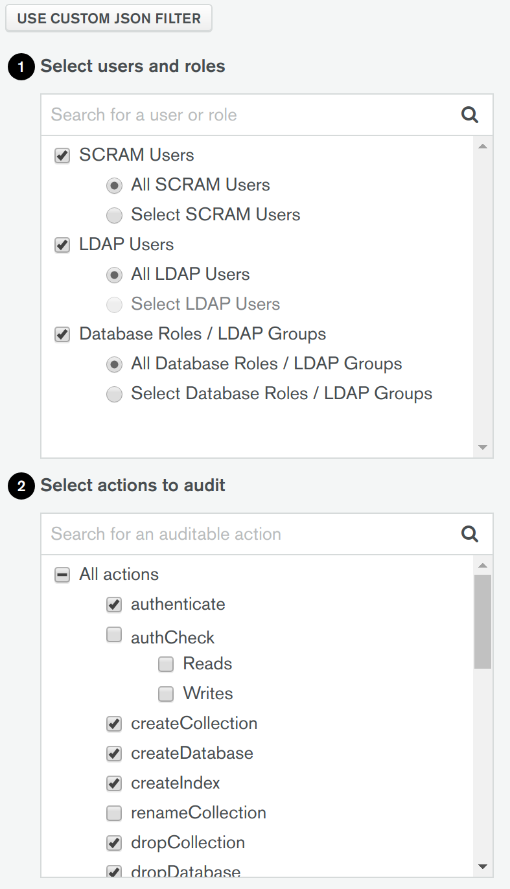
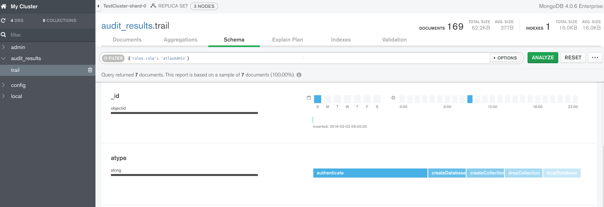

# AUDITING

__Ability to enforce native fine-grained auditing for administrative & user actions, to be able to subsequently prove who did what__

__SA Maintainer__: [Charles Lee](mailto:charles.lee@mongodb.com) <br/>
__Time to setup__: 15 mins <br/>
__Time to execute__: 15 mins <br/>


---
## Description

This proof shows how MongoDB's auditing framework can be configured to capture database administrative actions (Data Definition Language - DDL) such as schema operations, database user authorization activities for granting and revoking privileges (Data Control Language - DCL), along with database read and write operations (Data Manipulation Language - DML). Administrators can construct and filter audit trails for any combination of these DML, DCL or DDL operations against MongoDB, and even restrict this audit trail to track only specific users only, if required.

Specifically, this proof will show how to define that specific DDL commands should be captured for all users and then proves that the subsequently generated audit logs do indeed contain just these captured user actions.


---
## Setup
__1. Configure Laptop__
* Ensure MongoDB version 3.6+ is already installed your laptop, mainly to enable MongoDB command line tools to be used (no MongoDB databases will be run on the laptop for this proof)
* [Download](https://www.mongodb.com/download-center/compass) and install Compass on your laptop

__2. Configure Atlas Environment__
* Log-on to your [Atlas account](http://cloud.mongodb.com) (using the MongoDB SA preallocated Atlas credits system) and navigate to your SA project
* In the project's Security tab, choose to add a new user called __main_user__, and for __User Privileges__ specify __Atlas Admin__ (make a note of the password you specify)
* Create an __M10__ based 3 node replica-set in a single cloud provider region of your choice with default settings (auditing is not available for tiers lower than M10)
* In the Security tab, add a new __IP Whitelist__ for your laptop's current IP address
* In the Atlas console, for the database cluster you deployed, click the __Connect button__, select __Connect with the Mongo Shell__, and in the __Run your connection string in your command line__ section copy the connection command line - make a note of this connection command line to be used later

__3. Enable Auditing__
* Click Atlas console's __Security__ tab, then click __Enterprise Security__ tab
* Toggle __Database Auditing__ to __On__
* Add filters by clicking the _pencil_ below the toggle to expand the __Audit Filter Settings__ and the perform the following in the Filter Builder that appears:
  * For __1 Select users and roles__ enable the checkboxes for all of the 3 top level categories (_SCRAM users_, _LDAP users_, _Database Roles / LDAP Groups_)
  * For __2 Select actions to audit__ in 'All actions' enable checkboxes for: _authenticate_, _createCollection_, _createDatabase_, _createIndex_, _dropCollection_, _dropDatabase_, _dropIndex_, _createUser_, _dropUser_

  


  This configured set of rules declares that any authenticated user who performs a set of DDL operations related to creating and destroying users, databases, collections, and indexes should have these specific activities captured in an audit trail. Note: The _Use Custom Filter_ option can be employed to define much more specific rules (e.g. capture specific DML operations only for specific users).


---
## Execution
We will now perform database operations which should be audited according to the auditing filter rules that have been configured

* From a terminal/shell on your laptop, launch the Mongo Shell using the Atlas cluster connection command you recorded earlier, and when prompted, provide the password that you specified in an earlier setup step. For example:
  ```bash
  mongo "mongodb+srv://testcluster-abcde.mongodb.net/test" --username main_user 
  ```
* Switch to a database called 'audit_test'
    ```js
    use audit_test
    ```
* Create the database and collection by inserting a document
    ```js
    db.new_coll.insert({foo:"bar"})
    ```
* Drop the collection
    ```js
    db.new_coll.drop()
    ```
* Drop the database
    ```js
    db.dropDatabase()
    ```
 
---
## Measurement

Once the operations have been applied to the system, the auditing feature will have captured the forensics trail. To download these audit logs, in the Atlas Console navigate to the Clusters view from the navigation on the left. For the cluster, click the ellipses and select 'Download Logs' from the drop down menu. For the _Select process_ field, choose __mongod-audit-log__, for the _Select server_ field, choose the __primary__ node from the server, choose an appropriate time range, and finally press __Download Logs__. This will download a compressed file of JSON based audit trail records which you should use a __gunzip__ command on your laptop, to decompress and then inspect its contents in a text editor utility on your laptop.

Each entry to the audit log is a JSON document. Here are some examples:
```
{ "atype" : "authenticate", "ts" : { "$date" : "2019-02-15T14:20:02.881+0000" }, "local" : { "ip" : "192.168.248.173", "port" : 27017 }, "remote" : { "ip" : "18.209.60.20", "port" : 53872 }, "users" : [ { "user" : "charles", "db" : "admin" } ], "roles" : [ { "role" : "clusterMonitor", "db" : "admin" }, { "role" : "atlasAdmin", "db" : "admin" }, { "role" : "backup", "db" : "admin" }, { "role" : "dbAdminAnyDatabase", "db" : "admin" }, { "role" : "enableSharding", "db" : "admin" }, { "role" : "readWriteAnyDatabase", "db" : "admin" } ], "param" : { "user" : "charles", "db" : "admin", "mechanism" : "SCRAM-SHA-1" }, "result" : 0 }
{ "atype" : "dropCollection", "ts" : { "$date" : "2019-02-15T14:20:02.894+0000" }, "local" : { "ip" : "192.168.248.173", "port" : 27017 }, "remote" : { "ip" : "18.209.60.20", "port" : 53872 }, "users" : [ { "user" : "charles", "db" : "admin" } ], "roles" : [ { "role" : "clusterMonitor", "db" : "admin" }, { "role" : "atlasAdmin", "db" : "admin" }, { "role" : "backup", "db" : "admin" }, { "role" : "dbAdminAnyDatabase", "db" : "admin" }, { "role" : "enableSharding", "db" : "admin" }, { "role" : "readWriteAnyDatabase", "db" : "admin" } ], "param" : { "ns" : "loadGen.fakeColl" }, "result" : 0 }
{ "atype" : "createCollection", "ts" : { "$date" : "2019-02-15T14:20:03.048+0000" }, "local" : { "ip" : "192.168.248.173", "port" : 27017 }, "remote" : { "ip" : "18.209.60.20", "port" : 53872 }, "users" : [ { "user" : "charles", "db" : "admin" } ], "roles" : [ { "role" : "clusterMonitor", "db" : "admin" }, { "role" : "atlasAdmin", "db" : "admin" }, { "role" : "backup", "db" : "admin" }, { "role" : "dbAdminAnyDatabase", "db" : "admin" }, { "role" : "enableSharding", "db" : "admin" }, { "role" : "readWriteAnyDatabase", "db" : "admin" } ], "param" : { "ns" : "loadGen.fakeColl" }, "result" : 0 }
{ "atype" : "dropDatabase", "ts" : { "$date" : "2019-02-15T14:20:05.878+0000" }, "local" : { "ip" : "192.168.248.173", "port" : 27017 }, "remote" : { "ip" : "206.252.195.126", "port" : 53295 }, "users" : [ { "user" : "new_user", "db" : "admin" } ], "roles" : [ { "role" : "clusterMonitor", "db" : "admin" }, { "role" : "atlasAdmin", "db" : "admin" }, { "role" : "backup", "db" : "admin" }, { "role" : "dbAdminAnyDatabase", "db" : "admin" }, { "role" : "enableSharding", "db" : "admin" }, { "role" : "readWriteAnyDatabase", "db" : "admin" } ], "param" : { "ns" : "audit_test" }, "result" : 0 }
```

You can use mongoimport tool to import the uncompressed audit log to the cluster in Atlas for easy analysis via Compass. In the Atlas console, click the **... (*ellipsis*)**, select **Command Line Tools**, under **Data Import and Export Tools** select **mongoimport** and select  **Copy**. From a terminal/shell use a modified version of this copied command line to import the audit logs into a MongoDB collection, providing the _main\_user_ password you specified earlier, for example:

```bash
mongoimport --host TestCluster-shard-0/testcluster-shard-00-00-abcde.mongodb.net:27017,testcluster-shard-00-01-abcde.mongodb.net:27017,testcluster-shard-00-02-abcde.mongodb.net:27017 --ssl --username main_user --password MyPassword --authenticationDatabase admin --db audit_results --collection trail --file testcluster*mongodb-audit-log.log
```

Then from the Atlas console, click the __Connect button__, select __Connect With MongoDB Compass__, and click the __Copy__ button to copy the connection string. Launch __Compass__, select to use the __MongoDB Connection String__ detected from the clipboard, fill in the __Password__ field and once connected show the contents of the __audit_results.trail__ collection in both the __Documents__ tab and __Schema__ tab of Compass. To see only the subset of audit trail relating to the _main\_user_ actions you performed earlier, in the __Schema__ tab, apply the filter `{'roles.role': 'atlasAdmin'}`. 

The results will show you that the DDL actions performed earlier by this user were indeed captured in the audit log, as defined by the audit filter you created earlier. Below is a screenshot showing an example of what you will see in Compass, showing the different type of actions (_atype_) that were executed by _main\_user_:



