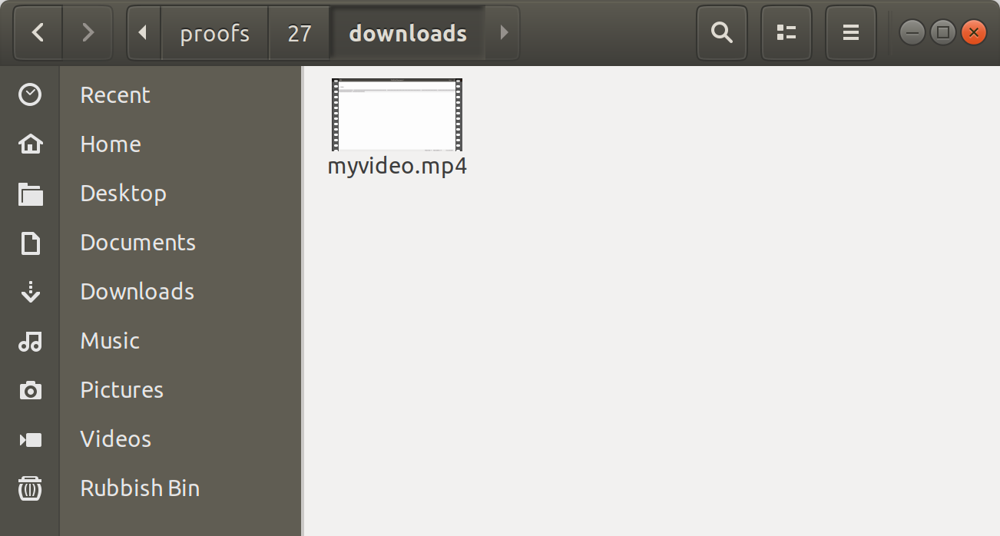

# MULTIMEDIA

__Ability to store both large binary documents and related metadata together for easy centralised data management__

__SA Maintainer__: [Eugene Kang](mailto:eugene.kang@mongodb.com) <br/>
__Time to setup__: 15 mins <br/>
__Time to execute__: 15 mins <br/>

---
## Description

This proof shows how you MongoDB's GridFS capability can be used to store large binary documents (over 16MB in size) alongside the application data that relates to it, in a single database cluster, rather relaying on separate storage. This helps to reduce deployment and operational complexity. It is a common use case for MongoDB, when used for Content/Document/Asset Management systems, where both large binary media files, and the metadata about those files (e.g. author, version, date created) need to be stored together in the same database. Using its GridFS capability, MongoDB internally stores separate parts of a persisted binary file as _chunks_, which also assists with being able to stream and buffer a movie file, for example, when servicing to client applications.

In this proof a very simplified version of a video blog application and database is simulated (e.g. similar to a rudimentary _YouTube_), using Python scripts, where you first provide your user details to be inserted into a _users_ collection. Then a Python script uses GridFS to upload a video file (18MB in size) to the database, associated with the user just created, and then another Python script is used to show how the video file can be downloaded from the database to the client.

---
## Setup

__1. Configure Atlas Environment__
* Log-on to your [Atlas account](http://cloud.mongodb.com) (using the MongoDB SA preallocated Atlas credits system) and navigate to your SA project
* In the project's Security tab, choose to add a new user called __main_user__, and for __User Privileges__ specify __Read and write to any database__ (make a note of the password you specify)
* Create an __M10__ based 3 node replica-set in a single AWS region of your choice with default settings
* In the Security tab, add a new __IP Whitelist__ for your laptop's current IP address
* In the Atlas console, for the database cluster you deployed, click the __Connect button__, select __Connect Your Application__, and for the __latest Python version__  copy the __Connection String Only__ - make a note of this MongoDB URL address to be used later

__2. Configure Laptop__
* Ensure MongoDB version 3.6+ is already installed your laptop, mainly to enable MongoDB command line tools to be used (no MongoDB databases will be run on the laptop for this proof)
* Ensure your laptop can run __Python 3__ and install the MongoDB Python Driver library:
  ```bash
  pip3 install pymongo
  ```
* Modify the file `global_vars.py` contained in the base folder of this proof and change the connection string part of the value of `connStr` to match the _Connection String_ you recorded earlier, and also replace the password part with the password you recorded earlier
* Once the database cluster is deployed and running, click the __Connect button__, select __Connect with the Mongo Shell__, and in the __Run your connection string in your command line__ section copy the connection command line - make a note of this connection command line ready for the next step
* From a terminal/shell on your laptop, launch the Mongo Shell targeting your Atlas cluster using the command you just copied (when prompted enter your password), for example:
  ```bash
  mongo "mongodb+srv://testcluster-abcde.mongodb.net/test" --username main_user 
  ```
* In the Shell show that the database collection _pov\_multimedia.users_ that this proof will use does not yet exist, then __leave the Shell open__, ready to be used in the _Execution_ phase of this proof:
  ```js
  use pov_multimedia
  show collections
  ```

    
---
## Execution

* Via a command line terminal, from the base directory of the proof, execute the Python script to add a user - this will prompt you to enter any username (e.g. _jdoe_) you like plus a full name (e.g. _Jane Doe_):
  ```bash
  ./1_add_user.py
  ```
* In the Shell, show that a record has been added to the _pov\_multimedia.users_ and no other collections yet exist (for example no GridFS collections exist to contain large media files):
  ```js
  use pov_multimedia
  show collections
  db.users.find().pretty()
  ```
* In the command line terminal/shell, execute the Python script to use GridFS to upload and save a large media file (e.g. a video) in the database, associated with the user just created - just press enter to use the default large MP4 video file stored in the base folder of this proof (just over 18 MB in size):
  ```bash
  ./2_upload_user_files.py
  ```
* In the Shell, show that _pov\_multimedia_ database now also contains two GridFS collections to hold the raw chunks that compose stored binary files (the _fs.chunks_ collection) and the metadata about the stored files (the _fs.files_ collection) - also notice our Python application added a reference in the users collection to the uploaded file, so it would be easy for the user to find their videos in the future:
  ```jss
  use pov_multimedia
  show collections
  db.fs.files.find().pretty()
  db.users.find().pretty()
  ```
* In the command line terminal/shell, execute the Python script to download the binary files (the video in this case) for the user, into a new file in a new directory called __downloads__ (before running this command, show that no such __downloads__ directory yet exists using a File Browser/Explorer):
  ```
  ./3_fetch_user_files.py
  ```


---
## Measurement

* To prove that the proof executed correctly, using a File Browser/Explorer, show that a __downloads__ directory now exits and contains the file that has been downloaded from the database (matching the video file you'd previously uploaded at an earlier stage), similar to the screenshot below:



