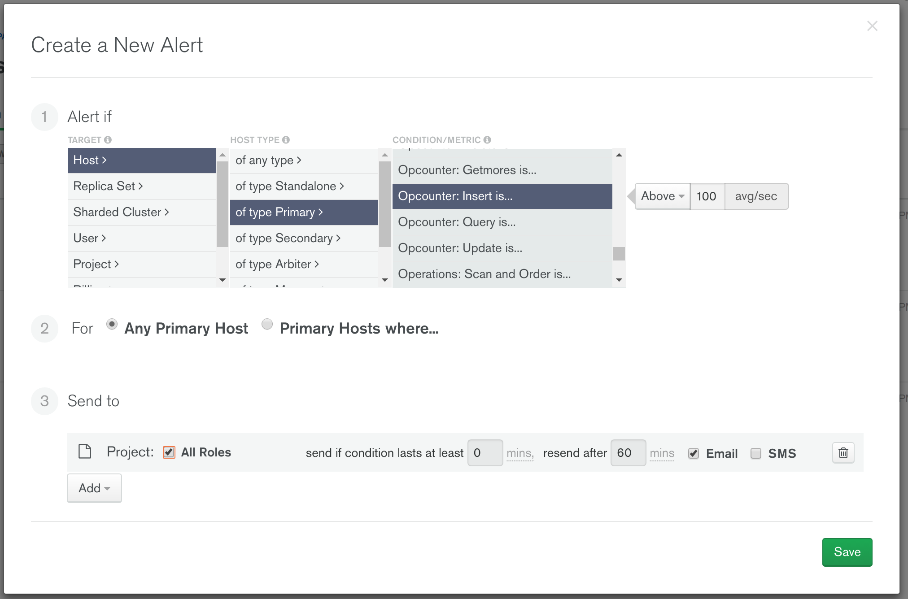
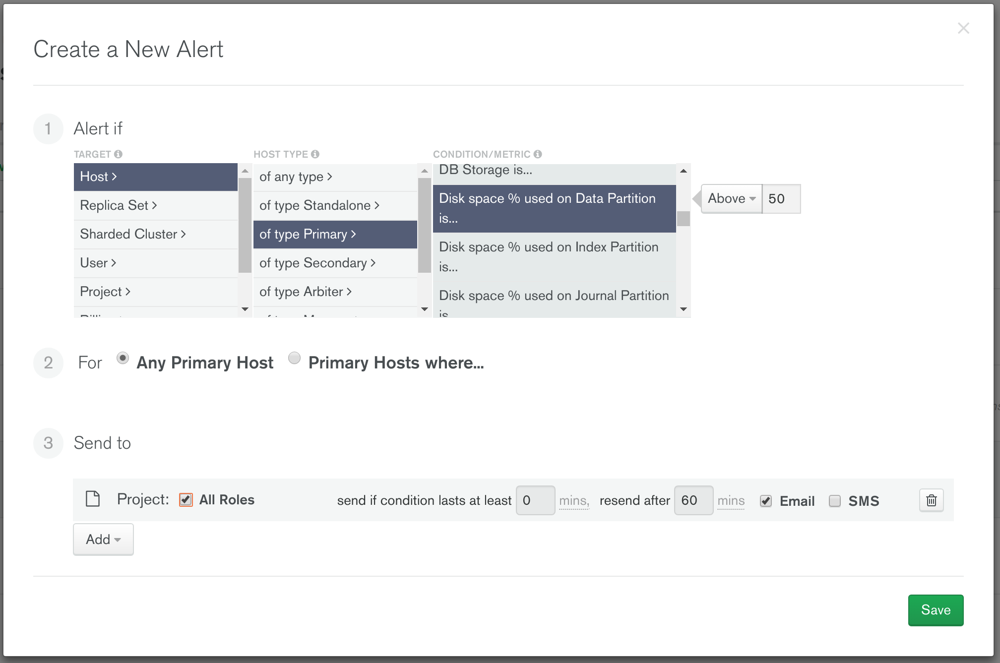
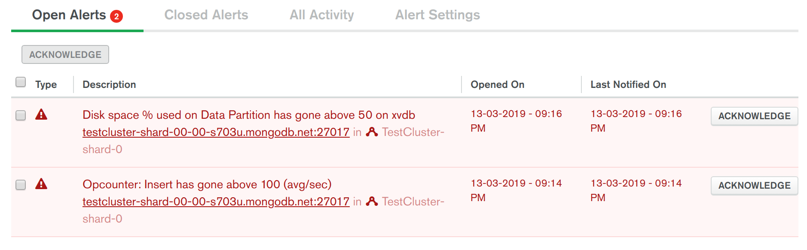

# ALERTS

__Ability to configure alerting to detect things like database slowdown or impending database overload, to enable proactive and remedial administration actions to be taken__

__SA Maintainer__: [Sahil Kedar](mailto:sahil.kedar@mongodb.com) <br/>
__Time to setup__: 30 mins <br/>
__Time to execute__: 30 mins <br/>


---
## Description

This proof shows how MongoDB's management tooling in Atlas can be easily configured to listen out for critical thresholds that are leading indicators of potential database slowdowns or overload, resulting in automated alerts being received by administrators via various channels (email, SMS, PagerDuty, Slack, etc). By receiving these alerts in a timely fashion, an administrator is better equipped to then take rapid remedial actions on the database, application and surrounding system, to help avoid a serious system outage before it can occur. 

For this specific proof, the following two types of database overload leading indicators will be induced using a load injection tool, showing how the alerts corresponding to these two indicators are quickly routed to administrators:
  1. The current rate of database insert operations on the database has exceeded 100 per second
  2. The database storage's used disk space has exceeded 50%


---
## Setup

__1. Configure Atlas Environment__
* Log-on to your [Atlas account](http://cloud.mongodb.com) (using the MongoDB SA preallocated Atlas credits system) and navigate to your SA project
* In the project's Security tab, choose to add a new user called __main_user__, choose to expand __Add Default Privileges__ and add role privileges for the roles __readWriteAnyDatabase__ and __clusterMonitor__ (make a note of the password you specify)
* Create an __M10__ based 3 node replica-set in a single AWS region of your choice with the following settings:
  * Storage size: 10GB 
  * Storage auto expand: Disabled

__2. Configure AWS Environment__
* Using your MongoDB 'Solution Architects' [AWS pre-existing account](https://wiki.corp.mongodb.com/display/DEVOPSP/How-To%3A+Access+AWS+Accounts), log on to the [AWS console](http://sa.aws.mongodb.com/) and near the top right hand side of the AWS Console, __change the region__ to match the same AWS region as you created the Atlas cluster in
* Launch (create) a new EC2 instance with the following settings (use defaults settings for the rest of the fields):
  * __AMI Type__: Amazon Linux 2 AMI (HVM), SSD Volume Type
  * __Instance Type__: m5.large
  * __Add Tags__: Be sure to set the 3 specific tags ('Name', 'owner', 'expire-on') on your instance as per the [MongoDB AWS Usage Guidelines](https://wiki.corp.mongodb.com/display/DEVOPSP/AWS+Reaping+Policies) to avoid your instance from being prematurely reaped
  * __Security Group__: Create a new security group which has an inbound rule to allow SSH only on port 22 from source 0.0.0.0/0
* When prompted, choose to use your existing key pair or create a new key pair (typically named similar to 'firstname.lastname'). If creating a new key pair, be sure to click the button to __Download Key Pair__ and store the key somewhere safe on your laptop.
*  Once the AWS instance is running, find it in the AWS Console __instances__ list, select it, and in the description section near the bottom of the AWS Console locate the __IPv4 Public IP__ field and make a note of its value
* Now go to the __Atlas Console__ and in the Security tab, add a new __IP Whitelist__ entry for the IP address you just captured, to allow the AWS instance to connect to your Atlas cluster

__3. Configure POC Driver__
* In the AWS Console __instances__ list select your AWS instance, press the __Connect button__ and follow the instructions to SSH into this instance from a new terminal window on your laptop
* In this SSH terminal session, run the following commands to update the system and to install __Java__ and __Maven__ (Maven will pull Java in automatically as a dependency):
  ```bash
  sudo yum -y update
  sudo yum -y install maven
  java -version
  mvn -version
  ```
* In the same SSH terminal session, download, unpack and build the MongoDB POCDriver project JAR (Java 'executable') from GitHub as follows:
  ```bash
  wget https://github.com/johnlpage/POCDriver/archive/master.zip
  unzip master.zip
  cd POCDriver*
  mvn clean package
  cd bin
  ls POCDriver.jar 
  ```
* In the Atlas console, for the database cluster you deployed, click the __Connect button__, select __Connect Your Application__, and for the __latest Java version__  copy the __Connection String Only__ - make a note of this MongoDB URL address to be used later

__4. Configure 2 Sample Alerts For The Atlas Cluster__

&nbsp;__(i) Add Alert to Trap If The Insert Database Workload Has Become High__
* In the Atlas console, from the left-hand-side menu, click __Alerts__, and then click __Add__ then __New Alert__ and configure the new alert with the following settings before saving:
  * ALERT IF: Host > of type Primary > __Opcounter: Insert is...Above 100 avg/sec__
  * FOR: Any Host
  * SEND TO: All Roles - Email




&nbsp;__(ii) Add Alert to Trap If The Used Disk Space Is Growing High__
* Add another new __Alert__ and configure it with the following settings before saving:
  * ALERT IF: Host > of type Primary > __Disk space % used on Data Partition is...Above 50__
  * FOR: Any Primary Host
  * SEND TO: All Roles - Email




---
## Execution

From the AWS instance SSH terminal/shell, inside the  __~/POCDriver*/bin__ folder, run the POCDriver load generator against the Atlas cluster using the command below. Running this will erase the existing load test database collection _POCDB\_POCCOLL_ if it already exists (-e), before recreating it and will __run the test for 15 minutes duration__ (-d 900). 
  ```bash
  java -jar POCDriver.jar -c "XXXXXX"  -t 4 -e -d 900 -f 1692 -a 10:10 --depth 2 -x 8
  ```
&nbsp;&nbsp;&nbsp;__Note__: Before running the command, replace __XXXXXX__ with the Connection SRV address you recorded earlier, and specify the main_user's password in this URL. 

Go back to the Atlas Console for the deployed cluster and in the __Alerts__ tab, wait at least 10 minutes and then keep refreshing the page until both the following new Alerts appear (the second alert may take longer to appear than the first):
  1. _Opcounter: Insert has gone above 100 (avg/sec)_
  2. _Disk space % used on Data Partition has gone above 50_


---
## Measurement

To prove that the alerting process is detecting issues like database slowdown or impending database overload, the two alerts for this test should appear in the AWS Console __Alerts | Open Alerts__ tab, after about 10 minutes from starting the load injection process, similar to the screenshot below:



You should also receive two separate emails notifying you of the details for each of these two alerts.

