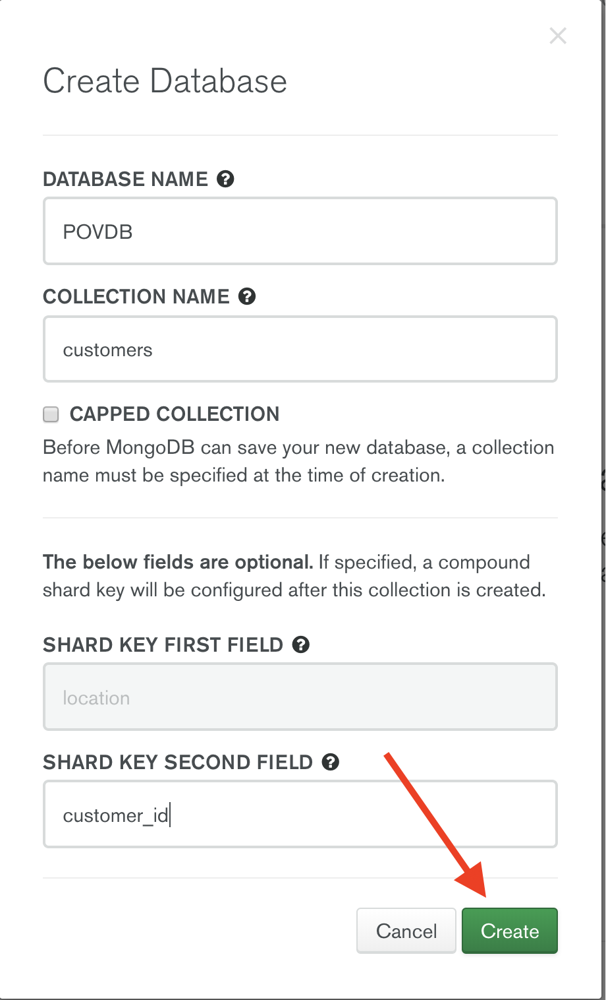

# DATA-LOCALITY

__Ability to govern and administer the database globally, whilst allowing local applications to read and write locally, for low latency and/or data sovereignty__

__SA Maintainer__: [Scott Stokes](mailto:scott.stokes@mongodb.com) <br/>
__Time to setup__: 15 mins <br/>
__Time to execute__: 30 mins <br/>


---
## Description

This proof shows how MongoDB Atlas can support data locality. We will create a small sharded _global cluster_, and then configure the shards so that data will be separated by different global regions (one shard in North America, one shard in Europe, one shard in Asia). The records inserted will contain a location field as a [2 character country code](https://en.wikipedia.org/wiki/ISO_3166-1) to enable the Atlas _global cluster_ to ensure it routes each written document to the correct regional zone in the global cluster.

---
## Setup

__1. Configure Laptop__
* Ensure MongoDB version 3.6+ is already installed your laptop, mainly to enable MongoDB command line tools to be used (no MongoDB databases will be run on the laptop for this proof)
* [Download](https://www.mongodb.com/download-center/compass) and install Compass on your laptop
* Ensure Node (version 6+) and NPM are installed your laptop
* Download and install the [mgeneratejs](https://www.npmjs.com/package/mgeneratejs) JSON generator tool on your laptop
  ```bash
  npm install -g mgeneratejs
  ```

__2. Configure Atlas Environment__
* Log-on to your [Atlas account](http://cloud.mongodb.com) (using the MongoDB SA preallocated Atlas credits system) and navigate to your SA project
* In the project's Security tab, choose to add a new user called __main_user__, and for __User Privileges__ specify __Atlas Admin__ (make a note of the password you specify)
* Create a __Sharded cluster__ in Atlas with the following settings:
  1. Expand "Global Cluster Configuration" and set "Enable Global Writes" to "On" 
  1. Select the "Global Performance" template<BR><BR>
  1. Specify the M30 tier
  1. Use default settings for the remaiming configuration, then click __*Create Cluster*__
* In the Security tab, add a new __IP Whitelist__ for your laptop's current IP address

__3. Generate Sample Data File__
* Via a terminal/shell in the base directory of this proof, run the following command to create 500 partly templated, partly randomly generated JSON documents representing customer records into a new file __demo-data.json__
  ```bash
  mgeneratejs -n 500 Customer.json > demo-data.json
  ```
&nbsp;_Note_: Each document has a location field generated, which should be a [2 charater country code](https://en.wikipedia.org/wiki/ISO_3166-1) to enable the Atlas _global cluster_ to ensure it is writing each document to the correct zoned shard.


---
## Execution
__1. Create the database and table__
* Via the Atlas console, for the deployed cluster that has been created, and then click on the cluster name link (<I>POVCluster1</I> in this example shown) to go to the cluster details<br><br><br><br>
* Select the <I>Collections</I> tabd<br><br><br><br>
* Click the <I>Create Database</I> button, specify a database name as __POVDB__ and collection name as __customers__. For the  __SHARD KEY SECOND FIELD__, you __must__ use __customer_id__ to enable the generated data-set to be utilised, then click the __CREATE__ button<br><br>

__2. Import the data using MongoDB Compass__
 - For the deployed database cluster, in the Atlas console, click the __Connect button__, select __Connect With MongoDB Compass__, and click the __Copy__ button to copy the connection string
 - Launch Compass and when prompted select to use the __MongoDB Connection String__ detected from the clipboard, fill in the __Password__ field and then click the __Connect__ button
 - Select your database _POVDB_ and collection _customers_
 - From the application menu, choose Collection -> Import Data<br><br><br><br>
 - Choose the data file you created previously (__demo-data.json__) and click __IMPORT__.<br><BR>
 - Once the import completes, you will see the documents. Notice that the value of the __location__ field for each document identifies a country which will mean that the document was saved to the corresponding physical region of the global cluster, which we will prove in the _Measurement_ section next.<br><br>


---
## Measurement

We will use two different methods to prove that saved documents are being physically located in the region that the country in the _location_ field belongs to.

### 1. Show documents in a Single Shard using the Mongo Shell
1. Select the POVCluster from your Atlas project page. <br><BR>
1. From the cluster overview page, right click on the "primary" node for one of your shards and select "Copy" to copy the link name. **IMPORTANT:** Make sure you select "Copy" and __NOT__ "Copy Link Address" (e.g. copy a string similar to _povcluster-shard-00-00-abcde.mongodb.net:27017_) <BR><BR>
<br><BR>
1. From a command prompt, use the command:<BR> `mongo mongodb://{FROM-CLIPBOARD} --ssl --authenticationDatabase admin --username main_user`
    * replace {FROM-CLIPBOARD} with the value you copied to the clipboard in the previous step
    * when prompted, enter your password
1. Show the records on that primary node by entering the following commands in the Mongo Shell:
  ```js
  use POVDB
  db.customers.find()
  ```

  You should see something like:<BR>
  ```
{ "_id" : ObjectId("5c648744c2d23b2b4db9118c"), "customer_id" : "476898564", "firstName" : "Chris", "lastName" : "Ridi", "address" : "1945 Makub Square", "city" : "Motsura", "state" : "OK", "zip" : "36383", "location" : "US", "age" : 62 }<BR>
{ "_id" : ObjectId("5c648744c2d23b2b4db9118b"), "customer_id" : "779306512", "firstName" : "Hulda", "lastName" : "Vieri", "address" : "501 Tapmo Drive", "city" : "Wurjeter", "state" : "VA", "zip" : "49460", "location" : "US", "age" : 59 }<BR>
{ "_id" : ObjectId("5c648744c2d23b2b4db9118e"), "customer_id" : "586749589", "firstName" : "Isabella", "lastName" : "Jimenez", "address" : "1384 Hisis Pike", "city" : "Ezicohlid", "state" : "NJ", "zip" : "05141", "location" : "CA, "age" : 44 }<BR>
{ "_id" : ObjectId("5c648744c2d23b2b4db91184"), "customer_id" : "632663717", "firstName" : "Rosetta", "lastName" : "Pezzati", "address" : "1843 Labiro Plaza", "city" : "Zakijiz", "state" : "IL", "zip" : "27416", "location" : "US", "age" : 38 }<BR>
{ "_id" : ObjectId("5c648744c2d23b2b4db91181"), "customer_id" : "302000467", "firstName" : "Brent", "lastName" : "Delaunay", "address" : "1876 Ubezic Heights", "city" : "Teoksi", "state" : "PA", "zip" : "33367", "location" : "US", "age" : 41 }<BR>
{ "_id" : ObjectId("5c648744c2d23b2b4db91182"), "customer_id" : "761674155", "firstName" : "Adele", "lastName" : "Williamson", "address" : "489 Ezzos Junction", "city" : "Givdeuma", "state" : "TN", "zip" : "65244", "location" : "CA", "age" : 62 }<BR>
{ "_id" : ObjectId("5c648744c2d23b2b4db91183"), "customer_id" : "445507368", "firstName" : "Agnes", "lastName" : "Lapini", "address" : "490 Guse Heights", "city" : "Bogmulej", "state" : "AK", "zip" : "85776", "location" : "CA", "age" : 22 }<BR>
{ "_id" : ObjectId("5c648744c2d23b2b4db91191"), "customer_id" : "133192226", "firstName" : "Milton", "lastName" : "Cianfanelli", "address" : "1736 Benvot Ridge", "city" : "Lazogava", "state" : "SD", "zip" : "93664", "location" : "CA", "age" : 25 }<BR>
{ "_id" : ObjectId("5c648744c2d23b2b4db91190"), "customer_id" : "349018198", "firstName" : "Alfred", "lastName" : "Sassi", "address" : "608 Ibowe Loop", "city" : "Waljocjoz", "state" : "WI", "zip" : "34832", "location" : "US", "age" : 29 }
```

1. In the results you should notice that for every document , the _location_ field only includes documents for the shard based on one region.  In the example data, I selected the primary node in the Americas shard.<BR><BR>The location values that were generated by for the template are:
    * US, CA - Americas zone
    * JP, IN - APAC Zone
    * DE, IT - EMEA Zone


### 2. Show Sharding Status using the Mongo Shell
1. Return to the Cluster Overview page and click the __Connect__ button
1. From the Connect Dialog, click on the __Connect with the Mongo Shell__ button
1. In the __Run your connection string in your command line__ section copy the connection command line
1. Open a terminal, paste the command into the terminal and press ENTER (when prompted, enter your password)
1. At the Mongo Shell prompt, issue the command `sh.status()` to see the sharding details.  The output is quite verbose, but scanning it you will see that chunks of records are spread across the 3 regions and all chunk ranges for a specific shard have _location_ values belonging to that shard region only.


