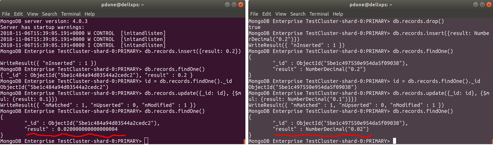

# DECIMAL-PRECISION

__Ability to natively store and retrieve high precision decimal numbers, and perform in place calculations on these with high precision__

__SA Maintainer__: [Paul Done](mailto:paul.done@mongodb.com) <br/>
__Time to setup__: 15 mins <br/>
__Time to execute__: 15 mins <br/>


---
## Description

This proof shows how MongoDB can store fields as floating point decimal numbers with high precision and also enable in-place arithmetic to be performed across these fields with the same high precision. This leverages the [support in MongoDB 3.4+](https://docs.mongodb.com/manual/tutorial/model-monetary-data/) for the [decimal128 floating-point format](https://en.wikipedia.org/wiki/Decimal128_floating-point_format) which sets MongoDB apart from other _NoSQL_ databases. The standard JSON types for decimal numbers only accommodate _floats_ and _doubles_ which both suffer from low precision. In many applications, especially financial or scientific ones, lack of high precision can have serious ramifications.


---
## Setup
__1. Configure Laptop__
* Ensure MongoDB version 3.6+ is already installed your laptop, mainly to enable the Mongo Shell to be used (no MongoDB databases will be run on the laptop for this proof; Compass can't be used for this proof as it does not support applying operators like _$mul_ for _in-place_ updates)

__2. Configure Atlas Environment__
* Log-on to your [Atlas account](http://cloud.mongodb.com) (using the MongoDB SA preallocated Atlas credits system) and navigate to your SA project
* In the project's Security tab, choose to add a new user called __main_user__, for this user select __Add Default Privileges__ and in the __Default Privileges__ section add the roles __readWriteAnyDatabase__ and __clusterMonitor__ (make a note of the password you specify)
* Also in the project's Security tab, add a new __IP Whitelist__ and select to __Use Current IP Address__ to ensure the Mongo Shell, which will run on your laptop later, will be allowed to connect to the cluster
* Create an __M10__ based 3 node replica-set in a single AWS region of your choice with default storage settings
* In the Atlas console, for the database cluster you deployed, click the __Connect button__, select __Connect with the Mongo Shell__, and in the __Run your connection string in your command line__ section copy the connection command line - make a note of this connection command line to be used later


---
## Execution
__1.__ From a command line terminal on your laptop, launch the Mongo Shell using the Atlas cluster connection command you recorded in the final setup step, and when prompted, provide the password that you specified in an earlier setup step. For example:
  ```bash
  mongo "mongodb+srv://testcluster-abcde.mongodb.net/test" --username main_user 
  ```
__2.__ In the default __test__ database that is connected to, insert a new record in a new collection called __records__ that contains a __result__ field with a floating point type of _double_ with value __0.2__, then perform an in-place update __multiplying__ the value of the _result_ field by __0.1__
  ```js
  db.records.insert({result: 0.2})
  db.records.findOne()
  id = db.records.findOne()._id
  db.records.update({_id: id}, {$mul: {result: 0.1}})
  db.records.findOne()
  ```
&nbsp;Notice that the value of the _result_ field is __not__ as expected. This is consistent with standard JSON float and double types, where loss of precision is suffered.

__3.__ Drop all the existing records from the __records__ collection and then insert a new record containing a __result__ field with a floating point type of _decimal128_ with value __0.2__, and perform an in-place update __multiplying__ the value of the _result_ field by __0.1__
  ```js
  db.records.drop()
  db.records.insert({result: NumberDecimal("0.2")})
  db.records.findOne()
  id = db.records.findOne()._id
  db.records.update({_id: id}, {$mul: {result: NumberDecimal("0.1")}})
  db.records.findOne()
  ```
&nbsp;Notice that the value of the _result_ field is now __as expected__. This is because a BSON field type of _decimal128_ has been used, which doesn't suffer precision loss.

 
---
## Measurement
The output of the Mongo Shell commands run in the execution step of 2 should clearly show the test observers that the JSON floating point type suffers from loss of precision, with a result of __0.020000000000000004__ rather than __0.02__ (see left half of screenshot below). However, the result of execution step 3 should clearly show an accurate result of __0.02__ with no precision loss suffered (see right half of screenshot below).



