# TEXT-SEARCH

__Ability to search & rank records based on matching a search string even if misspelled__

__SA Maintainer__: [Rajesh Ramamurthy](mailto:rajesh.ramamurthy@mongodb.com)  
__SA Author: [Jai Karve](mailto:jai.karve@mongodb.com)  __
__Time to setup__: 15 mins  
__Time to execute__: 30 mins  

---
## Description

This proof shows how MongoDB Atlas Search (previously Full-Text Search) provides the ability to search and rank records based on a query, even if the query is misspelled. The proof will provide a user interface, allowing the user to type in a query, including one that is misspelled, and produce the intended query results, as well as a ranking of the results, after the user submits the search. For the proof, the _movies_ collection from the [Atlas sample_mflix database](https://docs.atlas.mongodb.com/sample-data/available-sample-datasets/#available-sample-datasets) will be used, and specifically each movie's _fullplot_ attribute will be text searched. The tests will be run from the MongoDB Compass Aggregation Builder.

---
## Setup

__1. Configure Laptop__

* Ensure MongoDB Compass Enterprise __version 1.21.0 (stable)__ or higher is installed on your laptop. Enterprise version 1.21.0 is required since the `$search` operator is only available in these versions of Compass.  

__2. Configure Atlas Environment__

* Log-on to your [Atlas account](http://cloud.mongodb.com) (using the MongoDB SA preallocated Atlas credits system) and navigate to your SA project
* In the project's Security tab, choose to add a new user called __main_user__, and for __User Privileges__ specify __Atlas admin__ (make a note of the password you specify)
* Also in the Security tab, add a new __IP Whitelist__ for your laptop's current IP address
* Create an __M10__ based 3 node replica-set in an AWS region of your choice, running __MongoDB version 4.2__ (Atlas Full Text Search is only supported in version 4.2.  It is available on all cluster sizes.)
* Once the cluster has been fully provisioned, in the Atlas console, click the **... (*ellipsis*)** for the cluster, select **Load Sample Dataset**. In the modal dialog, confirm that you want to load the sample dataset by choosing **Load Sample Dataset**
* In the Atlas console, once the dataset has fully loaded, click the __Collections button__ for the cluster, and navigate to the `sample_mflix.movies` collection. Under the __Search__ tab, choose to __Create Search Index__
   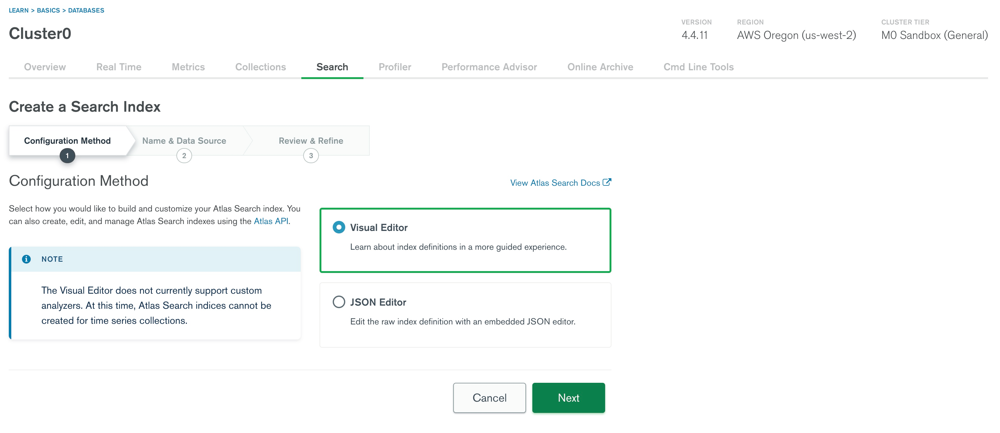
* To select the movies collection as a data source, type movies in the text box or click sample_mflix as shown below
   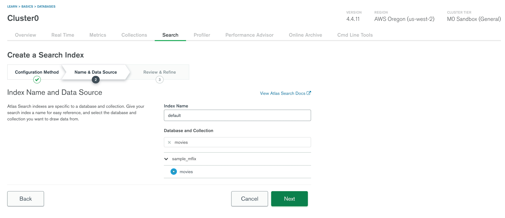
* Keep all of the default options and select __Create Index__
*  The default index structure can be edited as shown below
   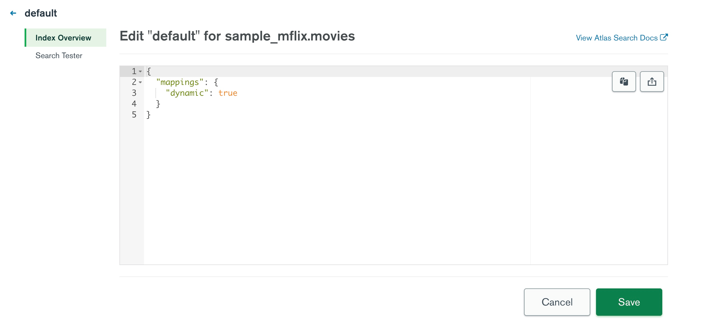
* The index creation process should take approximately 4 minutes.  Full-text search indexes are built in a rolling fashion, starting with the secondaries first.  You are able to view the progress and statistics of the cluster's primary node in the overview page:
   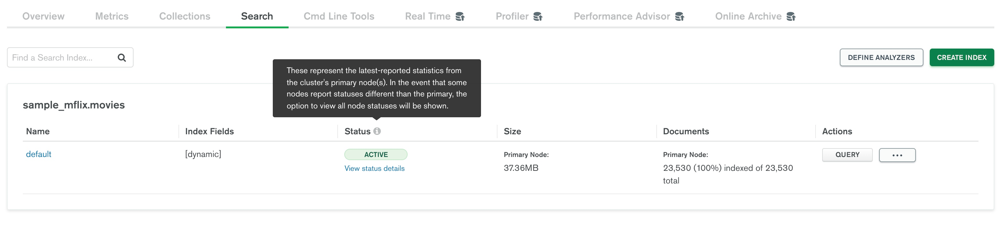
 
* In the event that some nodes report a different status than the primary node, there is an option to [view the status of the index build on each node](https://docs.atlas.mongodb.com/reference/full-text-search/create-index/#node-status)
   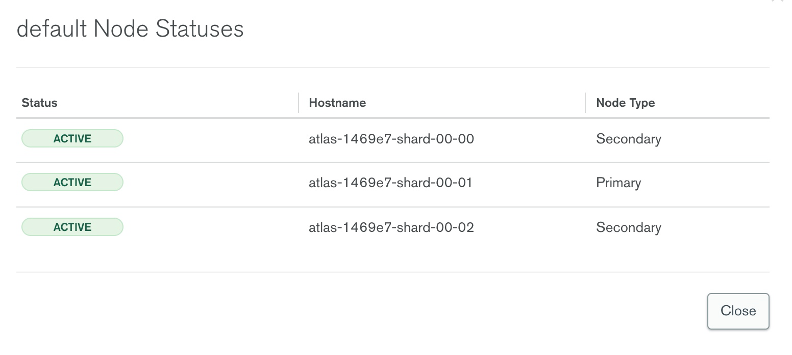

---
## Execution

__1. Configure Atlas Search Query within Compass__

* In the Atlas console, for the database cluster you deployed, click the __Connect button__, select __Connect with MongoDB Compass__, and copy the __Connection String__
* Launch Compass and when prompted select to use the __MongoDB Connection String__ detected from the clipboard, fill in the __Password__ field and then click the __Connect__ button
* In Compass, navigate to the `sample_mflix.movies` collection and select the __Aggregations__ tab
* In the following steps, we will use the `$search` stage to query for "werewolves and vampires" within the `fullplot` field in the `sample_mflix.movies` collection, while using a `$project` stage to only showing the `title`,  `year`,  `fullplot` fields.  We will use a `$limit` stage to limit the number of results to 15
* Open up the __New Pipeline From Text__ option within the Aggregations tab:
   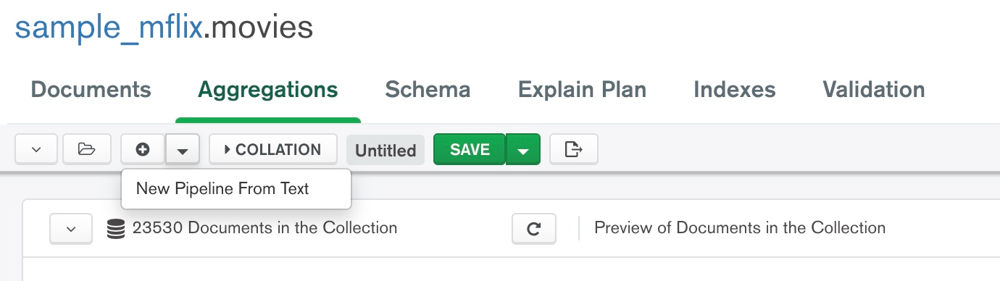
* Copy the following aggregation pipeline code snippet onto your clipboard:
	<pre>
	[
		{$search: {
			search: {
				path: 'fullplot',
				query: 'werewolves and vampires'
			}
		}},
		{$project: {
			_id: 0,
			title: 1,
			year: 1,
			fullplot: 1,
			score: {
				$meta: 'searchScore'
			}
		}},
		{$limit: 15}
	]
	</pre>
* Paste the copied pipeline code above into the __New Pipeline From Text__ modal window:
   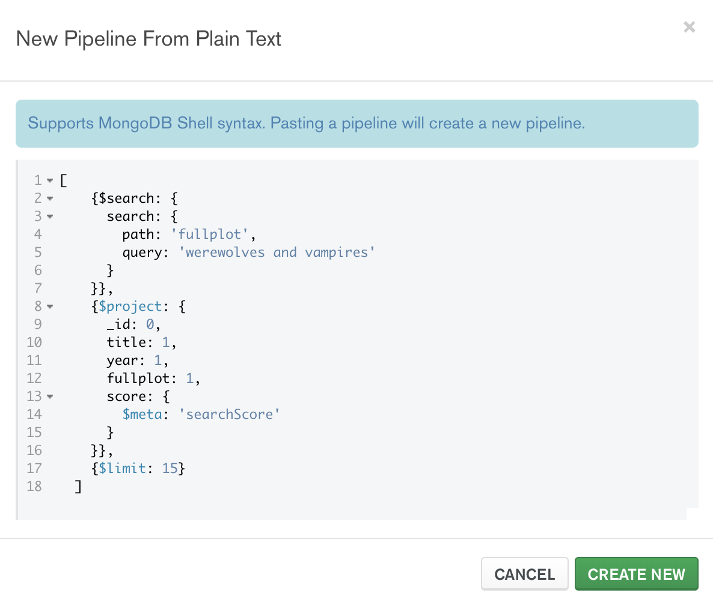
* Click __Create New__ and then __Confirm__ to create the new pipeline within Compass.
* The pipeline will automatically be executed and the result should now look similar to the following image:
   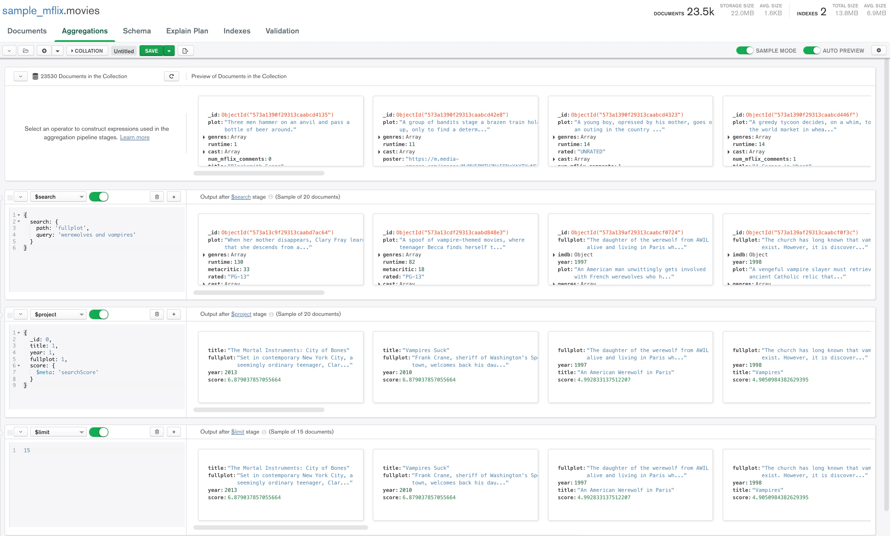  
__Note__: The [`search`](https://docs.atlas.mongodb.com/reference/full-text-search/search/) option allows queries to use an analyzer specified in the index configuration, which dictates how the index is broken down into searchable words. This proof uses the [default analyzer](https://docs.atlas.mongodb.com/reference/full-text-search/analyzers/standard/#ref-standard-analyzer).  [Different analyzers](https://docs.atlas.mongodb.com/reference/full-text-search/analyzers/#analyzers-ref) can be used, such as [language analyzers](https://docs.atlas.mongodb.com/reference/full-text-search/analyzers/language/#ref-language-analyzers) for searching indexed content stored in different languages.
* Notice that the _score_ attribute indicates how well each of the returned results matches to the query:  
   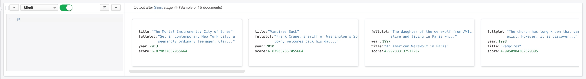
* Here is a screenshot of the same aggregation pipeline run within the shell:

   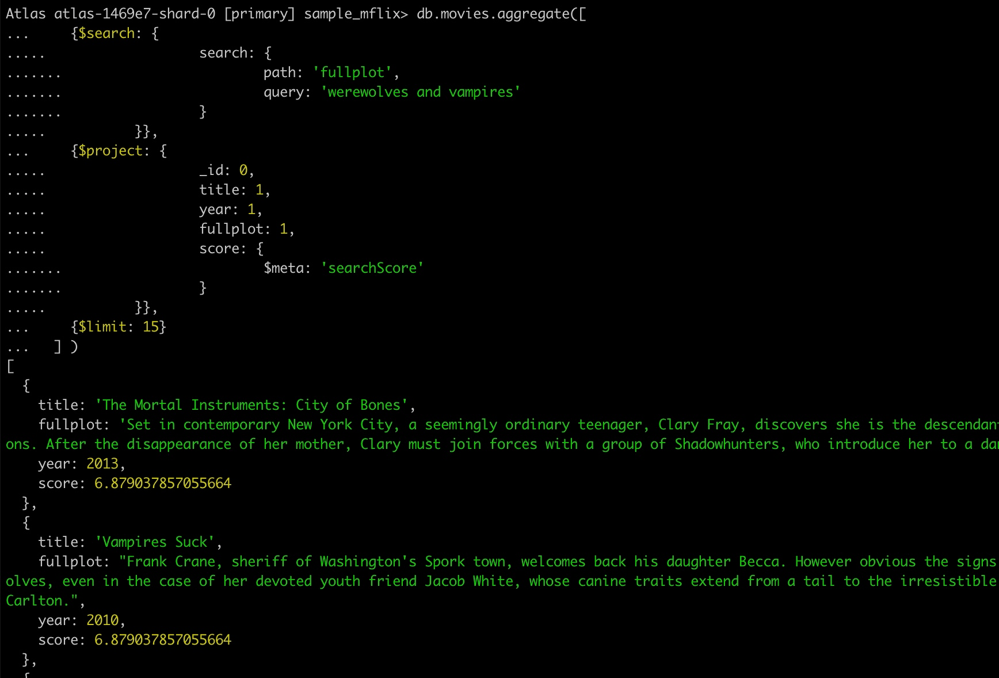

__2. Handling Misspellings__  

* Atlas Search is able to accommodate spelling mistakes through the `fuzzy` configuration attribute on the [`term`](https://docs.atlas.mongodb.com/reference/full-text-search/term/) option. The `term` operator does not use an analyzer in its queries.
* In the following steps, we will change the first aggregation stage to match all movies where the `fullplot` field contains text that is similar to the query __wherewolves__, a common misspelling of the word __werewolves__.
* Open up the __New Pipeline From Text__ option within the Aggregations tab of Compass.
* Copy the following aggregation pipeline code snippet onto your clipboard:
	<pre>
	[
		{$search: {
			term: {
				query: 'wherewolves',
				path: 'fullplot',
				fuzzy: {
					maxEdits: 2,
					prefixLength: 0
				}
			}
		}},
		{$project: {
			_id: 0,
			title: 1,
			year: 1,
			fullplot: 1,
			score: {
				$meta: 'searchScore'
			}
		}},
		{$limit: 15}
	]
	</pre>
* Paste the copied pipeline code above into the __New Pipeline From Text__ modal window.
* Click __Create New__, and then __Confirm__ to create the new pipeline within Compass.
* The pipeline will automatically be executed and the result should now look similar to the following image:
   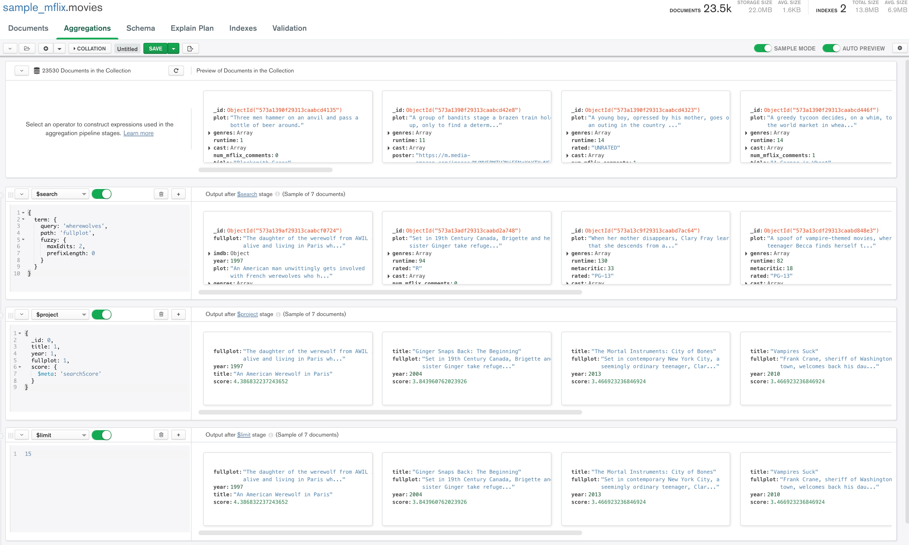
* Here is a screenshot of the same aggregation pipeline run through the shell:

   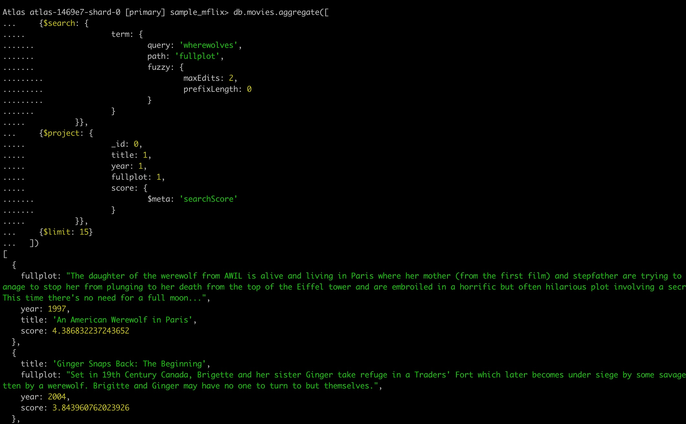

__3. Highlight Result Set__

* The Full Text Search [`highlight`](https://docs.atlas.mongodb.com/reference/full-text-search/highlighting/) option adds fields to the result set that display search terms in their original context.
* In the following steps, we will alter the first stage to use the `highlight` object, specifying `fullplot` as the search field within the `path` attribute in the `highlight` object.  We will then project the highlights in the `$project` stage within the pipeline.
* Open up the __New Pipeline From Text__ option within the Aggregations tab of Compass.
* Copy the following aggregation pipeline code snippet onto your clipboard:
	<pre>
	[
		{$search: {
			search: {
				path: 'fullplot',
				query: 'werewolves and vampires'
			},
			highlight: {
				path: "fullplot"
			}
		}},
		{$project: {
			_id: 0,
			title: 1,
			year: 1,
			fullplot: 1,
			score: {
				$meta: 'searchScore'
			},
			highlights: {"$meta":'searchHighlights'}
		}},
		{$limit: 15}
	]
	</pre>
* Paste the copied pipeline code above into the __New Pipeline From Text__ modal window.
* Click __Create New__, and then __Confirm__ to create the new pipeline within Compass.
* The pipeline will automatically be executed and the result should now look similar to the following image:
   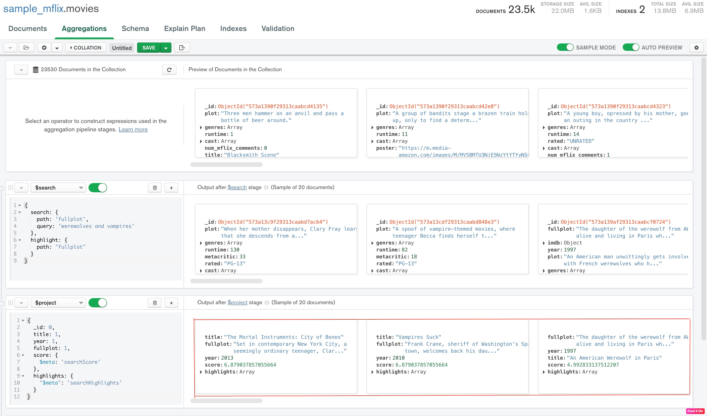
* Here is a screenshot of the same aggregation pipeline run through the shell:

   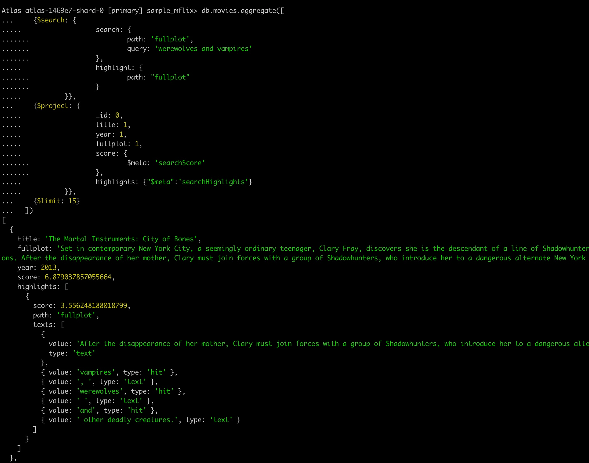

__4. Compound Full Text Search Queries__
* The Full Text Search [`compound`](https://docs.atlas.mongodb.com/reference/full-text-search/compound/) operator combines two or more operators in a single query.  
* In the following steps, we will change the first stage in our aggregation pipeline to search for all movies which `must` contain the phrase `werewolves` in the `fullplot` field, and `must not` contain the phrase `vampires` in the `fullplot` field.  All other stages will remain the same.
* Copy the following aggregation pipeline code onto your clipboard:
	<pre>
	[
		{$search: {
			compound: {
				must: {
					search: {
						path: 'fullplot',
						query: 'werewolves'
					}
				},
				mustNot: {
					search: {
					    path: 'fullplot',
					   query: 'vampires'
					}
				}
			}
		}},
		{$project: {
			title: 1,
			_id: 0,
			year: 1,
			fullplot: 1,
			score: {$meta: 'searchScore'},
			highlights: {"$meta": 'searchHighlights'}
		}},
		{$limit: 15}
	]
	</pre>
* Paste the copied pipeline code above into the __New Pipeline From Text__ modal window.
* Click __Create New__, and then __Confirm__ to create the new pipeline within Compass.
* The pipeline will automatically be executed and the result should now look similar to the following image:
   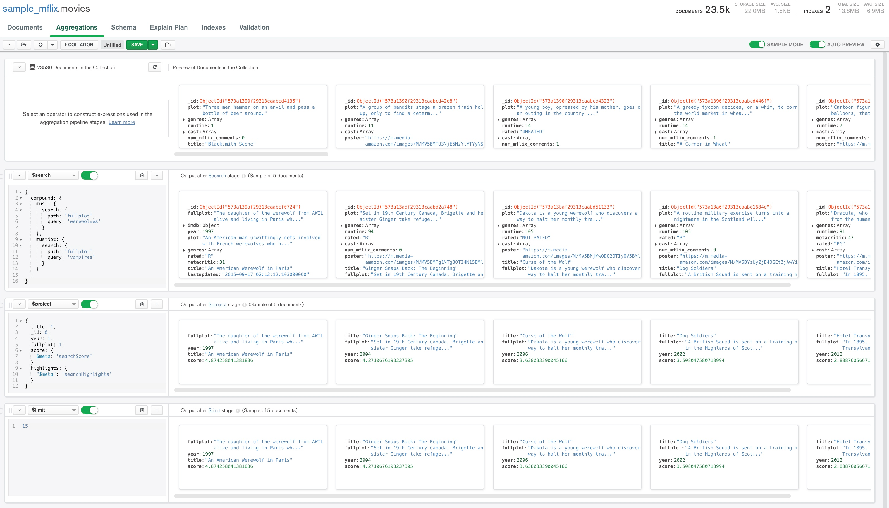
* Here is a screenshot of the same aggregation pipeline run through the shell:

   

---
## Measurement  

This proof should have demonstrated the following key capabilities for Atlas Search, measured by viewing the output of the Aggregation Builder in Compass:

* __Basic search__
* __Fuzzy search__ to accommodate common misspellings in search queries
* __Highlight search__ to present the result set in its original context, indicating which words in the result set matched the search query.  See [the highlighting documentation](https://docs.atlas.mongodb.com/reference/full-text-search/highlighting/) for more details
* __Compound search__ to return results that matched a phrase but did not match other phrases.  See the [compound search documentation](https://docs.atlas.mongodb.com/reference/full-text-search/compound/) for more details.
