# AUTO-COMPLETE

__Ability to provide auto-complete suggestions for a text field that appears in a set of records, when a user provides just the first few characters to search__

__SA Maintainer__: [Rajesh Ramamurthy](mailto:rajesh.ramamurthy@mongodb.com)  
__SA Author: [Jai Karve](mailto:jai.karve@mongodb.com)  __
__Time to setup__: 45 mins  
__Time to execute__: 15 mins  

---
## Description

This proof shows how MongoDB Atlas Full Text Search (FTS) can enable auto-complete suggestions for a text field that appears in a set of records, when an end user has provided the first 3 characters or more for the search. For the proof, the _movies_ collection from the [Atlas sample_mflix database](https://docs.atlas.mongodb.com/sample-data/available-sample-datasets/#available-sample-datasets) will be used, and specifically each movie's _plot_ attribute will be text searched. Also, for this proof, a Realm application has been created to provide a web search box (see screenshot below) for end users to enter the first few characters of a search string to look for in the movie's _plot_ attribute - as each character is added by the end user a Realm webhook is invoked by to perform the _$searchBeta_ based aggregation using the current text entered so far.

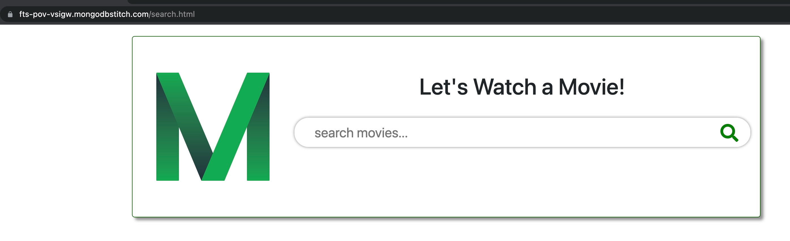

---
## Setup
__1. Configure Laptop__

* Ensure MongoDB Compass Enterprise __version 1.21.0 (stable)__ or higher is installed on your laptop.  Enterprise version 1.21.0 is required since the `$search` operator is only available in this version of Compass.

__2. Configure Atlas Environment__

&nbsp;&nbsp;&nbsp;__Note__: If you have just completed [TEXT-SEARCH](https://github.com/10gen/pov-proof-exercises/tree/master/proofs/36), you may skip to Step 3.
* Log-on to your [Atlas account](http://cloud.mongodb.com) (using the MongoDB SA preallocated Atlas credits system) and navigate to your SA project
* In the project's Security tab, choose to add a new user called __main_user__, and for __User Privileges__ specify __Atlas admin__ (make a note of the password you specify)
* Also in the Security tab, add a new __IP Whitelist__ for your laptop's current IP address
* Create an __M10__ based 3 node replica-set in an AWS region of your choice, running __MongoDB version 4.2__ (Atlas Full Text Search is only supported in version 4.2.  It is available on all cluster sizes.)
* Once the cluster has been full provisioned, in the Atlas console, click the **... (*ellipsis*)**, select **Load Sample Dataset**.  In the modal dialog, confirm that you want to load the sample dataset by choosing **Load Sample Dataset**.
* In the Atlas console, once the dataset has fully loaded, click the __Collections button__, and navigate to the `sample_mflix.movies` collection.  Under the __Search__ tab, choose to __Create Search Index__.
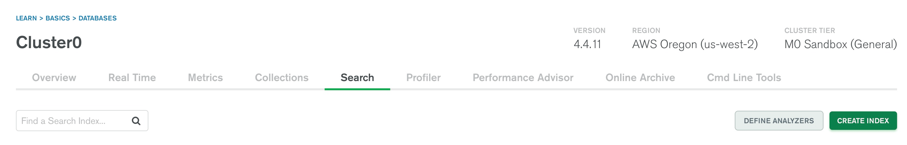
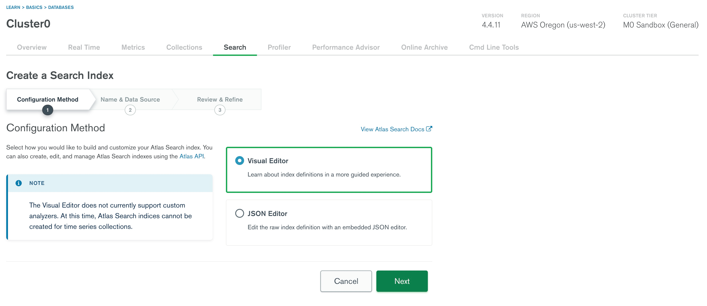

* To select the movies collection as a data source, type movies in the text box or click sample_mflix as shown below
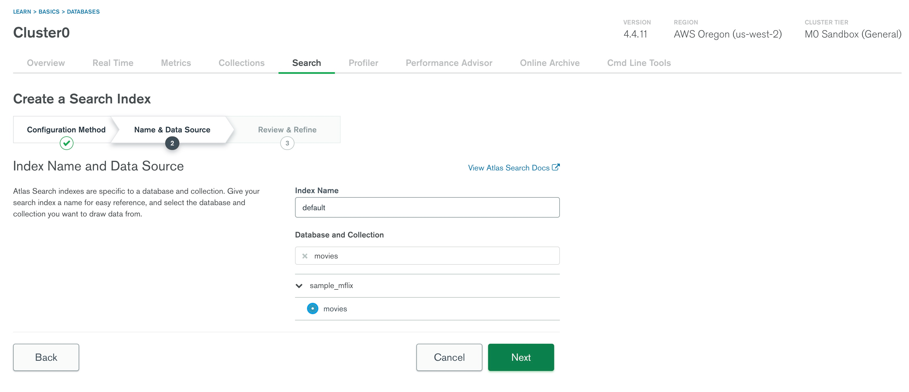

*  Keep all of the default options and select __Create Index__.

*  The default index structure can be edited as shown below
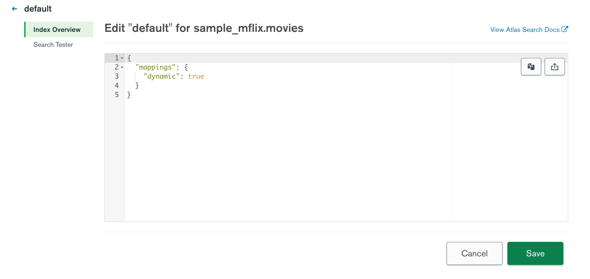

* The Index creation process should take approximately 4 minutes.  Full-text search indexes are built in a rolling fashion, starting with the secondaries first.  You are able to view the progress and statistics of the cluster's primary node in the overview page.   In the event that some nodes report a different status than the primary node, there is an option to [view the status of the index build on each node](https://docs.atlas.mongodb.com/reference/full-text-search/create-index/#node-status):

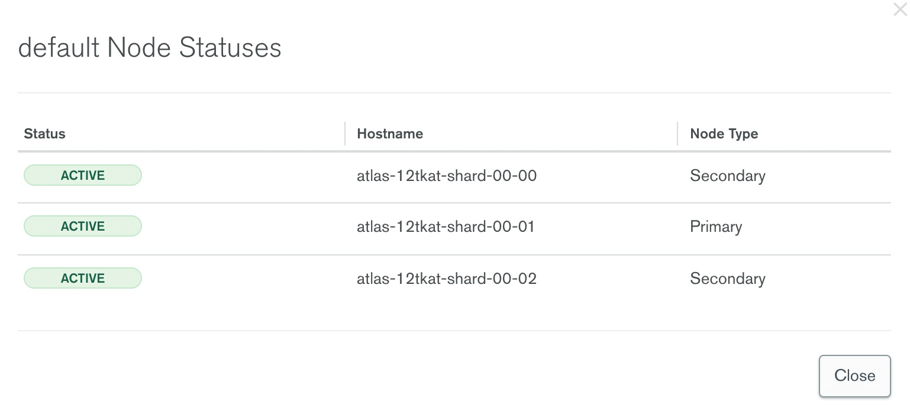

__3. Install and Configure Realm CLI Access__

* In a terminal session on your laptop, run `npm install -g mongodb-realm-cli` to install the [realm-cli](https://www.npmjs.com/package/mongodb-realm-cli).
* If you run into a `permission denied` error, you may need to run the following command in order to update permissions for your `node_modules` directory, according to [this help ticket](https://jira.mongodb.org/browse/HELP-12025): `sudo chown -R $USER /usr/local/lib/node_modules`
* Verify that the `realm-cli` is installed by executing the following command: `realm-cli --version`
* Back in the Atlas console, click on Access Manager and select Project Access. On that page, navigate to the [API Keys](https://docs.atlas.mongodb.com/configure-api-access/#create-an-api-key-for-a-project) tab to create an API Key for your project and from the top right hand page of the console click Create API Key in order to create a new API Key
* For the Description field, enter __FTS PoV__ and change the Project Permissions to Project Owner, and click Next:

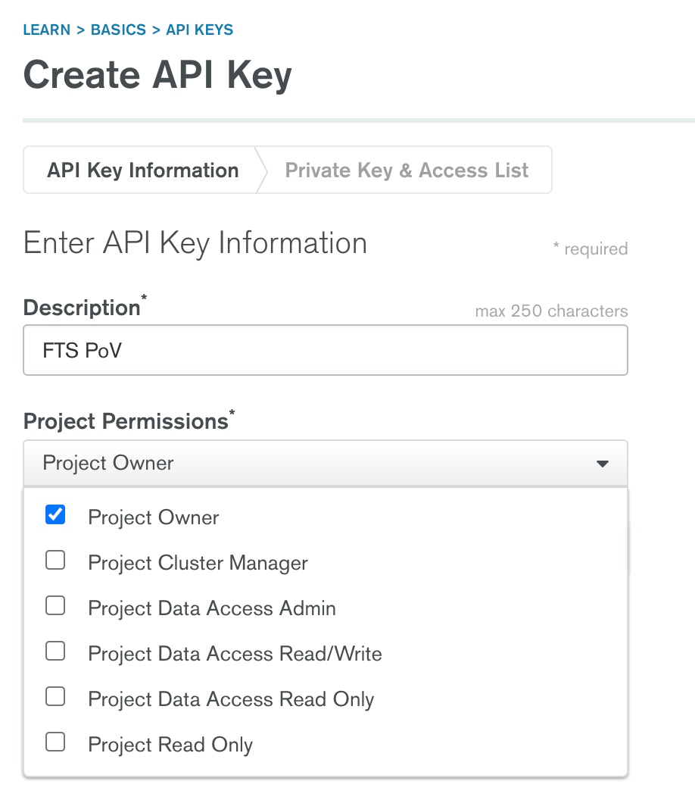

* Copy your private key and store it in a text file for later use.
* Add your IP address as a Whitelist Entry by selecting __Add Whitelist Entry__, and choosing to __Use Current IP Address__.
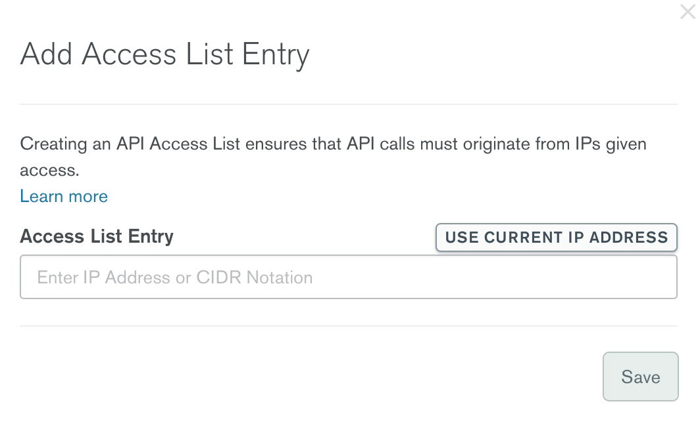

* Click __Done or Save__.

__4. Deploy Realm application__

* The exported version of the Realm application exists in the sub-folder `realm-fts-pov`.  In the base folder of this proof, deploy the `realm-fts-pov` application into Realm, in the same project as your Atlas cluster, by running the `deploy.sh` script - execute the script as shown below, first replacing the two parameters with the public & private keys you just saved, and for the 3rd parameter, the name of the Atlas cluster:

		./deploy.sh <PUBLIC_KEY> <PRIVATE_KEY> <ATLAS_CLUSTER_NAME>

&nbsp;&nbsp;&nbsp;_Example_:

        ./deploy.sh nrzwypmv ee038461-e4a1-4ab9-950c-35aedf1986g8 TestCluster

* You will first be authenticated to the Realm CLI.  If you already have an existing session running with access to the project, you do not need to de-authenticate the existing session.
* Select the project name where you have deployed the Atlas cluster.  Hit Enter to choose the project highlighted.
* Type `y` when prompted with `would you like to create a new app? [y/n]`
* Press Enter to use the default app name
* The Realm Runtime currently [works in the following AWS regions](https://docs.mongodb.com/realm/admin/deployment-models-and-regions/#cloud-deployment-regions): Virginia (`US-VA`), Oregon (`US-OR`), Ireland (`IE`), or Sydney (`AU`).  Type in the code for the region closest to your Atlas cluster.

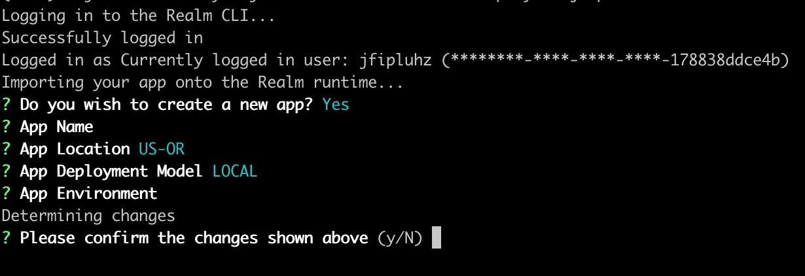

* Hit Enter to choose [a `LOCAL` deployment](https://docs.mongodb.com/realm/admin/deployment-models-and-regions/#deployment-models), the default configuration for this application.  A `LOCAL` deployment will deploy the Realm application in the specific [cloud region](https://docs.mongodb.com/realm/admin/deployment-models-and-regions/#stitch-regions) specified in the previous step.  Conversely, a `GLOBAL` deployment will host the Realm application in every region that Realm currently supports.
* Select development for app environment.
* The `realm-cli` will then import and deploy your application onto the Realm runtime. Note - It will take few minutes to deploy the application.

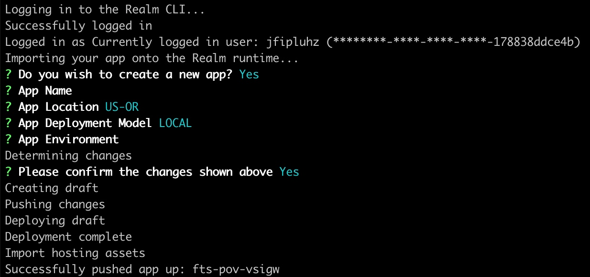

__5. Modify search.html page with callback URLs__

__Note:__ The URLs for the Realm application HTTPS Endpoints are only available after an initial deploy.  In the following step, we will retrieve the endpoint URLs from the Realm UI, and then update the  `search.html` web page to use these URLs.  We will have to then re-deploy the application.

* In the Atlas Console, navigate to the __Realm__ tab and select the __FTS-PoV__ Realm application.

* Select __HTTPS Endpoints__ and open up the HTTPS Endpoint `/FTSPoVService/ftspovhookquery`.  Go to the __ENDPOINT SETTINGS__ section, and click __Copy__ next to the __HTTPS Endpoint URL__:

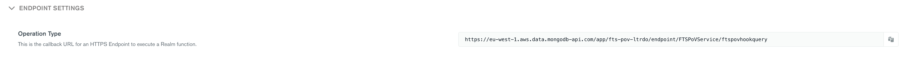

* Save the value of the HTTPS Endpoint URL in a text file.
* Select __HTTPS Endpoints__ breadcrumb within the Realm UI and open up the HTTPS Endpoint called `/FTSPoVService/ftspovhooktypeahead`.
* Save the value of the HTTPS Endpoint URL in a text file.
* Update the new URLs from the HTTPS Endpoints by executing the file `update.sh` as
`./update.sh <FTSPoVService/ftspovhookquery URL> </FTSPoVService/ftspovhooktypeahead URL>` from the saved values in the text file.
* Deploy the application again by running `sh deploy.sh <PUBLIC_KEY> <PRIVATE_KEY> <ATLAS_CLUSTER_NAME>`
* Notice that the Realm CLI will recognize the changes made to the application, and prompt you to upload these changes.  Select `y` to update the application with these local changes:

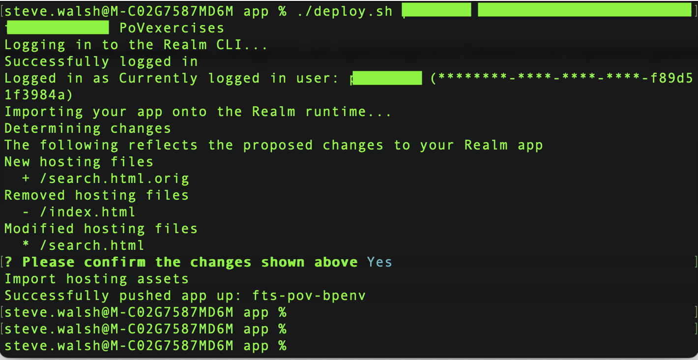

---
## Execution

__1. Open search web page__

* Navigate to the __FTS_PoV__ Realm application
* In the Realm left-hand navigation menu, select _Hosting_
* Enable Hosting for the application, since this currently can only be performed via the UI

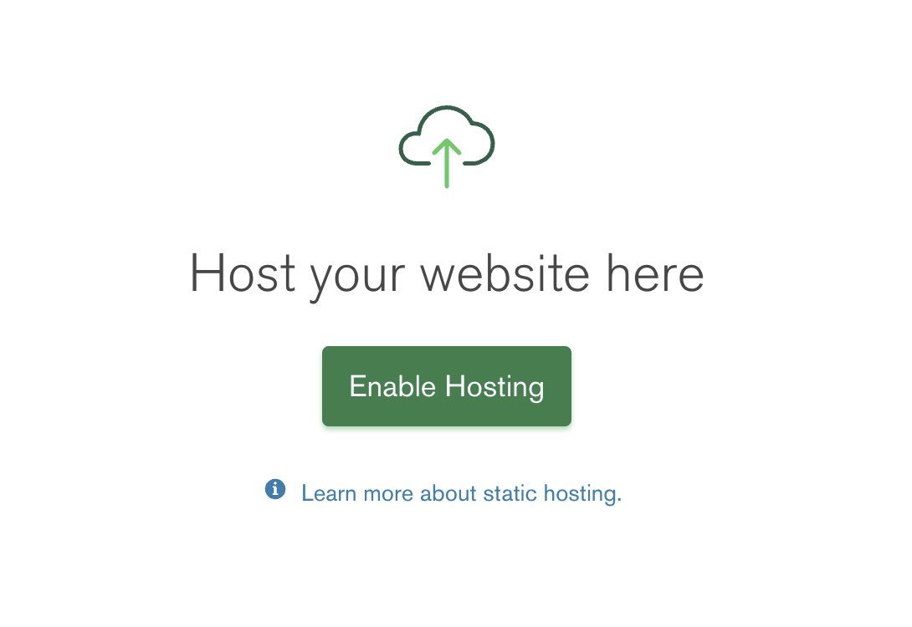

* You should see the `search.html` page listed in the table.
* Under __Actions__ click the ellipsis __...___ and select __Copy Link___ (i.e. https://stitch-statichosting-prod.s3.amazonaws.com/624b0de9772bbc74adb0a401/search.html?...)

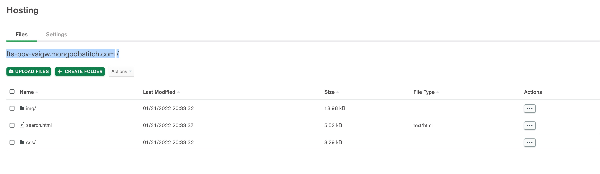

* Open up an incognito browser window, appending `search.html` to the URL
(__Note__: The _Open In Browser_ menu item only fetches the selected asset and does not preserve the links to the other assets).

__2. Test out search queries__

Before trying out search queries from the application, create an autocomplete index so that the fields that you intend to query are indexed with the autocomplete data
type in the collection's index definition. [Autocomplete](https://docs.atlas.mongodb.com/atlas-search/autocomplete/)

Name the index as `ix_autocomplete`. Copy the following index definition and paste it in the JSON editor as shown in the screenshow below and save the index.
<pre>
	{
	"mappings": {
		"dynamic": false,
		"fields": {
		"title": [
			{
			"foldDiacritics": false,
			"maxGrams": 7,
			"minGrams": 3,
			"tokenization": "nGram",
			"type": "autocomplete"
			}
		]
		}
	}
	}
</pre>

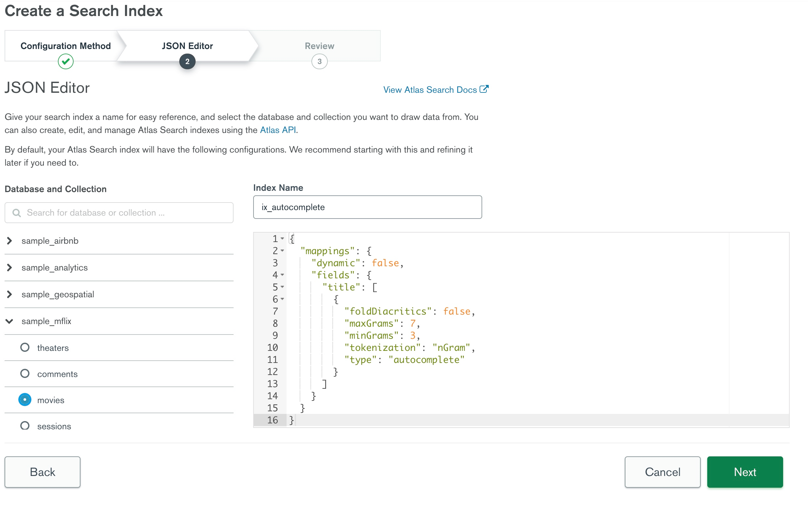

* Type in a search query (for the plot) into the box (e.g. _dines_ or _crime_) and notice that after the first three characters are typed, auto complete suggestions appear (don't select one at this point). This auto complete functionality is using the [typeahead.js library](https://github.com/twitter/typeahead.js/), which invokes the `fts-pov-hook-typeahead` webhook with an AJAX GET request, passing in the search query as the `arg` query parameter.
* The `fts-pov-hook-typeahead` webhook is using the following aggregation pipeline code where _arg_ is the variable containing the current search string:
<pre>
	[
		{$search: {
			"index": "ix_autocomplete",
			"autocomplete": {
				"query": arg,
				"path": "title",
				"tokenOrder": "any"
			}
		}},
		{$project: {
			title:  1,
			_id:  0,
			year:  1,
			fullplot:  1
		}},
		{$limit:  15}
	]
</pre>
__Note__:  The above aggregation pipeline performs a search for a word or phrase that contains a sequence of characters from an incomplete input string, only includes certain fields in the result set ([`$project` stage](https://docs.mongodb.com/manual/reference/operator/aggregation/project/)), and limits the returned results to 15 ([$limit stage](https://docs.mongodb.com/manual/reference/operator/aggregation/limit/)).  The `title` of the result set is shown in the dropdown on the `search.html` page.
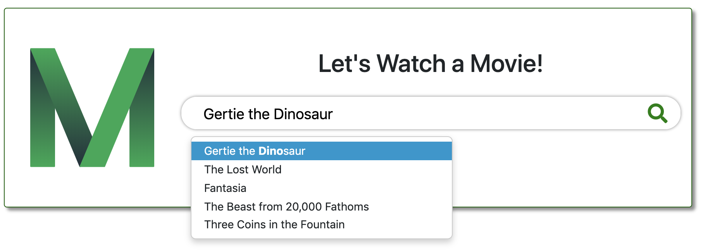

* After typing in a query, hit the `Submit` button.  An AJAX GET request passes the query as the `arg` query parameter to the `fts-pov-hook-query` webhook.  This webhook invokes the same full-text search aggregation pipeline code created in the [TEXT-SEARCH](https://github.com/10gen/pov-proof-exercises/tree/lucene-proofs-jai/proofs/36) proof.
<pre>
	[
		{$search: {
			compound: {
          		must: {
            		search: {
              			path: 'fullplot',
              			query: arg
            		}
          		},
          		should: {
            		search: {
              			path: 'title',
              			query: arg
            		}
          		}
        	}
		}},
		{$project: {
			title:  1,
			_id:  0,
			year: 1,
			fullplot:  1,
			score: {$meta:  'searchScore'}
		}},
		{$limit: 15}
	]
</pre>
* The above aggregation pipeline performs a compound search, finding all movies that match the search phrase in the `fullplot` field, and boosting results for any movies that contain a match on the `title` field.  If a movie is selected from the auto-complete dropdown, it should show up first in the list of results.
* The following is an example screenshot of the results page after typing in the query.

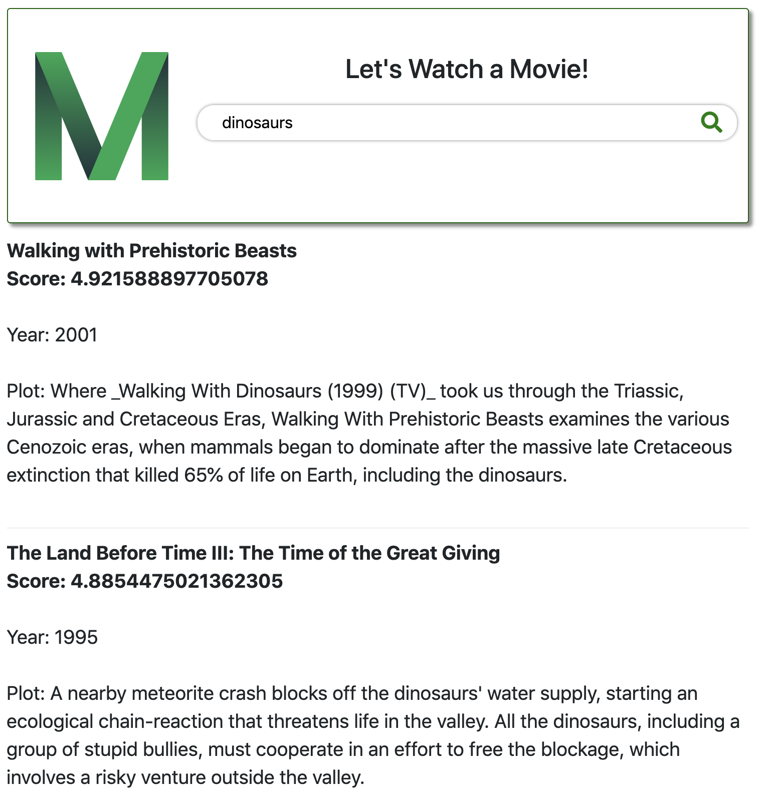

__3. Execute same query within Compass__

* In the Atlas console, for the database cluster you deployed, click the **Connect button**, select **Connect with MongoDB Compass**, and copy the **Connection String**.
* Launch Compass and when prompted select to use the **MongoDB Connection String** detected from the clipboard, fill in the **Password** fields and then click the **Connect** button.
* Copy the following aggregation pipeline code that is being used in the `fts-pov-hook-query` webhook, into your clipboard:

<pre>
	[
		{$search: {
			search: {
				path:  'fullplot',
				query:  'arg'
			}
		}},
		{$project: {
			title:  1,
			_id:  0,
			year: 1,
			fullplot:  1,
			score: {$meta:  'searchScore'}
		}},
		{$limit: 15}
	]
</pre>
* In Compass, navigate to the `sample_mflix.movies` collection and select the **Aggregations** tab.
* Paste the pipeline code using the **New Pipeline From Text** feature within Compass and BEFORE hitting _Create New_ change `arg` in the pipeline code to the first few characters of the query that you submitted (e.g. 'dinos') on the Realm web page earlier:

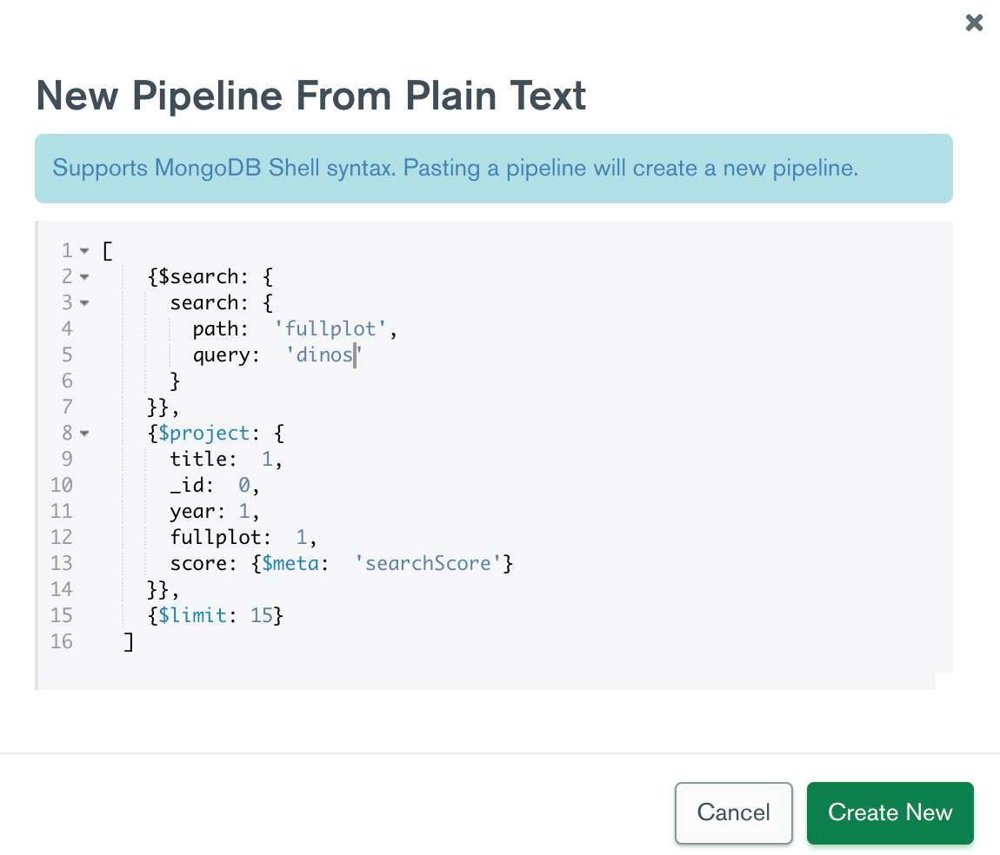

* The following is an example of a screenshot of the first two results shown after pressing _Create New_ in the previous stage, in Compass.

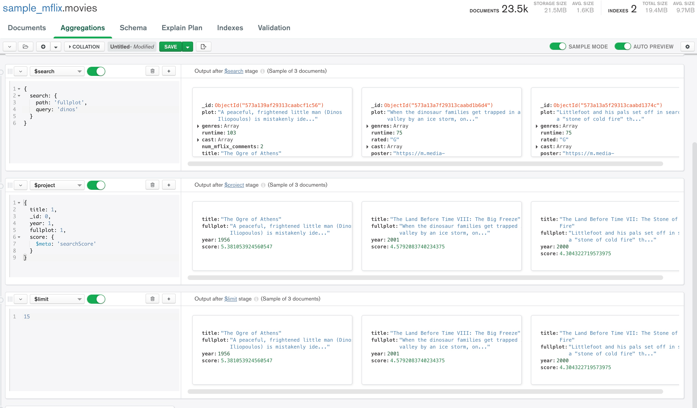

---
## Measurement
* For testing with the Realm application, suggested & correctly matching _plot_ search terms should have appeared in the web page once your entered 3 or more characters, and after hitting submit, multiple movie result records should have been displayed in the web page, where each movie has a plot containing the search term in its text.
* For testing with Compass, the results shown in the aggregation builder should include multiple movie result records, where each movie has a plot containing the search first few characters (the _arg_ value) in its text.
