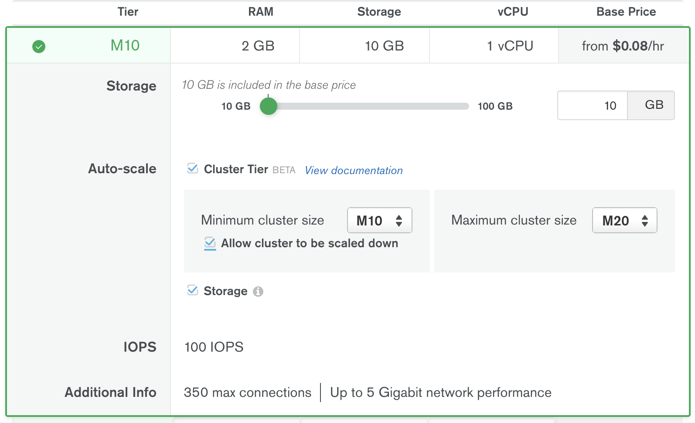
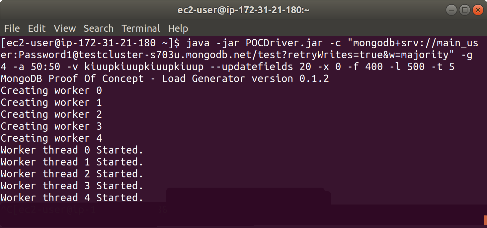
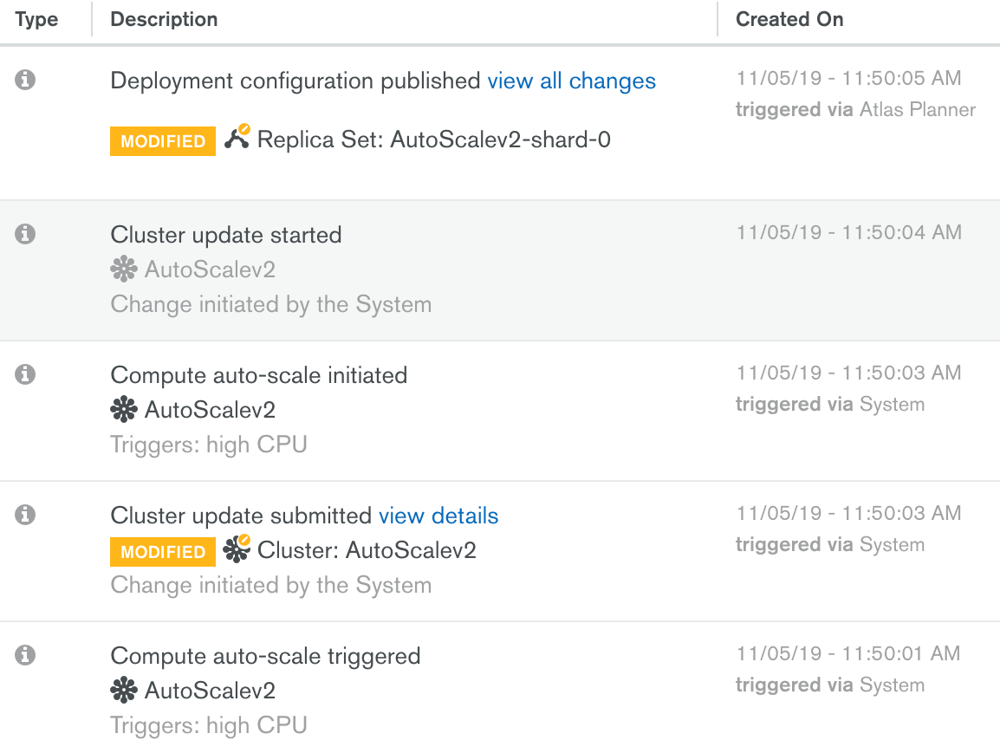
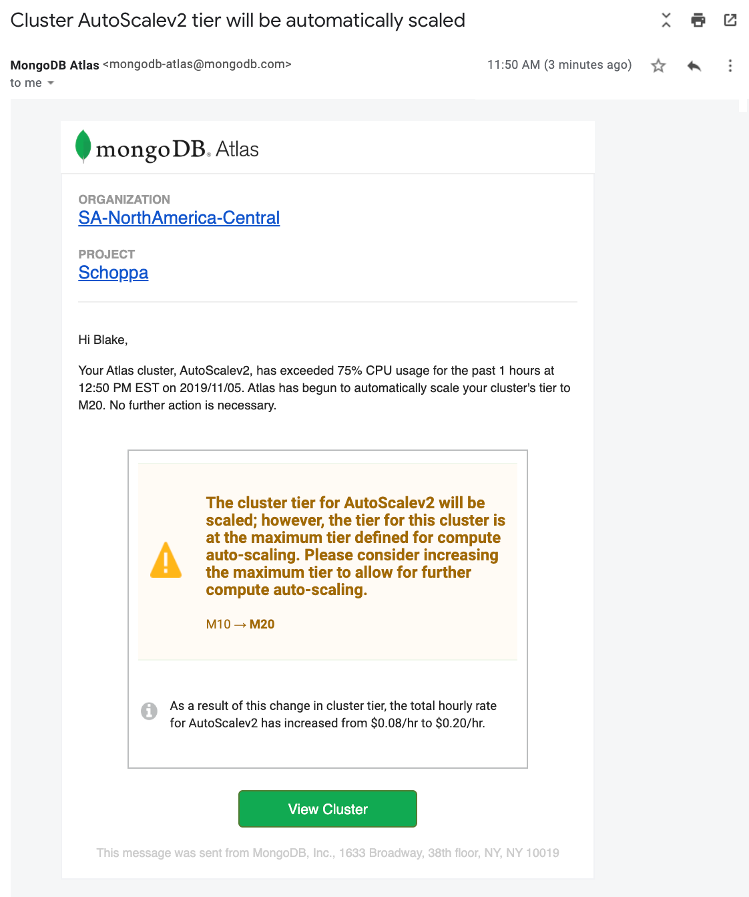
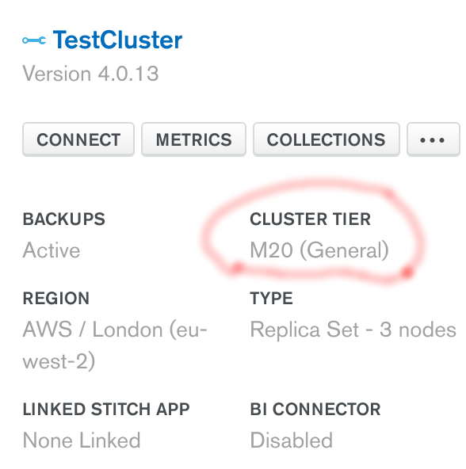

# ELASTIC-SCALE

__Ability for the database to automatically scale-up its compute capacity, without requiring human intervention, in response to increased database usage__

__SA Maintainer__: [Blake Schoppa](mailto:blake.schoppa@mongodb.com) <br/>
__Time to setup__: 30 mins <br/>
__Time to execute__: 1 hour &nbsp;&nbsp;_(to scale up - plus 3 days if also showing scale down)_ <br/>


---
## Description

This proof shows how MongoDB Atlas can [automatically scale](https://docs.atlas.mongodb.com/cluster-autoscaling/) its cluster tier up, and optionlly down, in response to changing cluster usage. Atlas cluster auto-scaling removes the need to write scripts to analyze cluster usage to make scaling decisions and enact the resulting actions.

Atlas scales the cluster up to the next tier of compute if one of the following is true for the current cluster:

* Average CPU Utilization has exceeded 75% for the past hour, or
* Memory Utilization has exceeded 75% for the past hour.

Atlas scales the cluster down to the next lowest tier of compute if both of the following are true:

* Based on data collected from the past 72 hours, the desired CPU Utilization and Memory Utilization on the target cluster tier has not exceeded 50%, and
* The cluster has not already been scaled down in the last 72 hours


---
## Setup

__1. Configure Atlas Environment__
* Log-on to your [Atlas account](http://cloud.mongodb.com) (using the MongoDB SA preallocated Atlas credits system) and navigate to your SA project
* In the project's security section, choose to add a new user called __main_user__, and for __User Privileges__ specify __AdminUser__ (__this level is required due to some of the things POCDriver does__; also make a note of the password you specify)
* Create a __M10__ based 3 node replica-set in an AWS region of your choice, and ensuring that in the M10 tier section you set the following fields, as shown in the screenshot below.
    * Enable __Auto-scale__ by checking the __Cluster Tier__ checkbox
    * Set __Minimum cluster size__ to M10
    * To enable scaling down, check the __Allow cluster to be scaled down__ checkbox
    * Set __Maximum cluster size__ to M20
    
     

__2. Configure AWS EC2 Instances to Generate Load__
* Using your MongoDB 'Solution Architects' [AWS pre-existing account](https://wiki.corp.mongodb.com/display/DEVOPSP/How-To%3A+Access+AWS+Accounts), log on to the [AWS console](http://sa.aws.mongodb.com/) and near the top right hand side of the AWS Console, __change the region__ to match the same AWS region as you created the Atlas cluster in
* Launch (create) __3x__ new EC2 instance with the following settings (use defaults settings for the rest of the fields):
  * __AMI Type__: Amazon Linux AMI 2018.03.0 (HVM), SSD Volume Type  _(use this type as it automatically includes software like Java)_
  * __Instance Type__: t2.small
  * __Add Tags__: _be sure to set the 3 specific tags ('Name', 'owner', 'expire-on') on your instance as per the [MongoDB AWS Usage Guidelines](https://wiki.corp.mongodb.com/display/DEVOPSP/AWS+Reaping+Policies)_ to avoid your instance from being prematurely reaped
  * __Security Group__: Create a new security group which has an inbound rule to allow SSH only on port 22 from source 0.0.0.0/0
* When prompted, choose to use your existing key pair or create a new key pair (typically named similar to 'firstname.lastname'). If creating a new key pair, be sure to click the button to __Download Key Pair__ and store the key somewhere safe on your laptop.
*  Once all the AWS instances are running, find each of them in the AWS Console __instances__ list, select each one, and for each, in the description section near the bottom of the AWS Console locate the __IPv4 Public IP__ field and make a note of its value
* Now go to the __Atlas Console__ and in the Security tab, add 3x new __IP Whitelist__ entries for the 3 IP addresses you just captured, to allow the AWS instances to connect to your Atlas cluster
* For each of the 3 AWS VMs, in the AWS Console __instances__ list select the AWS instance, press the __Connect button__ and follow the instructions to SSH into this instance from a new terminal window on your laptop, and then perform the following action to download the [POCDriver](https://github.com/johnlpage/POCDriver) (keeping all 3 of your terminal SSH remote sessions open afterwards, ready for later steps):

  ```wget https://raw.githubusercontent.com/johnlpage/POCDriver/master/bin/POCDriver.jar```


---
## Execution

### Generate Load using POCDriver
* From each of the already established remote SSH sessions, launch _POCDriver_ with the command show below and let the processes run, injecting load into the remote Atlas cluster, until the auto-scaling up completes process completes.  This should take approximately 1 hour.

  ```java -jar POCDriver.jar -c "mongodb+srv://main_user:<PASSWORD>@<SRV-CLUSTER-URL>/test?retryWrites=true&w=majority" -g 4 -a 50:50 -v kiuupkiuupkiuupkiuup --updatefields 20 -x 0 -f 400 -l 500 -t 5```

  * Replace __\<PASSWORD\>__ with the __main_user__'s password you created earlier
  * Replace __\<SRV-CLUSTER-URL\>__ with your cluster's SRV connection hostname (e.g. 'mycluster-a123b.mongodb.net')
  
  

---
## Measurement
__WARNING__:  This PoV takes a considerable amount of time to complete.  For upscaling events, Atlas will look at the average utilization of each metric over the past hour. For downscaling events, Atlas will track the maximum utilization for both metrics over the past 72 hours.

To prove that auto-scaling up action has been executed, look for the following evidence from when the auto-scaling event occurs:

* Atlas logs of the event in the project Activity Feed.



* Atlas sent emails received by all Atlas project's members, with information on the event. The email includes the original cluster tier and the new cluster tier after auto-scaling has occurred.



* After receiving the email or seeing the logged scale-up event, look at what tier the cluster is now reported as running on (should now be _M20_).



