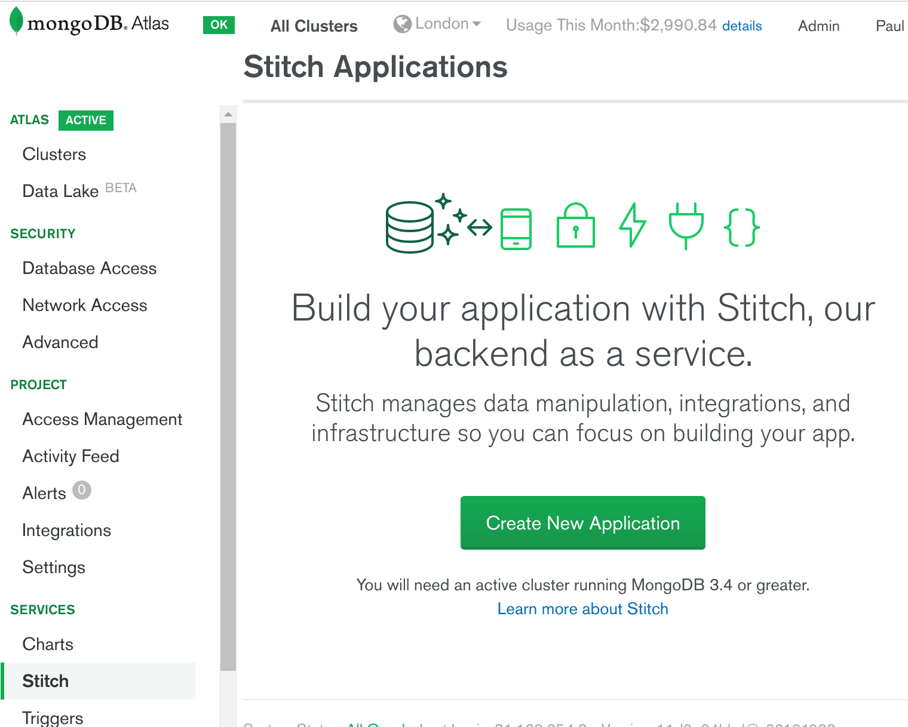
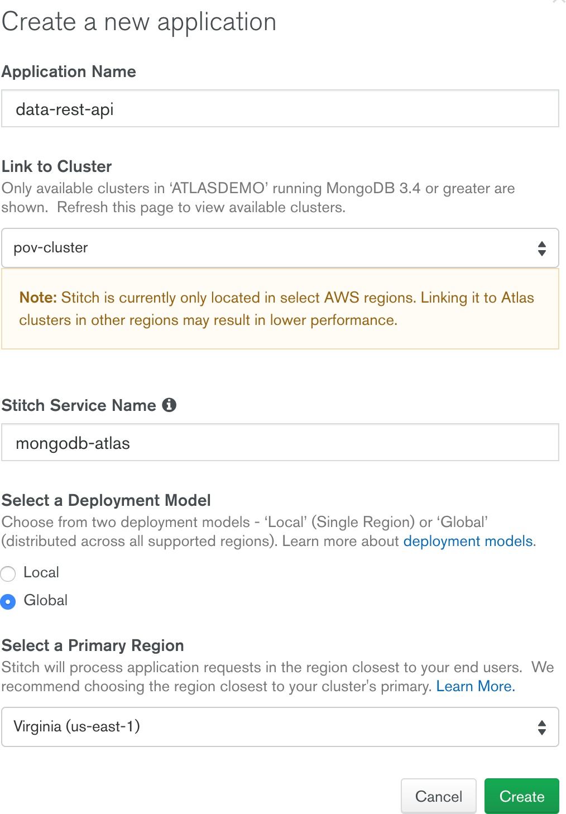
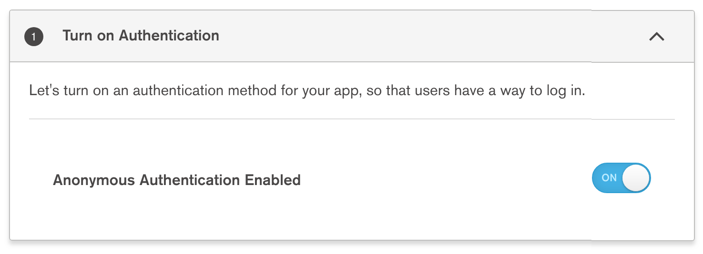
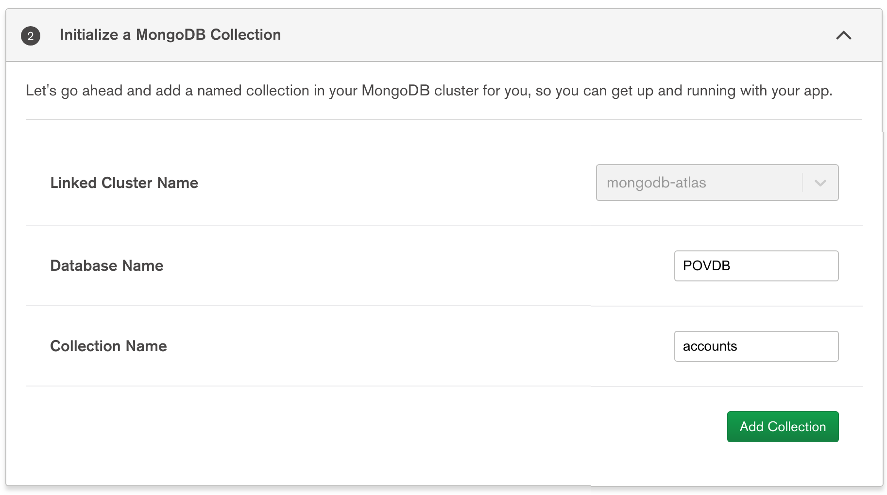
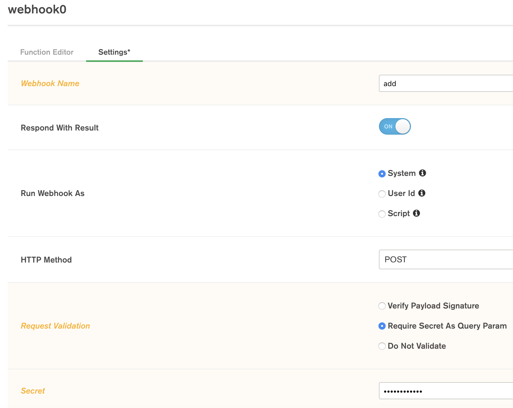
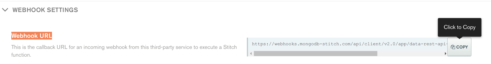
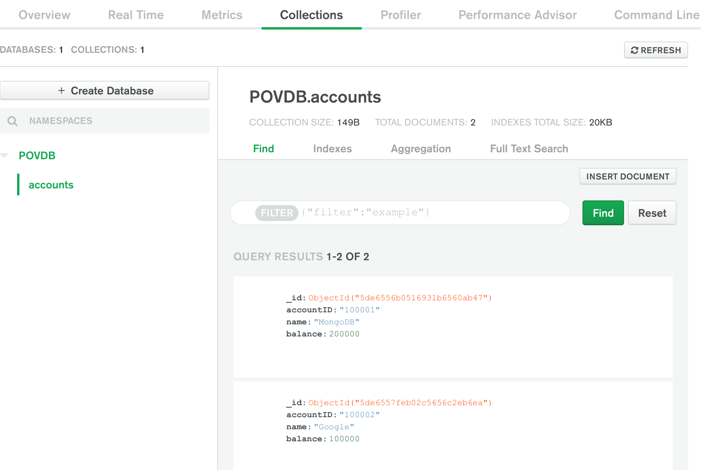

# DATA-REST-API

__Ability to expose a database data-set to consuming applications via a REST API__

__SA Maintainer__: [Kylin Soong](mailto:kylin.soong@mongodb.com) <br/>
__Time to setup__: 30 mins <br/>
__Time to execute__: 15 mins <br/>


---
## Description

This proof shows how MongoDB Atlas in combination with Mongo Stitch can be used to easily and rapidly expose MongoDB data via a REST API. MongoDB, like any database, typically provides access to data via one or more application programming APIs to consuming application tier code that is invariably responsible for presenting the data visually to end users. With the increase in the adoption of microservices and APIs in the industry, to separate concerns between parts of a business, or even between different partnering business, providing the ability to rapidly expose database data, securely, via standard REST APIs to consumers has become increasingly important. Minimising the coding required in an application tier, to present database data via a REST API, is important in the modern world where decreasing time-to-value can provide competitive advantage. 

As a result, for this proof a simple REST API will be provided via a Stitch HTTP Service to enable a REST client to insert _account_ records into a MongoDB Atlas database and then retrieve _account_ records back out of the database.

---
## Setup

__1. Configure Atlas Environment__
* Log-on to your [Atlas account](http://cloud.mongodb.com) (using the MongoDB SA preallocated Atlas credits system) and navigate to your SA project
* In the project's Security tab, click __Database Access__, choose to add a new user called __main_user__, and for __User Privileges__ specify __Read and write to any database__ (make a note of the password you specify)
* Also in the Security tab, add a new __IP Whitelist__ for your laptop's current IP address
* Create an __M10__ based 3 node replica-set in an AWS region of your choice

__2. Configure Stitch Environment__
* In the Atlas console, click *Stitch* from the left-hand navigation bar and then click the __Create New Application__ button



* In the __Create a new application__ dialog, enter '__data-rest-api__' as *Application Name* for your Stitch app, keep '__mongodb-atlas__' as *Stitch Service Name* and the other fields as default, as shown below and then click *Create*.



* After a few minutes the Stitch introduction screen will appear. In this screen turn on __Anonymous Authentication Enabled__ in the *Turn on Authentication panel* panel section.



* In the *Initialize a MongoDB Collection* panel section, set the value of the *database* field as '__POVDB__' and the *collection* field as '__accounts__' then click *Add Collection*



* From the top of the Atlas Stitch console, select *Review & Deploy Changes* and then click *Apply* to save the changes.


__3. Configure Stitch HTTP Service__

In this section, we will guide to create 2 HTTP Services, one is a HTTP POST service which will insert a JSON object into the backend database, the other is a HTTP GET service which will query the backend database and return the documents

* From the Stitch consoles left-hand navigation bar click __3rd Party Services__ -> __Add a Service__ -> __HTTP__ and give the service the name name *http*. then click __Add Service__ then click __Add Incoming webhook__
* In the __webhook0__ *Setting* tab, set the following field values, then press _Save_:
  - Webhook Name: add
  - Run Webhook As: System
  - HTTP Method: POST
  - Request Validation: Require Secret
  - Secret: samplesecret



* In the __webhook0__ *Function Editor* page, replace the code for the webhook with the following to simply insert a new record in the databse collection each time the HTTP POST service is invoked, then click _Save_

~~~
exports = function(payload, response) {

    const body = EJSON.parse(payload.body.text());
    console.log("Request body:", JSON.stringify(body));

    const mongodb = context.services.get("mongodb-atlas");
    const collection = mongodb.db("POVDB").collection("accounts");
    collection.insertOne(body);

    
    return  true;
};
~~~

* Navigate to the __Services__ -> __http__ service which was just created, then click __Add Incoming webhook__, and in the __webhook0__ *Setting* tab, set the following field values, before clicking _Save_:
  - Webhook Name: get
  - Run Webhook As: System
  - HTTP Method: GET
  - Request Validation: Require Secret 
  - Secret: samplesecret

* In the __webhook0__ *Function Editor* page, replace the code for the webhook with the following to simply query database and return all documents, then click _Save_

~~~
exports = function(payload, response) {
    const mongodb = context.services.get("mongodb-atlas");
    const collection = mongodb.db("POVDB").collection("accounts");
    return collection.find();
};
~~~

* From the top of the Atlas Stitch console, select *Review & Deploy Changes* and then click *Apply* to save the changes.
    
---
## Execution

* From the Atlas Stitch console for the Stitch application, click __Services__, then click on the service called __http__, then click on the __Incoming Webhook Name__ called __add__. Select the __Settings__ tab and then choose to COPY the value of the __Webhook URL__



* In a terminal on your laptop run the following Curl command to send some _account detail_ to the Stitch service to be inserted in the database (first replace 'XXXXXX' with the URL of the service you just copied, eg. ``https://webhooks.mongodb-stitch.com/api/client/v2.0/app/data-rest-api-xxxxx/service/http/incoming_webhook/add``):

~~~
curl \
-X POST \
-H "Content-Type: application/json" \
-d '{"accountID":"100001", "name": "MongoDB", "balance": 200000}' \
XXXXXX/add?secret=samplesecret
~~~ 

* Repeat the above curl commands, changing the -d parameter to have details of a different _account_ (again replacing 'XXXXXX' with the URL):

~~~
curl \
-X POST \
-H "Content-Type: application/json" \
-d '{"accountID":"100002", "name": "Google", "balance": 100000}' \
XXXXXX/add?secret=samplesecret
~~~ 

* From the Atlas Stitch console for the Stitch application, click __Services__, then click on the service called __http__, then click on the __Incoming Webhook Name__ called __get__. Select the __Settings__ tab and then choose to COPY the value of the __Webhook URL__

* From your laptop terminal run the following Curl command to query back from the Stitch service all the _account_ records currently held, which should be the two you just added (again replacing 'XXXXXX' with the URL):

~~~
curl XXXXXX/get?secret=samplesecret
~~~


---
## Measurement

* Invoking the HTTP GET REST service in the last part of the _Execution_ section, above, should return and display the two same records that were inserted via the HTTP POST REST services, similar to (but probably less well formatted):

```json
[
    {
        "_id": {"$oid":"5de6556b0516931b6560ab47"},
        "accountID": "100001",
        "name": "MongoDB",
        "balance": {"$numberInt": "200000"}
    },
    {
        "_id": {"$oid":"5de6557feb02c5656c2eb6ea"},
        "accountID": "100002",
        "name": "Google",
        "balance": {"$numberInt": "100000"} 
    }
]
```

* Go back to the Atlas console and for the database cluster click the __Collections__ button and verify that the two records that should have been inserted are indeed present in the database




