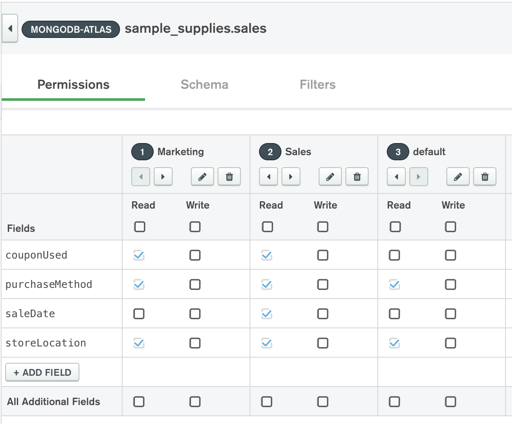
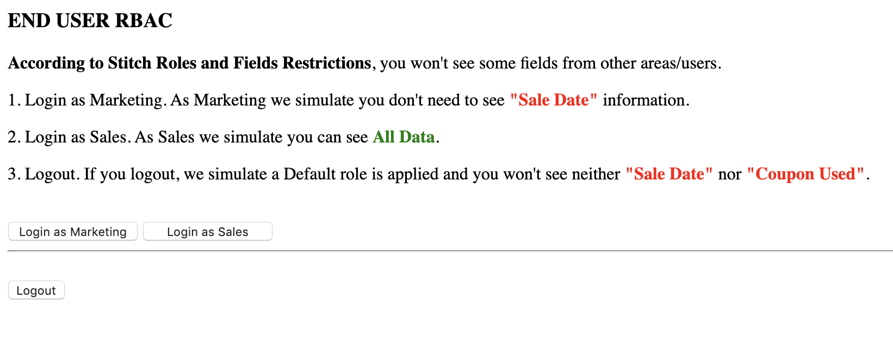
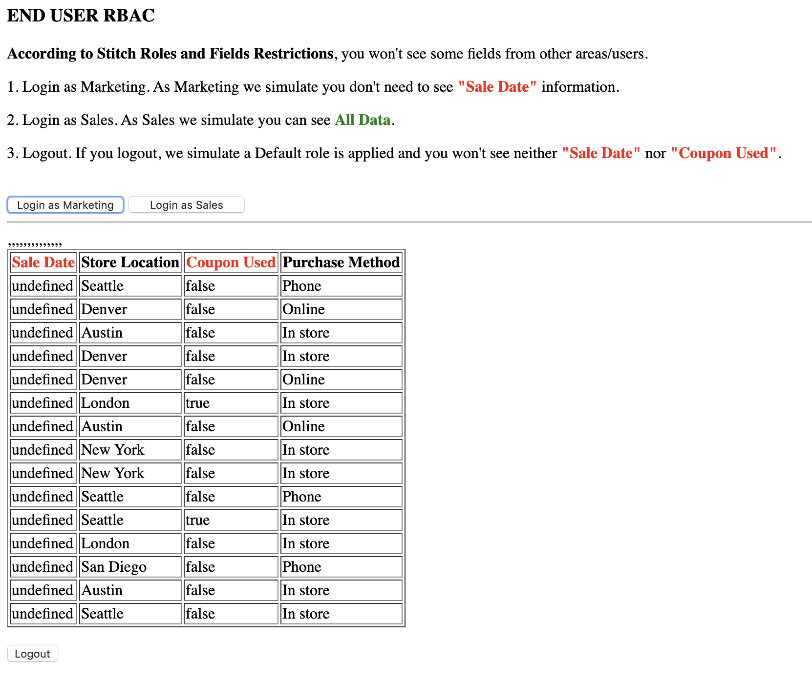
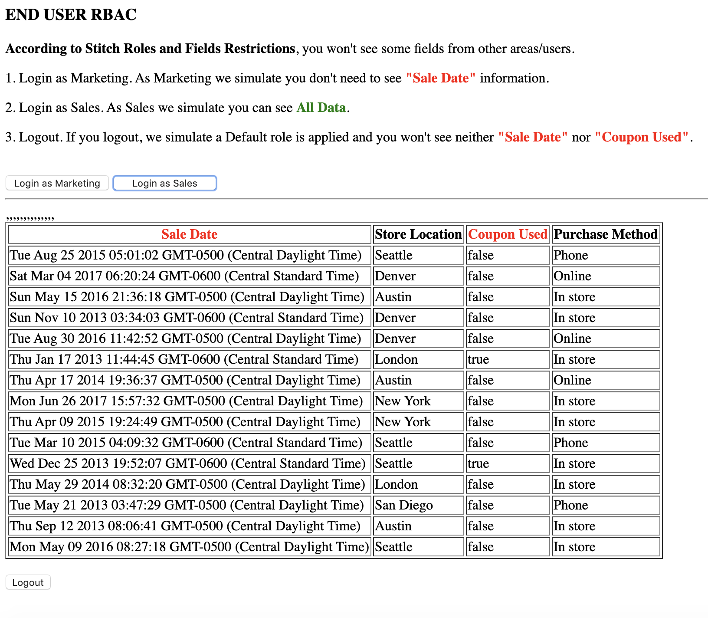
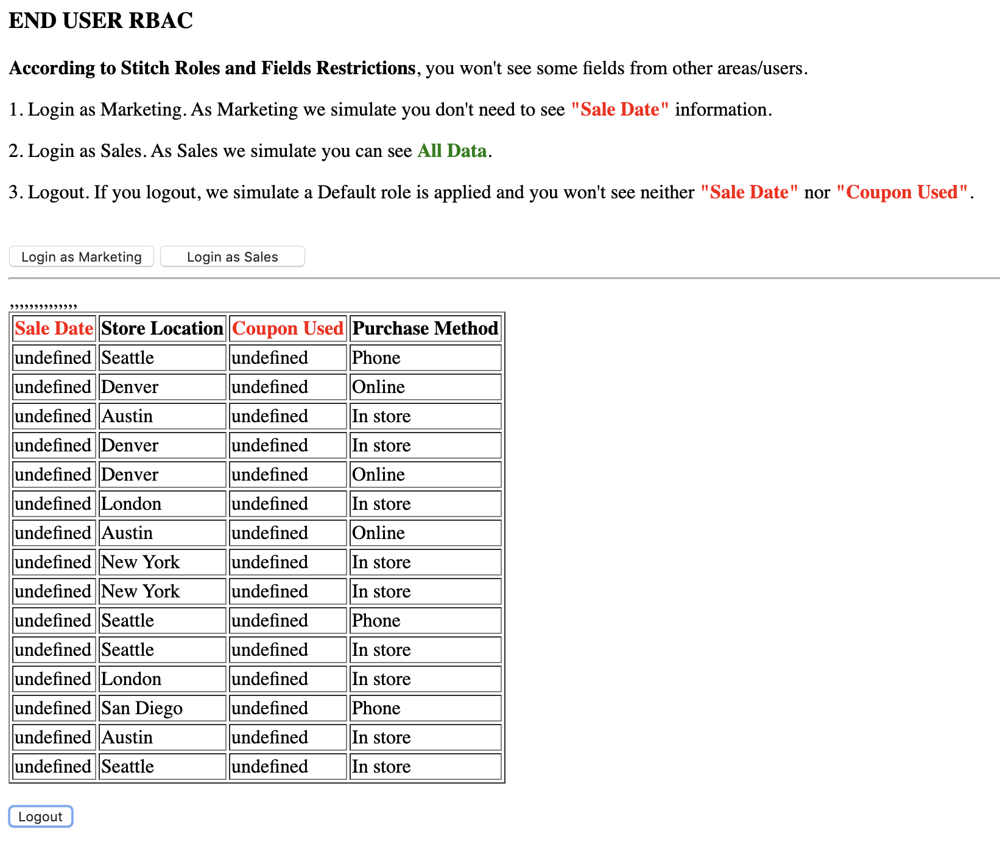

# END-USER-RBAC

__Ability to enforce Role-Based-Access-Control (RBAC) to lock down access to specific record fields depending on the end user’s identity__

__SA Maintainer__: [Alejandro Mancilla](mailto:alejandro.mancilla@mongodb.com) <br/>
__Time to setup__: 30 mins <br/>
__Time to execute__: 15 mins <br/>


---
## Description

This proof shows how MongoDB's Role Based Access Control (RBAC) capabilities can be extended through Stitch Backend as a Service and leveraged to govern and manage the access to a MongoDB database, its collections and specific fields. This is based on rules for end user access, defined for a collection using the Stitch UI. A MongoDB Rule grants privileges to perform specific actions on the collection’s specific fields.

In this proof we will deploy an Atlas cluster which automatically enforces Authentication and then we will define Authorization Roles and Rules for two specific end users. An example HTML app will be used based on a _supplies/sales_ database use case where one user belongs to Marketing and can read specific fields from _sales_ collection, and another user belongs to _Sales_ and can read all data from the same collection (there is also one _Default_ role who can read limited fields from the collection).

---
## Setup
__1. Configure Laptop__
* [Download](https://www.mongodb.com/download-center/compass) and install Compass on your laptop

__2. Configure Atlas Environment__
* Log-on to your [Atlas account](http://cloud.mongodb.com) (using the MongoDB SA preallocated Atlas credits system) and navigate to your SA project
* In the project's Security tab, choose to add a new user, e.g. __main_user__, and for __User Privileges__ specify __Read and write to any database__ (make a note of the password you specify)
* In the Security tab, add a new __IP Whitelist__ for your laptop's current IP address
* Create an __M10__ based 3 node replica-set in a single cloud provider region of your choice with default settings
* Once the cluster has been fully provisioned, in the Atlas console, click the **... (*ellipsis*)** for the cluster, select **Load Sample Dataset**. In the modal dialog, confirm that you want to load the sample dataset by choosing **Load Sample Dataset**
* In the Atlas console, for the database cluster you deployed, click the __Connect button__, select __Connect with MongoDB Compass__, copy the __Connection String Only__
* Launch Compass on your laptop and select YES to use clipboard string, fill in the _password_ field and then __Connect__
* Locate the __samples_supplies__ database and __sales__ collection and view the records in the _Documents_ tab

__3. Configure Atlas Stitch application__
* In Atlas console navigate on the left menu to __Services__, click __Stitch__ and then choose to __Create New Application__
* Set Application Name to __EndUserRBAC__, __link to your M10__ cluster previously created, leave other settings as __default__ and click __Create__
* After a few minutes the Stitch introduction screen will appear. In this screen turn on __Anonymous Authentication Enabled__ in the *Turn on Authentication panel* panel section
* In the *Initialize a MongoDB Collection* panel section, set the value of the *database* field as '__sample_supplies__' and the *collection* field as '__sales__' then click *Add Collection*
* In the *Execute a Test Request* panel section, choose to copy the __APP ID__ and make a note of this to be used later
* From the top of the Atlas Stitch console, select *Review & Deploy Changes* and then click *Deploy* to save the changes

__4. Configure Atlas Stitch Users & Rules__
* In Stitch console left menu select __Control-->Users__, then go to the __Providers__ tab, and for the provider __Email/Password__ and click the __Edit__ button
* In the shown _Users_ page, turn on the __Provider Enabled__ button, for __User Confirmation Method__ select __Automatically confirm users__, for __Password Reset URL__ set to "[http://test](http://test)" and then press __Save__, then from the top of the console, select *Review & Deploy Changes* and then click *Deploy* to save the changes
* Navigate to the __Users__ tab and create the following two users” and Add a MARKETING user:
  * For a MARKETING user, set _email address_: [marketing@yahoo.com](marketing@yahoo.com) and _password_: password123
  * For a SALES user, set _email address_: [sales@yahoo.com](marketing@yahoo.com) and _password_: password123
* In Stitch console left menu select __MongoDB Cluster-->Rules__, to show the page that displays the initialized MongoDB collection _sample_supplies.sales_
* Add 4 fields (ensure the field names that __match exactly__ including same case - view the records in _Compass_ to be sure): __saleDate__, __storeLocation__, __couponUsed__, __purchaseMethod__
* Edit “owner” role clicking pencil icon, choose to rename role as __Marketing__, and for the __Apply When__ field, specify that this role will apply when authenticated user belongs to Marketing, by pasting in following code:
    ```bash
    {
    "%%user.data.email": "marketing@yahoo.com"
    }
    ```
* __Uncheck__ the __Document-Level Permissions__ fields __Insert Documents__ & __Delete Document__, then click __Done Editing__
* In the fields listed, __uncheck__ __Write__ for __all__ fields and only ensure the following __Read__ fields are __checked__: __couponUsed__, __purchaseMethod__ & __storeLocation__ (the __saleDate__ field should not be viewable for the _Marketing_ role) - ensure you click __Save__ afterwards
* From the right-hand side of the page, click __+ NEW ROLLE__, then set new role name as __Sales__, and for the __Apply When__ field, specify that this role will apply when authenticated user belongs to Marketing, by pasting in following code:
    ```bash
    {
    "%%user.data.email": "sales@yahoo.com"
    }
    ```
* Leave __Document-Level Permissions__ fields __Insert Documents__ & __Delete Document__ unchecked, then click __Done Editing__
* For the fields listed for this new _Sales_ role, leave all __all__ fields uncheked for _Write_ and then __check__ ALL the __Read__ fields (this _Sales_ role will be able to view all data) - ensure you click __Save__ afterwards
* Create a New Role called __default__, leave all settings empty, then click __Done Editing__ 
* For the fields listed for this new _default_ role, leave all __all__ fields uncheked for _Write_ and and only ensure the following __Read__ fields are __checked__: __purchaseMethod__ & __storeLocation__ (the __saleDate__ & __couponUsed__ fields should not be viewable for the _default_ role) - ensure you click __Save__ afterwards
* From the top of the Atlas Stich console, select *Review & Deploy Changes* and then click *Deploy* to save the changes




__5. Configure Stitch Web Application__
* Open the file __EndUserRBAC_source.html__ (contained in the base folder of this proof) with a text editor on your laptop
* At the top you will see the JavaScript import to use Stitch
    ```bash
    <script src="https://s3.amazonaws.com/stitch-sdks/js/bundles/4/stitch.js"></script>
    ```
* Replace __\<APP_ID\>__ in line 6 with the previously recorded APP ID from you Stitch Application
* Observe the “find” query that HTML is executing at “displayResults()” function (line 17)
* Observe the 2 login functions that specify Marketing and Sales roles (“logInMarketing” & “logInSales”)
* Observe the “logout()” function that logs Out current connected user and logs with an Anonymous user, this function uses the “Default” role to see all the information.

---
## Execution

From a browseron your laptop, open HTML file directly from the laptop's filesystem, which should show a page similar to:



__1. Login as Marketing__

Click “Login as Marketing” button to login with the [marketing@yahoo.com](marketing@yahoo.com) user. The HTML page's JavaScript executes the same query each time, but the Stitch Rules on the server-side filter the information to be shown based on configured roles
You will see results based on Marketing role, __that will not contain “Sale Date” information__



__2. Login as Sales__

Click “Login as Sales” button to login with the [sales@yahoo.com](sales@yahoo.com) user
You will see results based on Sales role, __that will now contain All Data__



__3. Logout__

Click “Logout” button - this action simulates an Anonymous login
You will see results based on default role, ___it will not contain “Sale Date” and “Coupon Used” information.___



---
## Measurement

The results of using the test page should show:
* __Marketing__ users see all data APART from __Sale_Data__
* __Sales__ users see __ALL__ data
* __anonymouns__ users ONLY see __Store Location__ & __Purchase Method__ data

