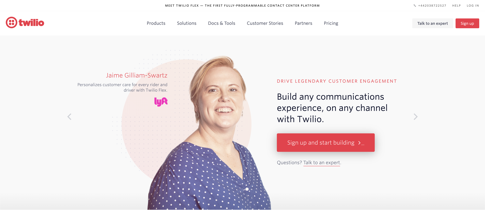
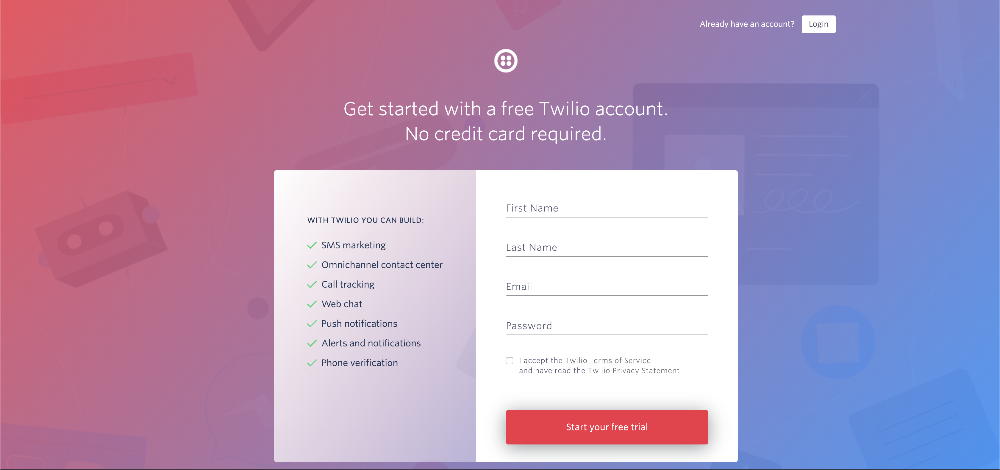
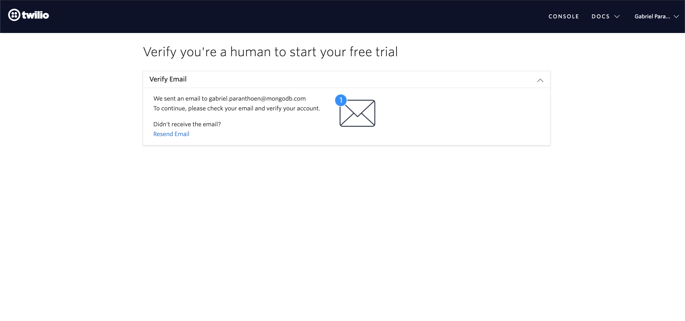
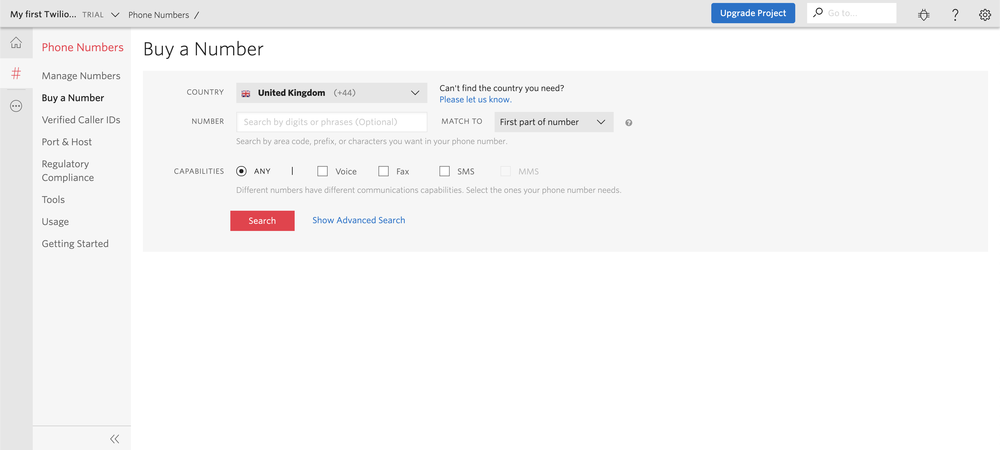
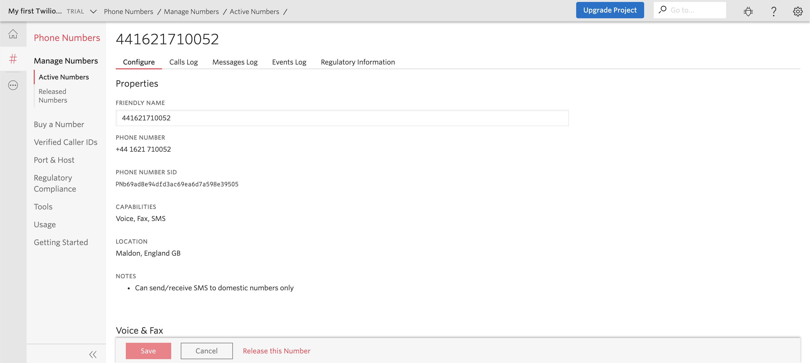
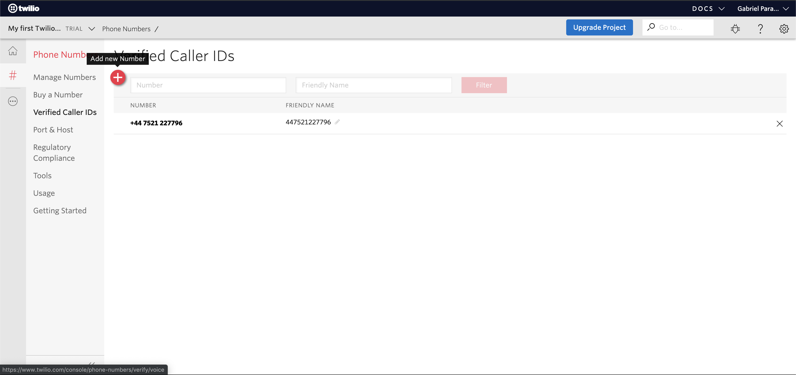
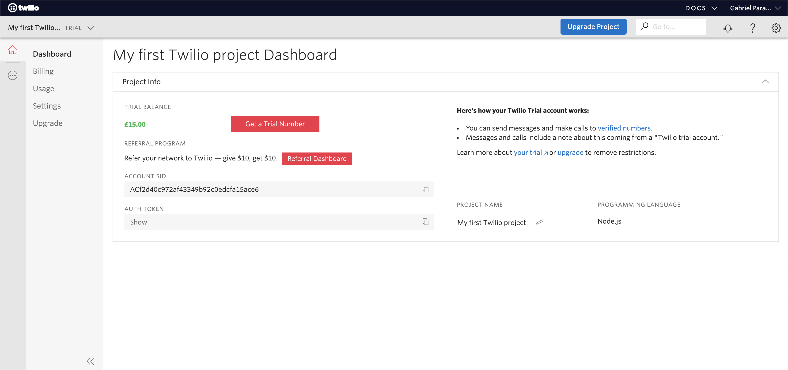
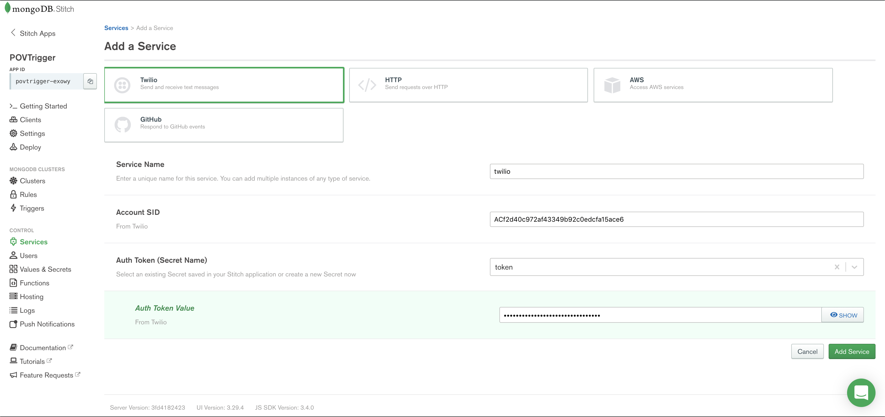
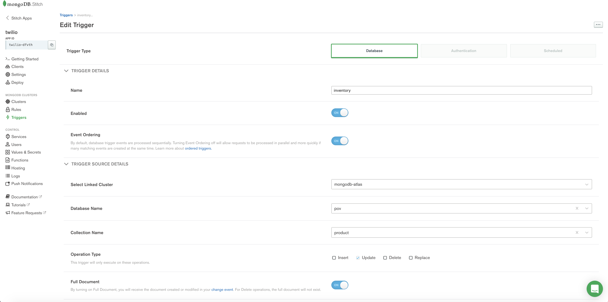

# TRIGGER-ALERT

__Ability to send an alert to an administrator if the value of a record's field changes__

__SA Maintainer__: [Gabriel Paranthoen](mailto:gabriel.paranthoen@mongodb.com) <br/>
__Time to setup__: 30 mins <br/>
__Time to execute__: 15 mins <br/>

---
## Description

This proof shows how MongoDB Atlas can perform server-side logic in response to a specific event occurring on the database. Specifically, we will create a trigger which will capture any update performed on an _amount_ field of a _stock inventory_ collection and send an SMS alert text message to the SA's mobile phone as a result.

To achieve this, the following services will be used:
1. __Twilio__: A 3rd party service which allows software developers programmatically send text messages using its web service APIs (this will require the use of the __SA's phone number__ to send messages to)
1. __Mongodb Atlas__
1. __Mongodb Stitch__

__NOTE__: Neither Compass nor the Atlas UI can be used to try to induce in-place updates of fields in this proof because those tools perform a document replace operation rather than an in-place update of a fields value operation.

---
## Setup
__1. Configure a Twilio account__

In this section you will create a free trial Twilio account, secure a sender phone number using the free credit allocated - ensure you make note of the following during this configuration stage: 
* Twilio Phone number 
* Account SID 
* Auth Token 

__Create a your Twilio account__ 
* Access [Twilio](https://www.twilio.com/) 
* Click on Sign-up 
* Fill out the form 
* Confirm your e-mail address and skip the form to access the dashboard 
* Check you email to verify your new Twilio account

Your free trial account is now activated with free credit (£15) allowing you now proceeed to secure a phone number for sending SMS messages with. 

__Obtain a new Twilio number__ 
* Access the [Buy a number](https://www.twilio.com/console/phone-numbers/search) page 
* Select the same country than your personal phone number and hit Search 
* Select any of them allowing SMS capability and click on Buy 
* Fill out the form with your address 
* Confirm 

Note: for some countries you might have to select a global phone number which is not included in the free trial account, you may need to expense it

You now have a phone number ready to be used. Capture the phone number as we will use it on the Stitch App 



__Verify your personnal phone number__
* Access the [Verified Caller IDs](https://www.twilio.com/console/phone-numbers/verified)
* If your personnal phone number hasn't been verfied yet, click on the + button to add your personnal phone number an follow the process 


__Capture your Twilio credentials__

Access the [Twilio console](https://www.twilio.com/console) and capture: 
* Account SID
* Auth Token 


You should have made a note of: 
* a phone number in the same region than your personnal phone number 
* your Twilio Account SID 
* the Auth Token associated 


__2. Configure Laptop__
* Ensure MongoDB version 4.2+ is already installed your laptop, mainly to enable the Mongo Shell to be used (no MongoDB databases will be run on the laptop for this proof)


__3. Configure Atlas environment__

* Log-on to your [Atlas account](http://cloud.mongodb.com) (using the MongoDB SA preallocated Atlas credits system) and navigate to your SA project
* In the project's Security tab, choose to add a new user, e.g. __main_user__, and for __User Privileges__ specify __Read and write to any database__ (make a note of the password you specify)
* In the Security tab, add a new __IP Whitelist__ for your laptop's current IP address
* Create an __M10__ based 3 node replica-set in a single cloud provider region of your choice with default settings
* In the Atlas console, for the database cluster you deployed, click the __Connect button__, select __Connect with the Mongo Shell__, copy the __Connection String__ - make a note of this MongoDB URL address to be used in the next step.

__4. Load data into Atlas__

* Open a new terminal and launch the Mongo Shell to connect to your Atlas cluster replacing the connection string shown below with the one for your cluster, and using the password you specified earlier:
```bash
mongo "mongodb+srv://testcluster-a123z.mongodb.net/test"  --username main_user 
```
* Run the following command to add a document in a collection __product__ under __triggerPov__ database:
```bash
use triggerPov
db.product.insertOne({productName: "Mongo DB T-shirt in Brown", inventory: 10})
```
* And add your contact details to a collection __team__ - __replace__ the \<parameters\> with your own details (ensure you include the international symbol __+__ in the phone number string): 
```bash
use triggerPov
db.team.insertOne({firstName: "<YOUR_FIRSTNAME>", lastName: "<YOUR_LASTNAME>", phoneNumber: "<YOUR_PERSONNAL_PHONE_NUMBER>"})
```

Keep the Mongo shell session opened, we will use later for the proof execution 

__5. Create a Stitch App__

* In the Atlas console, from the left menu, launch __Stitch__ and click on the __Create New Application__ button that is shown centrally in the console or is located on the top right if you already have some existing Stitch applications
* Fill the form with the following details: 
    * __Application Name__: anything you like (e.g. _my-trigger-app_)
    * __Link to Cluster__: Select the cluster used previously to product and team documents
    * __Select a deployment model__: Global 
    * __Stitch Service Name__: leave default "mongodb-atlas"
    * __Select a Primary Region__: closest region where your cluster is located 
* Submit the form and wait a few minutes until this completes, at which point you will be redirected to the Stitch app in the console. 

__Create a Stitch Twilio Service__

* From the Stitch console, click on __Services__ on the left menu, click to __Add a Service__, select __Twilio__ and specify the following:
* Service Name:  "twilio"
* Account SID: use the Twilio account SID you saved previously
* Auth Token (Secret Name): __token__, and click on "create token", a past the Auth Token you saved previously

The service should look like the following: 



__Create a Database Trigger__

* From Stitch UI, click on Trigger on the left  menu, and click to __Add a Trigger__
* Fill out the form as follows: 
    * Trigger Type: Database 
    * Name: any name (e.g. _db-trigger_)
    * Enabled: on 
    * Event Ordering: on 
    * Select Link Cluster: mongodb-atlas
    * Database name: triggerPov
    * Collection name: product 
    * Operation Type: update 
    * Full document: on 
    * Function: click on the dropdown list and select + New function 
        * give any name you want to the function (e.g. _updateFunc_)
        * replace the content shown in the function editor with the following, then replace <YOUR_TWILIO_PHONE_NUMBER> with your new twilio phone number (include the international symbol __+__ in the phone number string)

```
exports = function(changeEvent) {
  
  const twilioPhoneNumber = "<YOUR_TWILIO_PHONE_NUMBER>";
  const twilio = context.services.get("twilio");
  const teamCollection = context.services.get("mongodb-atlas").db("triggerPov").collection("team");
  
  if (Object.keys(changeEvent.updateDescription.updatedFields) == "inventory"){
    
    console.log(JSON.stringify(changeEvent.fullDocument.productName));
    
    team = teamCollection.find().toArray().then(doc => {
    
    for (var i in doc){      
        twilio.send({
            to: doc[i].phoneNumber,
            from: twilioPhoneNumber,
            body: "Hello " + doc[i].firstName + " " + doc[i].lastName + ", we now have " + changeEvent.updateDescription.updatedFields.inventory + " " + changeEvent.fullDocument.productName + " in stock"
        });
    }  
    });
  } 
};
```

Don't forget to save ! 


This trigger will capture any __update__ operation occuring on the __product__ collection create previously. The function associated will control which field has been updated, and if this is the __inventory__ field, it will send a SMS to your personal mobile phone using your Twilio phone number

From the top of the Atlas Stitch console, select *Review & Deploy Changes* and then click *Deploy* to save the changes

---
## Execution

Return to the already open Mongo shell ready to update the document in the collection product. 

__NOTE__: Do NOT use neither Compass nor the Atlas UI to update the field as they actually remove the document and then insert a new version, rather that performing an in-place update of the document on it, which would mean the trigger event would not be fired. 

From Mongo shell, double check that the database collection _product_ is configured correctly: 
```
use triggerPov
db.product.find().pretty()
```
The result should be similar to the following:
```
{
	"_id": ObjectId("5dc0418dd6f36d444e1b532d"),
	"productName": "Mongo DB T-shirt in Brown",
	"inventory": 10
}
```
Also check the _team_ collection: 
```
use triggerPov
db.team.find(),pretty
```
The result should be similar to the following (with different values to the fields to match the SA's details of course:
```
{
	"_id": ObjectId("5db1b37bd7b2fbba27cc8f64"),
	"firstName": "Gabriel",
	"lastName": "Paranthoen",
	"phoneNumber": "+447521123788"
}
```

__Test1: Induce an SMS Alert__: Decrement the value of the field __inventory__ on the product document with to simulate that a T-Shirt has been bought and so the amount in the inventory has decreased: 
```
db.product.updateOne({"productName": "Mongo DB T-shirt in Brown"}, {$inc: {"inventory": -1}}) 
```
You should have received an SMS text message on your mobile phone. 

__Test2: Do NOT induce an SMS Alert__: Update the field __productName__ on the product document with the following new field and value: 
```
db.product.updateOne({"productName": "Mongo DB T-shirt in Brown"}, {$set: {"size": "medium"}})

```
No SMS text message should have been received your mobile phone. 

---
## Measurement

The following results should be confirmed by the presence or absence of SMS text messages received as a result of database collection changes:

* __Test1: Induce an SMS Alert__: SMS text message received
* __Test2: Do NOT induce an SMS Alert__: SMS message not received

