# EMBED-VISUALIZATION

__Ability to rapidly & securely embed a graphical summary report of data in a web page, exposed to web users, where the report auto-refreshes__

__SA Maintainer__: [Christophe Locoge](mailto:christophe.locoge@mongodb.com)  
__Time to setup__: 45 mins  
__Time to execute__: 5 mins  

---
## Description

This proof shows how to embed an auto-refreshed graph from MongoDB Charts in an external web page application using MongoDB Stitch. This proof uses the _sales_ collection from the [Atlas sample datasets](https://docs.atlas.mongodb.com/sample-data/available-sample-datasets/) [_sample_supplies_](https://docs.atlas.mongodb.com/sample-data/sample-supplies/#sample-supplies) database. When you embed a chart, you can choose whether you want it to be "Unauthenticated", meaning anyone who has the embed code can view the chart, or to use "Verified Signature" authentication which checks the integrity of a signature in the URL before the chart will render. In this proof we will show how to use the "Verified Signature" authentication and take advantage of MongoDB Stitch Hosting feature to host the web page.

---
## Setup

__1. Configure Atlas Environment__
* Log-on to your [Atlas account](http://cloud.mongodb.com) (using the MongoDB SA preallocated Atlas credits system) and navigate to your SA project
* Create an __M10__ based 3 node replica-set in a single cloud provider region of your choice
* In the Security tab, add a new temporary __IP Whitelist__ for your laptop's current IP address
* Once the cluster has been fully provisioned, in the Atlas console, click the **... (*ellipsis*)** for the cluster, select **Load Sample Dataset**. In the modal dialog, confirm that you want to load the sample dataset by choosing **Load Sample Dataset**

  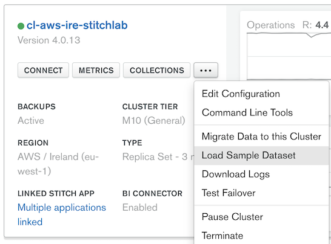

__2. Configure a MongoDB Charts Data Source__
* From the Atlas console, under __Services__ section, click on __Charts__, then from the Charts console, select the __Data Sources__ tab, and click the __New Data Source__ button
* Select your cluster name that you deployed from the list and click __Connect__, then select and tick the boxes for the __sample_supplies__ database and __sales__ collection, and click the __Set Permissions__ button

  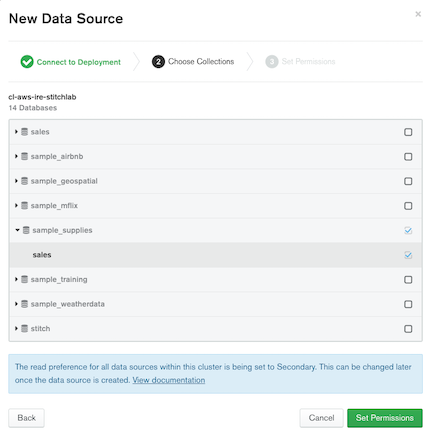

* You are by default the __owner__ of the new data source, click __Publish Data Source__
* Now nable the external embedding feature directly from the data source by clicking on the __...__ button and select __External Sharing Options__

  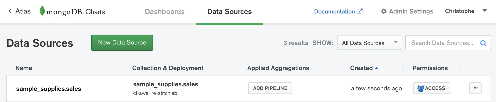
  

  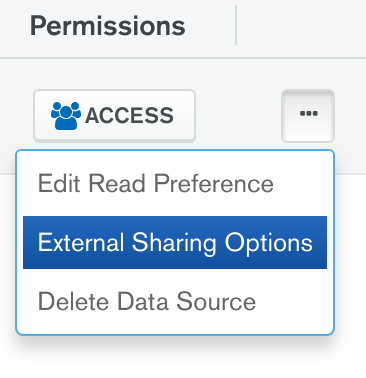

  * Then set the external embedding feature by switching to __ON__ and select the __Verified Signature Only__ and __save__ it

    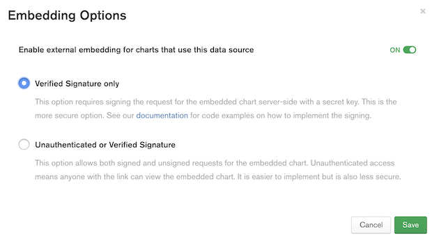

__3. Create a new Dashboard and graph on MongoDB Charts__
* From the Charts console, select the __Dashboards__ tab, and click the __New Dashboard__ button
* Provide a title of 'Sales' for your new dashboard that will host your graph based on the __sales__ collection dataset, click __Create__
* Then create your first graph by clicking on __Add Chart__
  * Choose the data source __sample_supplies.sales__ from the top left drop list
  * Select a __Bar__ chart type and __Grouped__ graph
  * Then from the __Fields__ list, drag & drop the field ___id__ on the __X Axis__ box and aggregate by __Count__
  * Drag & drop the field __storeLocation__ on the __Y Axis__ box and sort by __Value__
  * Drag & drop the field __purchaseMethod__ on the __Series__ box
  * Finally, click on the graph title to edit it, set title to 'Amount of sales by purchase method by shop' and then click __Save and Close__

  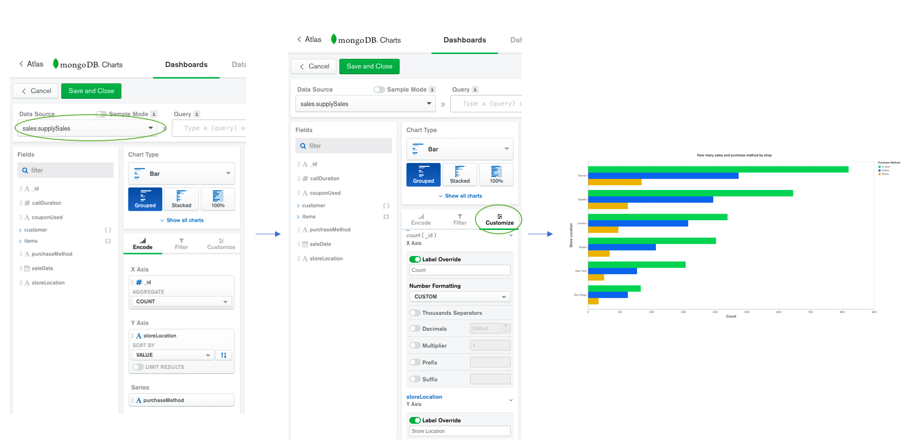

__4. Preparing your Chart for Embedding__
* From your new dashboard, click the __... button__ of your new graph and select __Embed Chart__
* Select the __Verified Signature__ tab and set the __Enable signed authentication access__ to __ON__
* Copy the __Embed Code__ and save it for later, you will need the following:
  * A part of the url __(e.g. "https://charts.mongodb.com/charts-demo-abcde")__
  * The tenant __(e.g. "921a9a9b-ade3-4540-a8af-06d974e4d09c")__
  * The id __(e.g. "ce7d6797-9e67-4269-bf17-70e83cfed383")__

  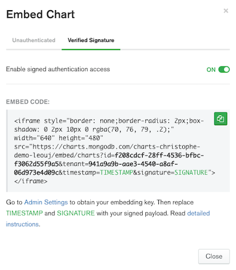

* From the Charts console, get the Embedding Signing Key from the top right __Admin Settings__ page
  * Generate a new key if you don't already have one, and save it for later and return to the main Charts console

  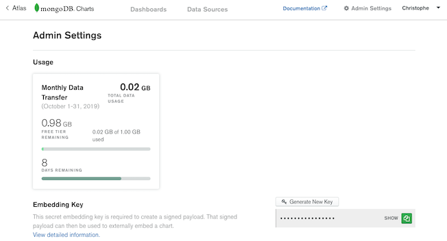

__5. Configure Stitch Function & Hosting__
* Back to the Atlas console, under __Services__ section, click on __Stitch__
* Create a new Stitch app by clicking on __Create New Application__ button
  * Give the name "EmbeddedChart" to your new Stitch app
  * Select your cluster name that you deployed
  * Provide a Stitch service name, you can keep the default name (mongodb-atlas)
  * Then hit __Create__, this will take few minutes

  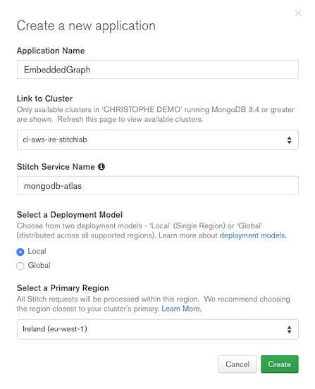

* From your new Stitch app on the __> Getting Started__ page, turn __ON__ the __Anonymous Authentication Enabled__ method for this demonstration
* Under the __Control__ section, click Functions and then __Create New Function__
* Set __getEmbeddingUrl__ as the function name, leaving all other options as they are
* Click the __Function Editor__ tab, and paste the contents of the __/function/getEmbeddingUrl.js__ file into the editor
* Replace the ~REPLACE placeholders in the pasted code for the following variables:
  * __~REPLACE CHARTS_EMBEDDING_BASE_URL__ with the base URL of your charts instance (e.g. https://charts.mongodb.com/charts-foo-abcde)
  * __~REPLACE CHARTS_TENANT_ID__ with the value of the tenant parameter from the IFRAME snippet you copied from Charts
  * __~REPLACE EMBEDDING_SIGNING_KEY__ with the Embedding Signing key you obtained from Charts  __Admin Settings__ page
  * __AUTOREFRESH_TIME_SECONDS__ if you want the chart to automatically refresh at a predetermined interval other than the existing value specified of every 20 seconds
  * Then __Save__ the Stitch function
* Select to __Review & Deploy Changes__

  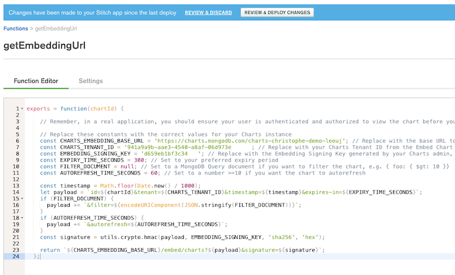

* Now under the Stitch console __Control__ section, click __Hosting__
* Click __Enable Hosting__ button, the process of creating the site may take up to 15 minutes
* Open the index.html file (client-side code) __/html/index.html__, and replace:
  * __Your_Stitch_App_ID__ with the Stitch App ID, shown in the top left of the Stitch console (e.g. embeddedchart-xxxxx)
  * __Your_Embedded_Chart_ID__ with the value of the id parameter from the __Embed Code__ IFRAME snippet you copied from Charts
  * Save it, and from the __Hosting__ page, click on __Upload Files__ to upload it on Stitch (this will replace the existing _index.html_ file)

  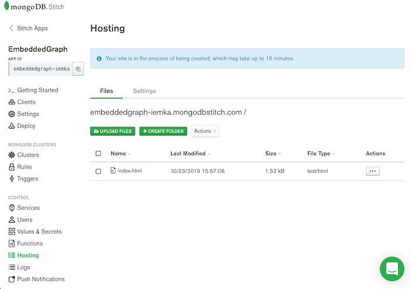

* Select to __Review & Deploy Changes__

---
## Execution

The execution is simple, just open the __index.html__ file from MongoDB Stitch Hosting:

* Click on the __...__ Actions button of the __index.html__ file, and click on __Open in Browser__

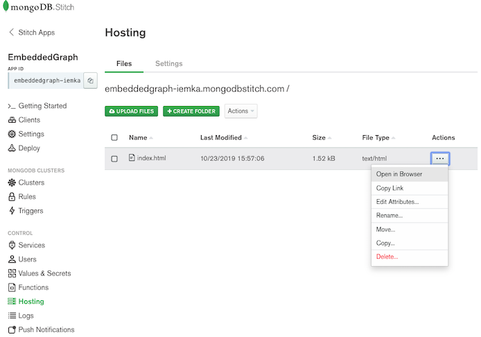

#---
# Measurement

You can now show an embedded auto-refreshed graph from MongoDB Charts in an external web page application using MongoDB Stitch. Based on the __AUTOREFRESH_TIME_SECONDS__ you defined, you will see the embedded graph automatically refreshing in your web page. .

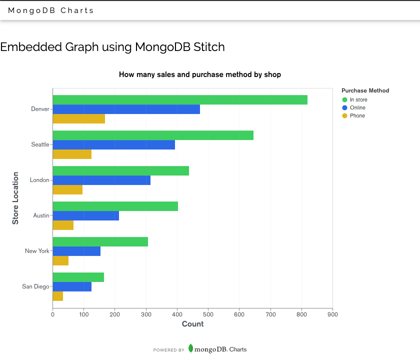

