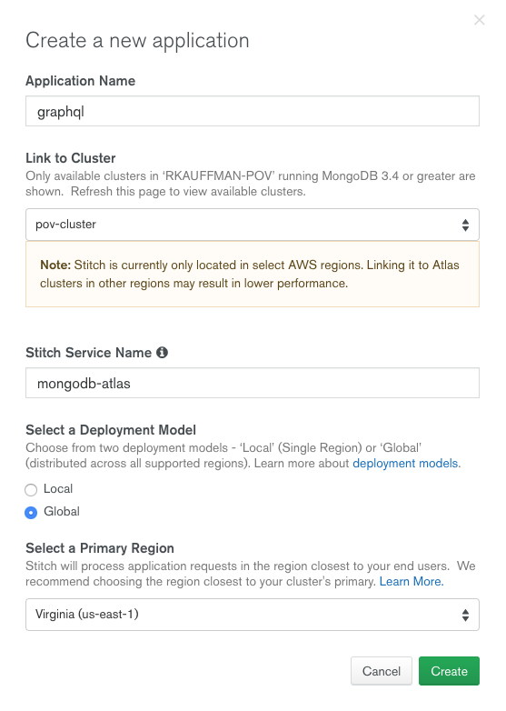
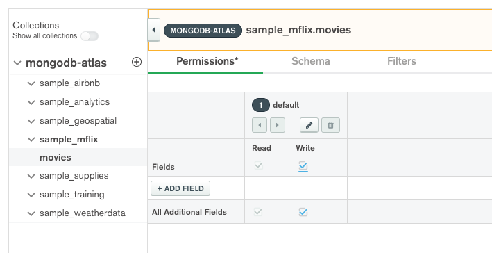

# GRAPHQL

__Ability to perform a database query, using GraphQL, which combines data from two different data-sets and returns only the required fields in the combined result__

__SA Maintainer__: [Robbert Kauffman](mailto:robbert.kauffman@mongodb.com)  <br/>
__Time to setup__: 30 mins  <br/>
__Time to execute__: 15 mins  <br/>

---
## Description

This proof shows how MongoDB Stitch provides the ability to use GraphQL for querying data in Atlas. GraphQL is a query language for APIs and reduces both under- and overfetching of data by specifying precisely what data is needed per query. GraphQL queries only the minimum amount of endpoints and returns only the data that is needed.

In the proof, data will be queried via both Stitch's Rules API (REST API) and Stitch's GraphQL API in order to clearly show the differences in behaviour between the two approaches. It will demonstrate that GraphQL only returns the needed data thus reducing the amount of data that needs to be transferred, and it will show how certain queries can be reduced to a single API call instead of requiring multiple subsequent calls. For the proof, the _movies_ and _comments_ collections from the [Atlas sample_mflix database](https://docs.atlas.mongodb.com/sample-data/available-sample-datasets/#available-sample-datasets) will be used. The tests will be run from the command line using _curl_.

---
## Setup

__1. Configure Laptop__
* Ensure your laptop can run __Python__ - please follow the installation steps for your operating system and version as described in the [Python setup and usage](https://docs.python.org/using/index.html) guide

__2. Configure Atlas Environment__
* Log-on to your [Atlas account](http://cloud.mongodb.com) (using the MongoDB SA preallocated Atlas credits system) and navigate to your SA project
* Create an replica set __M0__ (or __M2__ or __M5__) tier deployment in a cloud provider and region of your choice with default settings
* Once the cluster has been fully provisioned, in the Atlas console, click the __... (*ellipsis*)__ for the cluster, select __Load Sample Dataset__ and in the modal dialog, confirm that you want to load the sample dataset by choosing __Load Sample Dataset__

__3. Configure Stitch Environment__
* In the Atlas console, click *Stitch* from the left-hand navigation bar and then click the __Create New Application__ button

* In the __Create a new application__ dialog, enter '__graphql__' as *Application Name* for your Stitch app, select your cluster from the *Link to Cluster* menu if it's not already selected, keep '__mongodb-atlas__' as *Stitch Service Name* and the other fields as default, as shown below and then click *Create*



* After a few minutes the Stitch getting started screen will appear. In this screen turn on __Anonymous Authentication Enabled__ in the *Turn on Authentication* panel - select to Review and Deploy Changes


* In Stitch, navigate to __Rules__ on the left
  * Click __Add Collection__ to add a rule. For __Database Name__ use *sample_mflix* and for __Collection Name__ use *movies*. Choose __No template__ and click __Add Collection__ at the bottom right.
  
    * The __Permissions__ tab should now be openend for the rule that was created. Check the __Read__ checkboxes
    * Navigate to the tab __Schema__ and copy + paste the following schema (generating the schema can cause errors later on due to inconsistent data types for some fields):

      ```json
      {
        "title": "movie",
        "properties": {
          "_id": {
            "bsonType": "objectId"
          },
          "awards": {
            "bsonType": "object",
            "properties": {
              "nominations": {
                "bsonType": "int"
              },
              "text": {
                "bsonType": "string"
              },
              "wins": {
                "bsonType": "int"
              }
            }
          },
          "cast": {
            "bsonType": "array"
          },
          "countries": {
            "bsonType": "array"
          },
          "directors": {
            "bsonType": "array"
          },
          "fullplot": {
            "bsonType": "string"
          },
          "genres": {
            "bsonType": "array"
          },
          "imdb": {
            "bsonType": "object",
            "properties": {
              "id": {
                "bsonType": "int"
              }
            }
          },
          "languages": {
            "bsonType": "array"
          },
          "metacritic": {
            "bsonType": "int"
          },
          "plot": {
            "bsonType": "string"
          },
          "poster": {
            "bsonType": "string"
          },
          "rated": {
            "bsonType": "string"
          },
          "runtime": {
            "bsonType": "int"
          },
          "title": {
            "bsonType": "string"
          },
          "type": {
            "bsonType": "string"
          },
          "writers": {
            "bsonType": "array"
          },
          "year": {
            "bsonType": "int"
          }
        }
      }
      ```

    * Hit __Save__
  * Add another rule using the __+__ button next to *mongodb-atlas*. For __Database Name__ use *sample_mflix* and for __Collection Name__ use *comments*. Choose __No template__ and click __Add Collection__ at the bottom right
    * The __Permissions__ tab should now be openend for the rule that was created. __IMPORTANT__: Check both the __Write__ checkboxes, which should automatically check the _Read_ checkboxes
    
    * Navigate to the tab __Schema__ and copy + paste the following schema (generating the schema can cause errors later on due to inconsistent data types for some fields):

      ```json
      {
        "title": "comment",
        "properties": {
          "_id": {
            "bsonType": "objectId"
          },
          "email": {
            "bsonType": "string"
          },
          "movie_id": {
            "bsonType": "objectId"
          },
          "name": {
            "bsonType": "string"
          },
          "text": {
            "bsonType": "string"
          }
        }
      }
      ```

      * Navigate to the __Relationships__ tab and click __Add Relationship__ on the right. Use *movie_id - objectId* for __Field__; *sample_mflix* for __Database__; *movies* for __Collection__; and *_id - objectId* for __Property__. Click __Add__
      
    * Don't forget to click __Save__
* From the top of the Stitch UI, select *Review & Deploy Changes*, scroll all the way down and then click *Deploy* to save the changes

We have now configured our Stitch app to allow anonymous users to query the _movies_ and _comments_ collections of the _sample_mflix_ database, while also having defined a schema for these collections to be used by GraphQL. This tells GraphQL what fields can be queried and returned. Finally, the relationship we have defined allows GraphQL to query data across collections to reduce underfetching that would otherwise occur by having to query the two collections separately from a client.

---
## Execution

Copy the __Stitch App ID__ from the top left in the Stitch UI. Then from a command line terminal run the following to obtain an access token for querying the Stitch APIs as followed (first replace <YOUR_STITCH_APP_ID> with your App ID):

```bash
export POV_APP_ID="<YOUR_STITCH_APP_ID>"
curl -X POST "https://stitch.mongodb.com/api/client/v2.0/app/${POV_APP_ID}/auth/providers/anon-user/login"
```

This should return:

```json
{
  "access_token":"...",
  "refresh_token":"...",
  "user_id":"...",
  "device_id":"..."
}
```

Export the access token to an environment variable using the following command (replace <YOUR_ACCESS_TOKEN> with your access token value first):

```bash
export POV_ACCESS_TOKEN="<YOUR_ACCESS_TOKEN>"
```

__Warning:__ The access token expires after 30 minutes. Follow the above instructions again if your token has expired.

### Testing GraphQL Queries in Stitch

Assume we're building a web movie archive that displays an overview of all movies by year and we're only interested in the title, year and poster of the movie for this purpose. GraphQL allows you to specify exactly what fields should be returned to reduce overfetching: requesting and downloading of unneeded data. Using the __Graph*i*QL__ tool provided in Stitch user interface, we can execute GraphQL queries through a visual UI to show this in practice.

* Open __Stitch__ and select the __GraphQL__ from the left-hand menu
  * From this interface you can view and explore the defined GraphQL schemas on the right; And you can execute GraphQL queries on the left
  * Enter the following query (replacing what is shown by default) and click on the __Play__ button next to Graph*i*QL to execute the query:

    ```gql
    query {
      movies(query: {year:1999}) {
        title
        year
        poster
      }
    }
    ```

    

  * The above query tells GraphQL to query documents of type movie, and to return a list of movies that are made in the year 1999. It differentiates between the collection name in singular form (_movie_) and in plurar form (_movies_)  for _find_ and _findOne_ queries respectively. It then specifies what fields need to be returned. As you can see from the response on the right, it only returns the specified fields *title*, *year* and *poster*.

### Reducing overfetching

Run the script __query-api.sh__. The script queries the *sample_mflix.movies* collection for all movies that were made in *1999*. It will do this 10 times using GraphQL based API and then 10 times using Stitch Rules API.

```bash
./query-api.sh
```

The script should run for a couple of seconds and return how long each query took and how much data was downloaded. Verify that there were no errors while querying by checking the response code at the start of each line, which should read __200__.

```bash
$ ./query-api.sh
200: GraphQL query took 0.855667 seconds. Downloaded 7333 bytes
200: GraphQL query took 0.770970 seconds. Downloaded 7333 bytes
200: GraphQL query took 0.809895 seconds. Downloaded 7333 bytes
200: GraphQL query took 0.803220 seconds. Downloaded 7333 bytes
200: GraphQL query took 0.817461 seconds. Downloaded 7333 bytes
200: GraphQL query took 0.797987 seconds. Downloaded 7333 bytes
200: GraphQL query took 0.724011 seconds. Downloaded 7333 bytes
200: GraphQL query took 0.786869 seconds. Downloaded 7333 bytes
200: GraphQL query took 0.748253 seconds. Downloaded 7333 bytes
200: GraphQL query took 0.765576 seconds. Downloaded 7333 bytes
200: Stitch Rules query took 1.014047 seconds. Downloaded 67822 bytes
200: Stitch Rules query took 0.978420 seconds. Downloaded 67822 bytes
200: Stitch Rules query took 1.014591 seconds. Downloaded 67822 bytes
200: Stitch Rules query took 0.910923 seconds. Downloaded 67822 bytes
200: Stitch Rules query took 1.010544 seconds. Downloaded 67822 bytes
200: Stitch Rules query took 1.017136 seconds. Downloaded 67822 bytes
200: Stitch Rules query took 1.023071 seconds. Downloaded 67822 bytes
200: Stitch Rules query took 0.976709 seconds. Downloaded 67822 bytes
200: Stitch Rules query took 0.942131 seconds. Downloaded 67822 bytes
200: Stitch Rules query took 0.892319 seconds. Downloaded 67822 bytes
```

From the results you can see by using the GraphQL API, the amount of data returned is far less than with the Stitch Rules API.

### Reducing underfetching

Next, let's query data across collections: get the movie details for a movie comment/review. With Stitch Rules we have to query the comment first to get the movie ID, and then the movie. Execute the following query, which queries the _sample_mflix.comments_ collection for any comments by name _Scott Melton_:

```bash
curl "https://stitch.mongodb.com/api/client/v2.0/app/${POV_APP_ID}/functions/call" \
  -H "Authorization: Bearer ${POV_ACCESS_TOKEN}" \
  -H 'content-type: application/json' \
  -d '{"name":"find","service":"mongodb-atlas","arguments":[{"collection":"comments","database":"sample_mflix","query":{"name":"Scott Melton"},"sort":{}}]}' \
  | python -m json.tool
```

Copy the __movie_id__ from the response and replace in the following command before doing the next query. This query uses the _movie_id_ we just retrieved from the comment to find that movie in the _sample_mflix.movies_ collection:

```bash
export POV_MOVIE_ID="573a139af29313caabcf0d74"
curl "https://stitch.mongodb.com/api/client/v2.0/app/${POV_APP_ID}/functions/call" \
  -H "Authorization: Bearer ${POV_ACCESS_TOKEN}" \
  -H 'content-type: application/json' \
  -d '{"name":"find","service":"mongodb-atlas","arguments":[{"collection":"movies","database":"sample_mflix","query":{"_id":{"$oid":"'$POV_MOVIE_ID'"}},"sort":{}}]}' \
  | python -m json.tool
```

The above can be done in GraphQL with a single query. You can run the query below in the __GraphiQL__ tool in the Stitch user interface. It will query the _sample_mflix.comment_ collection by the name _Scott Melton_ and return the fields _email_, _name_, _text_ of the _comment_ document, and the _title_ and _year_ fields of the referenced _movie_ document as described by the GraphQL relationship between the two collections:

```gql
query {
  comment(query:{name:"Scott Melton"}) {
    email
    name
    text
    movie_id {
      title
      year
    }
  }
}
```

Alternatively, you can execute the above query via curl:

```bash
curl -X POST "https://stitch.mongodb.com/api/client/v2.0/app/${POV_APP_ID}/graphql" \
  -H "Authorization: Bearer ${POV_ACCESS_TOKEN}" \
  -H 'Content-Type: application/json' \
  -d '{"query":"{comment(query:{name:\"Scott Melton\"}) {email name text movie_id {title year}}}"}' \
  | python -m json.tool
```

This should return the comment and the movie it references.

### Mutations

Apart from querying, GraphQL can also be used to insert, update, replace or delete data, by using mutations. Let's change the text of the comment that was queried earlier by executing the mutation below. This will update a single comment by name _Scott Melton_ and changes the _text_ of that comment:

```gql
mutation {
  updateOneComment(
    query: { name: "Scott Melton"},
    set: { text: "It ain't much if it ain't Dutch" }) {
    _id
    email
    text
  }
}
```

The same mutation operation can also be executed from the command line as followed:

```bash
curl -X POST "https://stitch.mongodb.com/api/client/v2.0/app/${POV_APP_ID}/graphql" \
  -H "Authorization: Bearer ${POV_ACCESS_TOKEN}" \
  -H 'Content-Type: application/json' \
  -d '{"query":"mutation{updateOneComment(query:{name:\"Scott Melton\"},set:{text:\"It aint much if it aint Dutch\"}) {_id email name text}}"}' \
  | python -m json.tool
```

---
## Measurement

* Consider what the differences are in downloaded size between GraphQL and Stitch Rules responses and the response times:
  * How do the returned documents by GraphQL compare to Stitch Rules? Which fields are omitted?
  * Compare the response of the GraphQL queries with the Stitch Rules queries should show that GraphQL has a much smaller response size: 7333 vs 67822 bytes. More than 9 times the size! Compare the response bodies of the two APIs to find that GraphQL returns only a three fields per document:

```bash
python -m json.tool response-graphql.json
python -m json.tool response-stitch-rules.json
```

* From the Atlas console, for the cluster, navigate to _Collections_ tab and verify that the mutation updated the comment by querying the _comments_ collection for `{ name: "Scott Melton" }`: 
