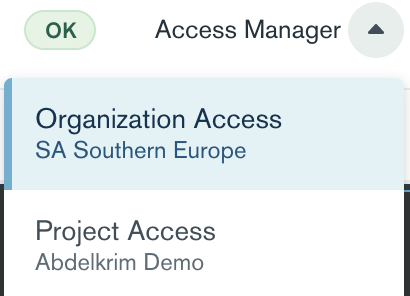
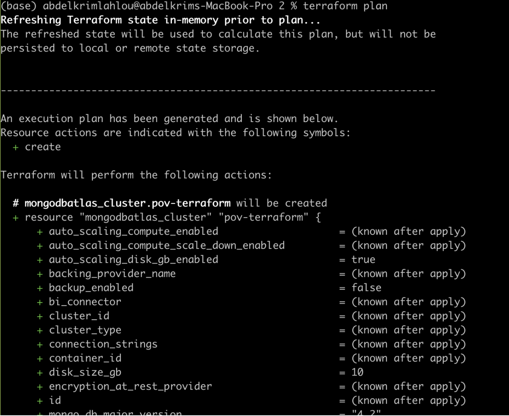
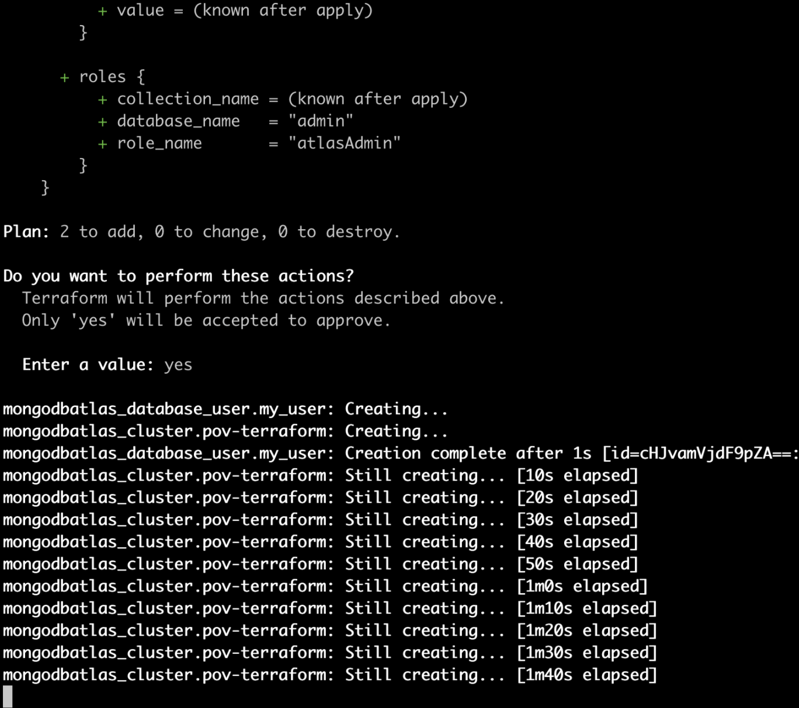
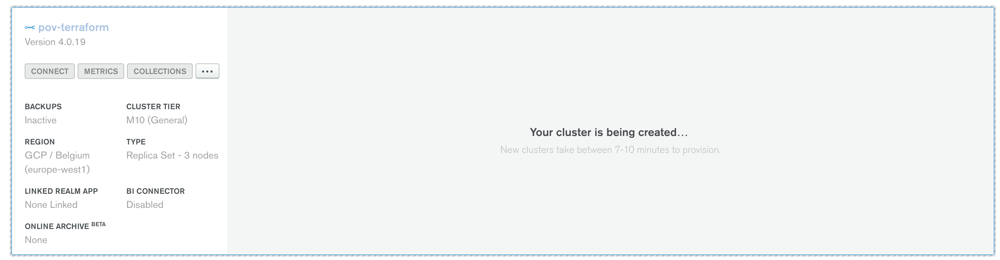
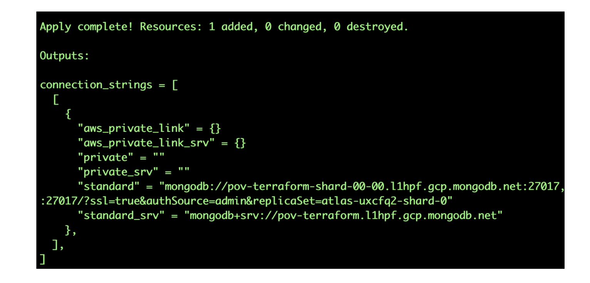
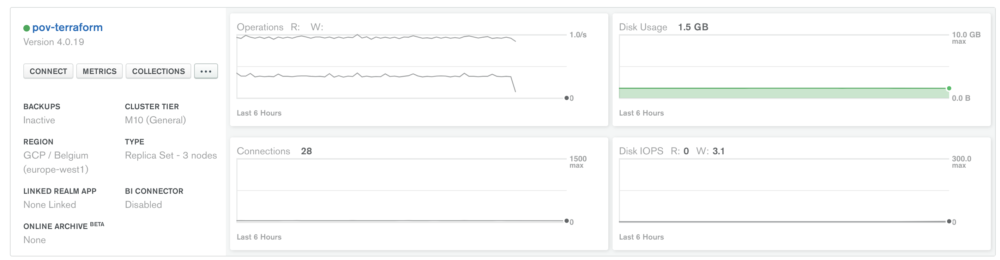
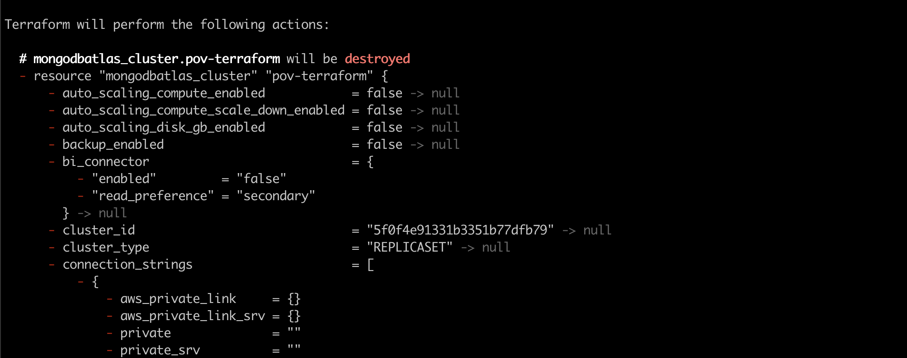

# TERRAFORM

__Ability to automate the deployment & configuration of a production ready database cluster, using Terraform__

__SA Maintainer__: [Abdelkrim Lahlou](mailto:abdelkrim.lahlou@mongodb.com) <br/>
__Time to setup__: 30 mins <br/>
__Time to execute__: 15 mins <br/>


---

## Description
 
This proof shows how MongoDB Atlas, as a Database-as-a-Service (DBaaS), can use Terraform to automate the deployment and the configuration of Mongodb clusters.
This proof uses a [Terraform](www.terraform.io) to perform the database cluster automated provisioning and should take between 5 to 10 minutes to complete, depending on the underlying cloud provider and the size and complexity of the cluster.
 
---

## Setup
 
__1. Configure Laptop__
Ensure the Terraform is installed, e.g.:
```
brew install terraform
```
__2. Configure Atlas Environment__
* Log-on to your [Atlas account](http://cloud.mongodb.com) (using the MongoDB SA preallocated Atlas credits system) and navigate to your SA project
* As MongoDB Atlas clusters are created under a specific Atlas Organization and Project,  go to your __Account__ settings and in the [Organizations](https://cloud.mongodb.com/v2#/account/organizations) tab, ensure you have the Organization [created](https://docs.atlas.mongodb.com/tutorial/manage-organizations/#create-an-organization) to be used in this proof and then for this Organization, __create__ a new __Project__ (or re-use an existing Project) and make a record of the project name.
* Navigate to the project you are using and go to the API Keys tab on the [Access Manager](https://docs.atlas.mongodb.com/configure-api-access#manage-programmatic-access-to-a-project) page.  



 
Generate a new Programmatic API Key (record the public and private keys ready for subsequent use). Create the key with the 'Project Owner' permission as it needs permissions to create a cluster. Make sure to keep a copy of the public and private keys and add the IP of your laptop (or from where the API will be invoked) to the API whitelist entry.
Navigate to the new/existing Atlas Project, then select the Settings option from the left hand menu and record the value of the Project ID field ready for subsequent use.


---
## Execution
__1. Configure Terraform variable file__
Open the following file [terraform.tfvars](terraform.tfvars) in the Git folder, and update the values as follow  : 
```
public_key  = "ATLAS-API-PUBLIC-KEY"
private_key = "ATLAS-API-PRIVATE-KEY"
atlasprojectId     = "ATLAS-PROJECTID"
cluster_region = "CLUSTER-REGION" (e.g. For Paris, cluster_region = “eu-west-3” on AWS)
```
For the list of all the available regions in Atlas, please visit these pages :

* GCP https://docs.atlas.mongodb.com/reference/google-gcp/#google-gcp
* AWS https://docs.atlas.mongodb.com/reference/amazon-aws/#amazon-aws
* AZURE https://docs.atlas.mongodb.com/reference/microsoft-azure/#microsoft-azure
 
Save the file

__2. Execute the below command in the GitHub folder to init the terraform__ 
```bash
Terraform init 
```

__3. Validate the terraform__ 
Execute the below command in the GitHub folder to check the plan.
```
terraform plan
```


__4. Provision The Database Cluster Using terraform__
```
terraform apply
```
Validate the list of actions to be performed by Terraform by entering “yes”. 

__5. Show The Cluster Deployment Status Via The MongoDB Atlas UI__
From the terminal, you can see:



And you check the creation in Atlas UI



 
__6. Adding database user__
In this part, we will add an admin user to the created cluster. To do we have to add some code on the terraform file 
Open the init.tf file and add the code below at the end
```
#
# Create an Atlas Admin Database User
#
resource "mongodbatlas_database_user" "my_user" {
  username           = local.mongodb_atlas_database_username
  password           = local.mongodb_atlas_database_user_password
  project_id              = var.atlasprojectid
  auth_database_name = "admin"
 
  roles {
    role_name     = "atlasAdmin"
    database_name = "admin"
  }
}
```
now execute again the command : 
```
Terraform apply
``` 
---

## Measurement
When finished, you will see a message in the terminal that the creation of the cluster is finished.



You can check also in the Atlas UI that the cluster is now created and ready for access, similar to the example shown below
 


To finish, you can delete the cluster created by executing the following command : 
```
terraform destroy
```
When having the message “Do you really want to destroy all resources?”, enter the value “yes”




