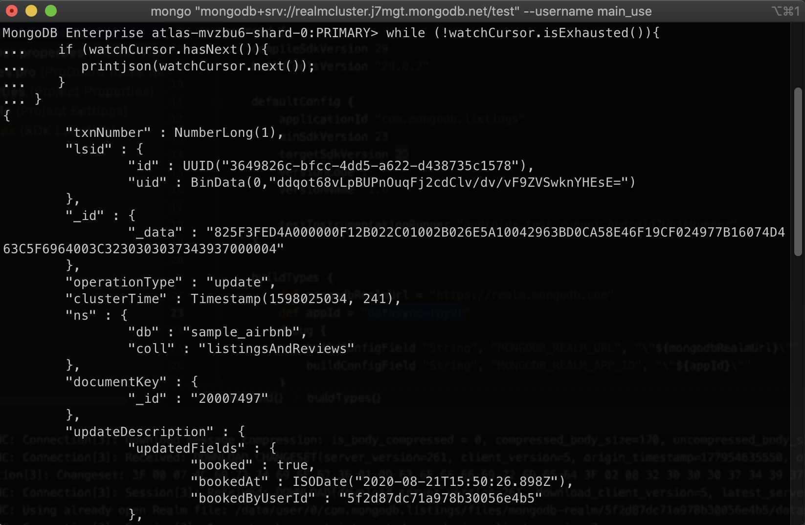

# DEVICE-SYNC

__Ability to keep user data automatically synchronized between intermittently internet connected devices and a centrally managed database__

__SA Maintainer__: [Carlos Castro](mailto:carlos.castro@mongodb.com) <br/>
__Time to setup__: 60 mins <br/>
__Time to execute__: 60 mins <br/>

---

## Description

This proof shows how [MongoDB Realm Sync](https://www.mongodb.com/realm/mobile/sync), can automatically keep multiple mobile devices' data in sync with a [MongoDB Atlas](https://www.mongodb.com/cloud/atlas) cluster, allowing you to customised any conflict resolution logic.<br/>

It uses the [Realm Android SDK](https://docs.mongodb.com/realm/android/) to implement a simple _Airbnb Bookings_ mobile app, using the [sample_airbnb](https://docs.atlas.mongodb.com/sample-data/available-sample-datasets/#available-sample-datasets) database and its __listingsAndReviews__ collection, that is available for use in any Atlas cluster.<br/>

Realm Sync needs a [partition](https://docs.mongodb.com/realm/sync/partitioning/) key to sync the realms. The field __property_type__ was chosen to partition the data in the __listingsAndReviews__ collection. By default the mobile app is syncing the Realm with the partition value of _"Resort"_.

The booking app is very simple and all the bookings are for the same day only - this means that when a booking is made, the listing will become unavalaible for other users. This will be shown via 2 virtual Android mobile phones.

---

## Setup

__1. Configure Laptop__

* Download and install Android Studio 4.0 (minimum required version is 4.0) [here](https://developer.android.com/studio). 
* Open Android Studio and in the lower right corner of the initial splash screen, select __Configure > SDK Manager__ to install Android SDK 10.0 API Level 29


* Back in the initial splash screen, in the lower right corner, select __Configure > AVD Manager__ to install at least 2 different android virtual devices.  Select a __Nexus 5X__ and a __Pixel 3a__. Be sure to select the correct API Level ( Android Q - API Level 29).


* If you haven't already, [clone](https://docs.github.com/en/github/creating-cloning-and-archiving-repositories/cloning-a-repository) this repo or download it as a zip file


* Ensure Terraform is [installed](https://learn.hashicorp.com/tutorials/terraform/install-cli), e.g.:

```bash
brew install terraform
```

* Ensure Realm CLI is [installed](https://docs.mongodb.com/realm/deploy/realm-cli-reference/#installation), e.g.:

```bash
npm install -g mongodb-realm-cli
```

__2. Configure Atlas Environment__

**Option 1 - Using the command line**

* Log-on to your [Atlas account](http://cloud.mongodb.com) (using the MongoDB SA preallocated Atlas credits system) and navigate to your SA project

* Navigate to the project you are using and go to the API Keys tab on the [Access Management](https://docs.atlas.mongodb.com/configure-api-access#manage-programmatic-access-to-a-project) page.

* __Generate__ a new __Programmatic API Key__ (record the public and private keys ready for subsequent use). Create the key with the 'Project Owner' permission as it needs permissions to create a cluster.

* Navigate to the project's __Settings__ page from the left hand menu and record the value of the Project ID field ready for subsequent use.

* Navigate to the  project's __Security page__, and add a new __IP Whitelist__ for your laptop's current IP address.

* Edit the following file [terraform.tfvars](terraform/terraform.tfvars) in the Git folder, and update the values as follow:

```properties
public_key  = "ATLAS-API-PUBLIC-KEY"
private_key = "ATLAS-API-PRIVATE-KEY"
atlasprojectId = "ATLAS-PROJECTID"
```

* Execute the below command in the __terraform__ folder to init the terraform:

```bash
terraform init
```

* Provision the atlas cluster using _terraform apply_:

```bash
terraform apply
```

Validate the list of actions to be performed by Terraform by entering _yes_.

* Once the cluster is created, copy the __connection_string__ value from the terraform output.

* Load the data into the cluster using mongoimport (from the root folder of the PoV):

```bash
mongoimport --drop -c listingsAndReviews --uri "<CONNECTION_STRING>" --jsonArray ./data/sample_airbnb.listingsAndReviews.json
```

> **_NOTE:_**  Make sure the __sample_airbnb__ database is selected in the __connection_string__ otherwise you might import data to the default __test__ database! This will cause the app to show an empty bookings list!

**Option 2 - Using the Atlas UI**

* Follow the steps described [here](./SETUP_ATLAS.md)

__3. Configure Realm Environment__

**Option 1 - Using the command line**

* Using the same __Programmatic API Key__ you created before, login to Realm:

```bash
realm-cli login --api-key="ATLAS-API-PUBLIC-KEY" --private-api-key="ATLAS-API-PRIVATE-KEY"
```

* Now import the application (from the root folder of the PoV) accepting the defaults in the import wizard:

For realm-cli V1

```bash
realm-cli import -path=./device-sync
```

For realm-cli V2

```bash
realm-cli push --local "./device-sync"
```

> **_NOTE:_**  If there is an error in the import process, manually delete the Realm application and try again. A common issue is that the cluster name does not match the default **RealmCluster**.

You should see a success message similar to:

```bash
Successfully imported 'device-sync-<EMPTY>'
```
> **_NOTE:_** Notice that the identifier will be empty, and you will have to retrieve it from the Realm app configuration page. 

__4. Update configuration files, with the identifier from realm__

Once you have successfully pushed the app and it has been generated in realm, you will see an additional file in your [device-sync](./device-sync/) folder, called [realm_config.json](./device-sync/realm_config.json).

Find the field _app_id_ and copy the value. Replace it in the [config.json](./device-sync/config.json) file and save it to configure your gradle module.

**Option 2 - Using the Realm UI**

* Follow the steps described [here](./SETUP_REALM.md)

---

## Execution

__1. Run the device-sync project__

* Back on Android Studio initial splash screen, select the __Open Existing Project__ option and open the folder named __mobile-app__ where you cloned this repository (or where you have unziped the file you previously downloaded).


* Syncronize the Gradle Scripts

The project will load and a small status window will ask you to syncronize the gradle files.  Chose the options to syncronize.  If you miss the prompt you can select __File -> Sync Project with Gradle Files__.


* Set the __AppId__

On the left hand navigation pane and expand the __Gradle Scripts__ and select the __build.gradle(Module: app)__ file.  Find the _appId_ variable and set it to the realm sync project __AppId__ configured in step 4 of the **Configure Realm Environment* section.


* Launch the Android Application

You can run the Inventory Demo on a single AVD.  Just press the green arrow on the toolbar and it will run the AVD selected in the drop list to the left.  However to show synchronization to Atlas and then back to multiple devices you may want to run the application on multiple AVDs.

  

* Run on Multiple Devices

Once the dialog is open, select the two devices to run the application on.


Once you have the AVDs selected click the run button. It might take a few minutes for both the AVDs to launch.

* Connect to Atlas via Realm Authentication

When the AVDs Launch, you will see the _Login Screen_. Here you can login an existing user or create new user accounts.

If you have _imported_ the Realm app in the __Setup__ section, you will need to create 2 new user accounts using the __Create Account__ button in the _Login_ screen of the app. If you have followed the manual _Realm_ setup steps, you should have already these 2 user accounts created.

Create each user in a different AVD.
The username is an email address. Use a simple password you won't forget like _Passw0rd_.

__demo_user1@gmail.com__

__demo_user2@gmail.com__

You can now log in with the user name (email address) and passwords you defined. Log in each user to a different device.


__2. Open a change stream to see data updates in the Atlas Cluster__ 

* Open a mongo shell using the __MongoDB Connection String__ from the Atlas cluster you have saved before (verify the database username and password if you have created it yourself):

```bash
mongo "<CONNECTION_STRING>"
```

* Open a change steam for the __listingsAndReviews__ collection in the __sample_airbnb__ database using the following commands in the mongo shell:

```bash
use sample_airbnb
watchCursor = db.listingsAndReviews.watch()
while (!watchCursor.isExhausted()){
   if (watchCursor.hasNext()){
      printjson(watchCursor.next());
   }
}
```


__3. Open Compass to see the data updates in the Atlas Cluster__ 

* Open Compass and connect to the Atlas Cluster using the __MongoDB Connection String__ you have saved before (verify the database username and password if you have created it yourself)

__4. Test 1 - __demo_user1@gmail.com__ is online and makes a booking__

* Using __demo_user1@gmail.com__, book a stay at _"2 Bdrm Condo at Makai Club Cottages"_.

The listing is updated with a __bookedAt__ timestamp.
The Atlas cluster received the update and triggers the function to confirm the booking.
The listing is updated with a __confirmedAt__ timestamp.

__5. Test 2 - __demo_user1@gmail.com__ is offline and makes a booking__

* Turn on airplane mode (or turn off the Wifi and Mobile Data) on the mobile emulator where __demo_user1@gmail.com__ is logged in.

If you like overpaying for your smartphones, you might not know how to do this :stuck_out_tongue_winking_eye:. In Android, to open the **Quick Settings** panel, swipe down from the top of the screen. Toggle the **airplane** icon to turn it on or off. Similarly you can use the **data** icon to turn it on or off.

* Book a stay at _"2 Outdoor Pools | Tennis Court | Near the Beach"_.

The listing is updated with a __bookedAt__ timestamp.
Because the user is offline, the booking cannot be confirmed.

* Turn off airplane mode (or turn on the Wifi and Mobile Data) on the mobile emulator where __demo_user1@gmail.com__ is logged in.

The Atlas cluster received the update and triggers the function to confirm the booking.
The listing is updated with a __confirmedAt__ timestamp.

__5. Test 3 - __demo_user1@gmail.com__ is offline and makes a booking, __demo_user2@gmail.com__ is online and makes a booking in the same location__

* Turn on airplane mode (or turn off the Wifi and Mobile Data) on the mobile emulator where __demo_user1@gmail.com__ is logged in.

* Book a stay at _"B103 Waipouli Beach Resort, Sleeps 8!"_.

The listing is updated with a __bookedAt__ timestamp.
Because the user is offline, the booking cannot be confirmed.

* Using __demo_user2@gmail.com__, book a stay at _"B103 Waipouli Beach Resort, Sleeps 8!"_.

The listing is updated with a __bookedAt__ timestamp.
The Atlas cluster received the update and triggers the function to confirm the booking.
The listing is updated with a __confirmedAt__ timestamp.

* Turn off airplane mode (or turn on the Wifi and Mobile Data) on the mobile emulator where __demo_user1@gmail.com__ is logged in.

The listing is updated with a __Not Available__ message because the booking was taken by another user.

---

## Measurement

Realm Sync happens automatically in the background, and keeps  the local realm mobile database in sync with the Atlas Cluster.

__1. Test 1 - __demo_user1@gmail.com__ is online and makes a booking__

Using the change streams you opened before, you can see both updates that are made to the listing.



The first update comes from the mobile device where the user has made the booking.
The second update comes from the Atlas Trigger where the booking gets confirmed.

In compass you can see the booking details using these options:
- Filter

```json
{ property_type: 'Resort' }
```

- Project

```json
{ _id:0, name:1, 'bookingRequests.booked':1, 'bookingRequests.bookedAt':1, 'bookingRequests.confirmed':1, 'bookingRequests.confirmedAt':1, 'bookingRequests.bookedByUserId':1 }
```

- Sort

```json
{ name:1 }
```


__2. Test 2 - __demo_user1@gmail.com__ is offline and makes a booking__

Using the change streams you opened before, you can see that there are no updates when __demo_user1@gmail.com__ books the stay (since the user is offline).
As soon as __demo_user1@gmail.com__ comes online, you can see the updates in the change stream, along with the updated data in Compass.


__3. Test 3 - __demo_user1@gmail.com__ is offline and makes a booking, __demo_user2@gmail.com__ is online and makes a booking in the same location__

Using the change streams you opened before, you can see that there are no updates when __demo_user1@gmail.com__ books the stay (since the user is offline).

When __demo_user2@gmail.com__ books the stay in the same listing you can see both updates in the change stream, along with the updated data in Compass.

As soon as __demo_user1@gmail.com__ comes online, you can see its booking is cancelled because a conflict has been detected and the latest data from the Atlas cluster has been applied to the local Realm database. The custom conflict resolution logic is applied and the data is consistent in all devices along with the Atlas cluster.


