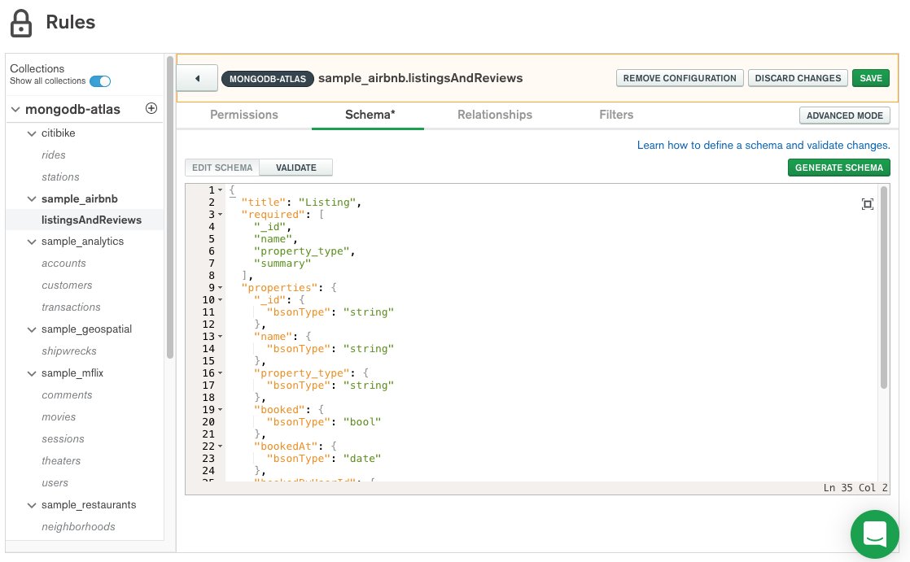

# Setup a Realm application

## Configure Realm Environment

* In the Atlas console, click the __Realm__ tab in the upper middle tab of the Atlas console.  Then select the green __Create a New App__ button in the upper right.


* This brings up the __New Application__ Dialog window.  Give the application the name __device-sync__ and select the atlas cluster to link the application.  Then press the Create Realm Application Button.


* When the application is created, copy the __AppID__ into the clipboard and save it for later use when connecting the mobile device to Atlas. Click the __Copy__ button next to the __device-sync__ name at the upper left of the realm console window and save the value for later. 


* Create a schema for the mobile application. Select the __Rules__ tab, then click on the database __sample_airbnb__ and the collection __listingsAndReviews__, leave the option __No Template__ selected and click the button __Configure Collection__. Next click on the __Schema__ tab and copy the schema below into the schema for the application. Save the changes.



```js
{
  "properties": {
    "_id": {
      "bsonType": "string"
    },
    "name": {
      "bsonType": "string"
    },
    "property_type": {
      "bsonType": "string"
    },
    "bookingRequests": {
      "bsonType": "array",
      "items": {
        "bsonType": "object",
        "properties": {
          "booked": {
            "bsonType": "bool"
          },
          "bookedAt": {
            "bsonType": "date"
          },
          "bookedByUserId": {
            "bsonType": "string"
          },
          "confirmed": {
            "bsonType": "bool"
          },
          "confirmedAt": {
            "bsonType": "date"
          }
        }
      }
    }
  },
  "required": [
    "_id",
    "name",
    "property_type"
  ],
  "title": "Listing"
}
```

* Click on the __Sync__ menu item on the left hand navigation menu of the Realm console.  The Sync configuration window appears and you can now specify the cluster to sync with and the partition key as well as define permissions.  Use __property_type__ as the partition key and leave the permissions to the default empty document __{}__.


* Start the sync process by saving the config and pressing the __Enable Sync__ button and deploy the changes.  

> Troubleshooting: If for any reason sync seems to fail feel free to pause sync, deploy the changes.  After a few moments start sync again and deploy the changes.  Terminating sync requires rebuilding the schema and starting over.

* Select the __Users__ menu item from the left Navigation menu pane of the Realm console.  This brings up the Realm Users window. Navigate to the __Providers__ tab and click on the __Edit__ button on __Email/Password__.


* Set the provider __Enabled__ to __On__ by moving the slider.  Select __Automatically Confirm Users__ and choose a password reset function, then select __Create New Function__ go with the default reset function and then save. Review and Deploy the changes before the next step.


* On the same screen, on the top right corner click on __Add New User__ to create the following users, one at a time.  The username is an email address. Use a simple password you won't forget like _Passw0rd_.

__demo_user1@gmail.com__

__demo_user2@gmail.com__


* Click on the __Triggers__ menu item on the left hand navigation menu of the Realm console.


* Click __Add a Trigger__ in the top right corner, set the __Cluster Name__ to _mongodb-atlas_, the __Database Name__ as __sample_airbnb__ and the __Collection Name__ as __listingsAndReviews__. On __Operation Type__ check the __Update__ option. Turn on the __Full Document__ option.


* Under __Function__ select __+ New Function__ and paste the following code:

```javascript
exports = function (changeEvent) {
  const docId = changeEvent.documentKey._id;
  const fullDocument = changeEvent.fullDocument;
  const collection = context.services.get("mongodb-atlas").db("sample_airbnb").collection("listingsAndReviews");

  console.log("checking booking update...");
  console.log(JSON.stringify(fullDocument));

  if (fullDocument.bookingRequests.length == 1) {
    console.log("checking initial booking request...")
    if (fullDocument.bookingRequests[0].booked && !fullDocument.bookingRequests[0].confirmed) {

      const query = {
        "_id": docId,
        "bookingRequests.bookedByUserId": fullDocument.bookingRequests[0].bookedByUserId
      };

      const update = {
        $set:
        {
          "bookingRequests.$.confirmed": true,
          "bookingRequests.$.confirmedAt": new Date()
        }
      };

      const options = { "upsert": false };

      collection.updateOne(query, update, options)
        .then(result => {
          const { matchedCount, modifiedCount } = result;
          if (matchedCount && modifiedCount) {
            console.log("approved booking request...")
          }
        })
        .catch(err => console.error(`Failed to update the doc: ${err}`))
    }
  } else if (fullDocument.bookingRequests.length > 1) {
    console.log("ignoring new booking request...")

  } else {
    console.log("booking cancelled...")
  }
};
```


* Save and deploy all the changes.
