# DATA-API

__Ability to easily read, insert, modify, and delete documents stored in MongoDB Atlas using a REST-like API without a driver or additional infrastructure management.__

__SA Maintainer__: [David Hiltenbrand](mailto:david.hiltenbrand@mongodb.com) <br/>
__Time to setup__: 15 mins <br/>
__Time to execute__: 15 mins <br/>

---

## Description

This proof shows how MongoDB Atlas Data API enables interacting with collections through a REST-like interface without needing to provision or manage additional infrastructure or write code for managing an API layer. Specifically, the proof will show that data can be interacted with easily using the Data API endpoint. Postman will be used for trying out the various POST actions, namely
* findOne
* find
* insertOne
* insertMany
* updateOne
* updateMany
* replaceOne
* deleteOne
* deleteMany
* aggregate


---

## Setup

__1. Configure Atlas Environment__
* __Note__: If using the [Shared Demo Environment](https://docs.google.com/document/d/1cWyqMbJ_cQP3j7S4FJQhjRRiKq9WPfwPG6BmJL2bMvY/edit), please refer to the pre-existing collections for this PoV. (sample_mflix.movies)
* Log in to your [Atlas account](http://cloud.mongodb.com) (using the MongoDB SA preallocated Atlas credits system) and navigate to your SA project
* In the project's Security tab, choose to add a new user, e.g. __main_user__, and for __User Privileges__ specify __Read and write to any database__ (make a note of the password you specify)
* In the Security tab, add a new __IP Whitelist__ for your laptop's current IP address
* Create an __M10__ based 3 node replica-set in a single cloud provider region of your choice with default settings
* Once the cluster has been fully provisioned, in the Atlas console, click the __... (ellipsis)__ for the cluster, select __Load Sample Dataset__ and in the modal dialog, confirm that you want to load the sample dataset by choosing Load Sample Dataset

__2. Configure Postman account__
* Go to the [Postman](https://www.postman.com/) webpage.
* Click the __Sign In__ button to log in with existing credentials.
* If you don't already have an account registered, click the __Sign Up for Free__ button to register.

---

## Execution

Now that the test environments have been configured, we will enable the Data API, generate an API key, build a Postman collection, and finally test examples of the various endpoint actions.

__1. Enable the Data API in Atlas__

* In the left-hand Deployment menu, click to navigate to __Data API (PREVIEW)__.
* Slide the __Data API Enabled__ toggle to ON for the cluster you're using for this PoV. Select __Enable__ when prompted and wait for the deployment to complete:
  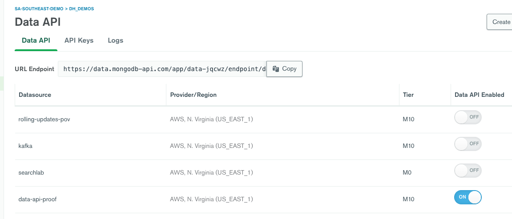
At this point, the Data API infrastructure has been automatically provisioned without any configuration or custom code to be written.
* Copy your Data API App ID from the __URL Endpoint__ as you will need it for Postman. In the above screenshot, __data-jqcwz__ is my App ID.

__2. Generate an API key__

* Switch to the API Keys tab and click __Generate API Key__
* Give your API key an appropriate name the click the __Generate API Key__ button.
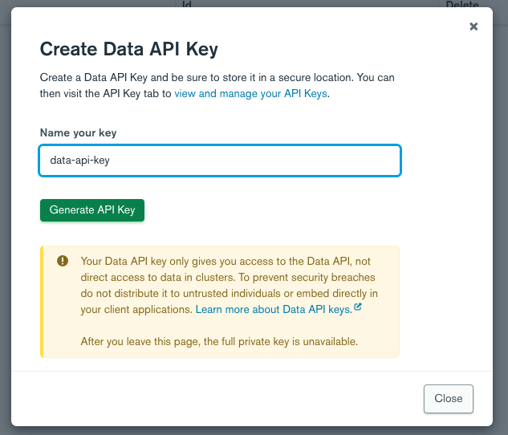
* Copy the private API Key for use and safekeeping that is displayed once generated. __NOTE: This is the only time you can retrieve the full private key.__.

  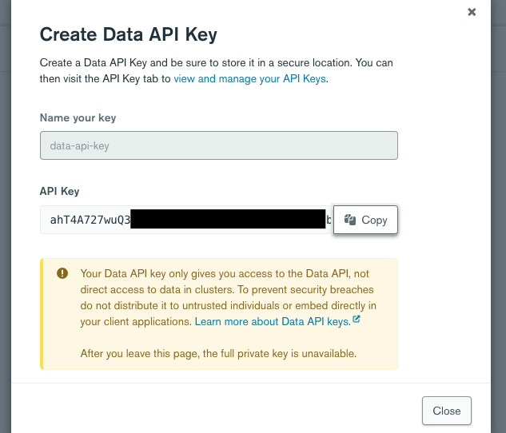

__3. Test your API from Atlas UI__

* Click the 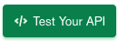 button.
* Choose the cluster where you enabled the Data API for Cluster, sample_mflix for the Database, and theaters for the Collection.
* Copy the cURL snippet generated similar to below. Replace the __<API_KEY>__ in the snippet with your generated private key. Paste the snippet into your terminal and execute it.
```
curl --location --request POST 'https://data.mongodb-api.com/app/data-jqcwz/endpoint/data/beta/action/findOne' \
--header 'Content-Type: application/json' \
--header 'Access-Control-Request-Headers: *' \
--header 'api-key: <API_KEY>' \
--data-raw '{
    "collection":"theaters",
    "database":"sample_mflix",
    "dataSource":"data-api-proof",
    "projection": {"_id": 1}
}'
```

By default, it only projects the _id field so you should see a result similar to this:
```
{"document":{"_id":"59a47286cfa9a3a73e51e72c"}}
```
If you remove the projection line and trailing comma from dataSource, you should retrieve a full document similar to this result:
```
{"document":{"_id":"59a47286cfa9a3a73e51e72c","theaterId":1000,"location":{"address":{"street1":"340 W Market","city":"Bloomington","state":"MN","zipcode":"55425"},"geo":{"type":"Point","coordinates":[-93.24565,44.85466]}}}}
```

__4. Build a Postman collection__

* Go to the [MongoDB Atlas Data API (Preview) Postman collection](https://www.postman.com/mahisatyanarayana/workspace/hello-world/collection/945759-9e2f0b9b-8a36-4be8-82e2-6aa08f64dd94?ctx=documentation) created by [Mahi Satyanarayana](mailto:mahi.satyanarayana@mongodb.com).
* Click the Fork button. Give your fork a new label and fork the collection to your own workspace.
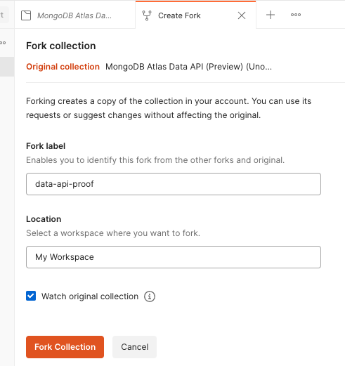
* Switch to the variables tab. Update the INITIAL VALUE of the collection variables with your Data API App ID, private API key, and Atlas cluster name. __NOTE: Postman variable names are case sensitive.__

  | VARIABLE     | INITIAL VALUE                                   |
  | ------------ | ----------------------------------------------- |
  | DataAPIAppID | Data API App ID copied from your Atlas endpoint |
  | api-key      | Private Data API Key                            |
  | dataSource   | Your Atlas cluster name                         |
  | database     | sample_mflix                                    |
  | collection   | movies                                          |

  Click Save.
  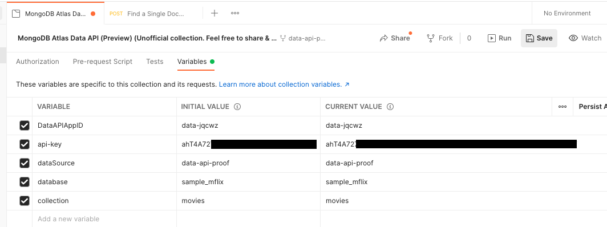

__5. Test the Data API Actions from their Respective Endpoints__

  1. findOne
  * In your Postman collection, click to __Find a Single Document__.
  * Click the __Send__ button. This will POST to the [findOne endpoint](https://docs.atlas.mongodb.com/api/data-api-resources/#find-a-single-document), retrieving one document from sample_mflix.movies with no query filter. You should see a JSON result in the Body tab of the results pane. Make sure __Pretty__ is selected and change the type dropdown to __JSON__ to view the results as a readable, formatted document.
  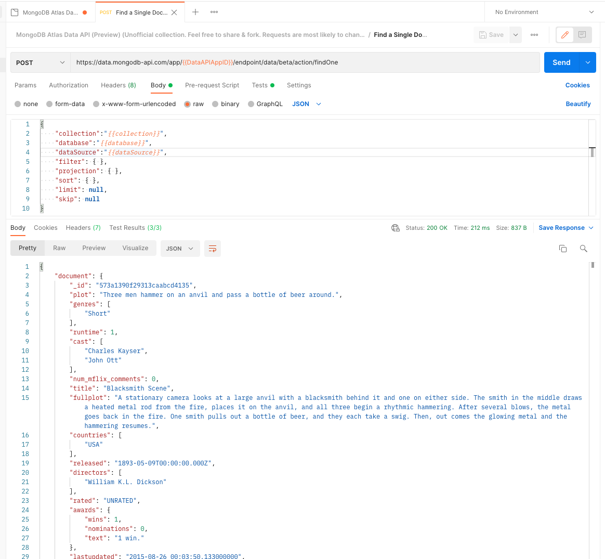

  2. find
  * In your Postman collection, click to __Find Multiple Documents__.
  * Update the JSON in the Body (changes are in bold) to filter for only movies with IMDB ratings above 9, sorted in descending order of rating, and only returning the _id, title, and imdb.rating fields:
    <pre>
    {
      "collection":"{{collection}}",
      "database":"{{database}}",
      "dataSource":"{{dataSource}}",
      "filter": <b>{ "imdb.rating": { "$gt": 9 } }</b>,
      "projection": <b>{ "_id":1, "title":1, "imdb.rating":1 }</b>,
      "sort": <b>{ "imdb.rating":-1 }</b>,
      "limit": 100,
      "skip": 0
    }
    </pre>
  * Click the __Send__ button. This will POST to the [find endpoint](https://docs.atlas.mongodb.com/api/data-api-resources/#find-multiple-documents), retrieving multiple document from sample_mflix.movies with the described criteria.
  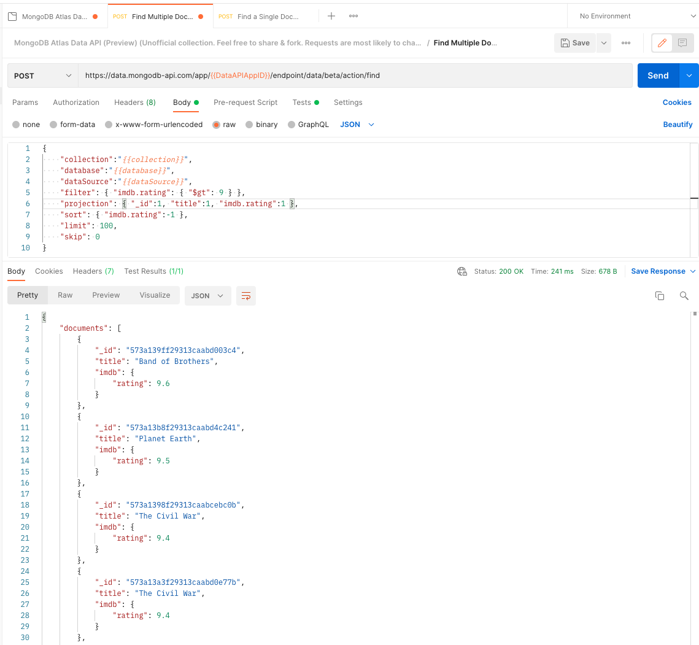

---

  __UPDATE VARIABLES: Before testing the remaining endpoints, go back to your collection variables and update the CURRENT VALUE of database to sample_postman and collection to quotes and save your changes.__

  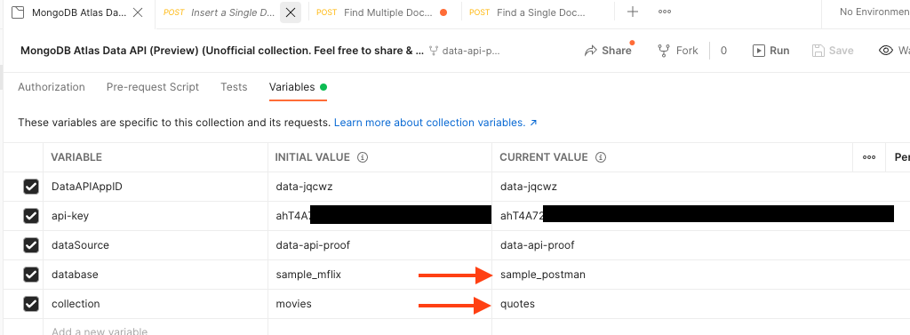

---

  3. insertOne
  * In your Postman collection, click to __Insert a Single Document__.
  * Use the provided Body that will insert a quote from "Wise Soul": 
    ```
    {
        "collection":"{{collection}}",
        "database":"{{database}}",
        "dataSource":"{{dataSource}}",
        "document": { 
            "text": "If it's free, take three",
            "author": "Wise Soul"
        }
    }
    ```
  * Click the __Send__ button. This will POST to the [insertOne endpoint](https://docs.atlas.mongodb.com/api/data-api-resources/#insert-a-single-document), inserting the single document shown to sample_postman.quotes. In the Results Body you should have an _id returned like this:
    ```
    {"insertedId":"61e64e768128e2c76c3eadf8"}
    ```
  * Use the Data Explorer in Atlas to view the new collection and verify the document inserted.
  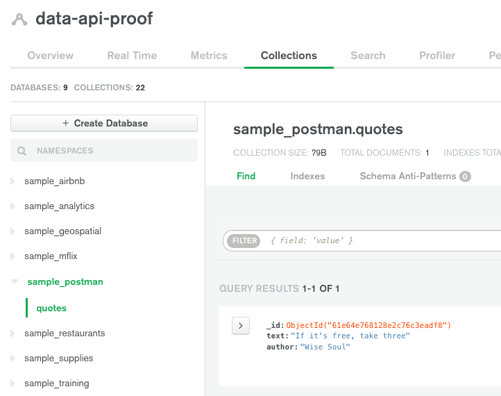
  * Click the __Send__ button again to insert a duplicate of this document. This will be used in step 6.

  4. insertMany
  * In your Postman collection, click to __Insert multiple Documents__.
  * Click the __Send__ button. This will POST to the [insertMany endpoint](https://docs.atlas.mongodb.com/api/data-api-resources/#insert-multiple-documents), inserting multiple documents to sample_postman.quotes. In the results Body you should have multiple _ids returned:
    ```
    {
      "insertedIds": [
        "61e650268128e2c76c417413",
        "61e650268128e2c76c417414",
        "61e650268128e2c76c417415",
        "61e650268128e2c76c417416",
        "61e650268128e2c76c417417",
        "61e650268128e2c76c417418",
        "61e650268128e2c76c417419",
        "61e650268128e2c76c41741a",
        "61e650268128e2c76c41741b",
        "61e650268128e2c76c41741c",
        "61e650268128e2c76c41741d",
        "61e650268128e2c76c41741e"
      ]
    }
    ```
  * Use the Data Explorer in Atlas to verify the multiple documents you just inserted.
  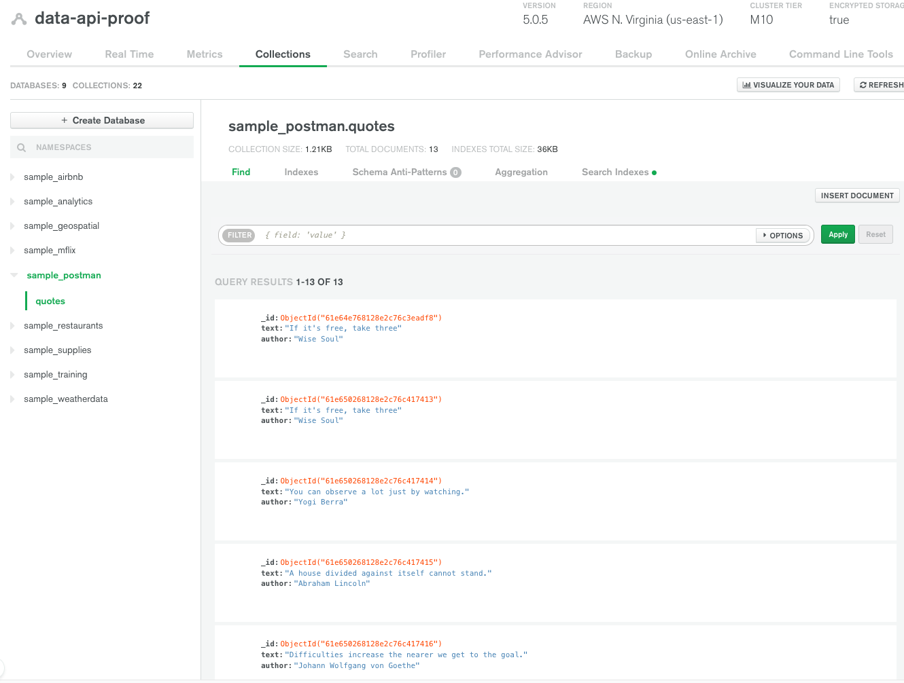

  5. updateOne
  * In your Postman collection, click to __Update a Single Document__.
  * Click the __Send__ button. This will POST to the [updateOne endpoint](https://docs.atlas.mongodb.com/api/data-api-resources/#update-a-single-document), updating only the fields described in the update expression for one document in sample_postman.quotes matching the provided filter. In the Results Body you should have returned a count for the matched and modified Documents. Notice that the matched count is 1 even though we have duplicates of this document. updateOne always matches and updates the first document found with the filter criteria.
    ```
    {"matchedCount":1,"modifiedCount":1}
    ``` 
  * Use the Data Explorer in Atlas to verify the document updated the author to "Very Wise Soul".
  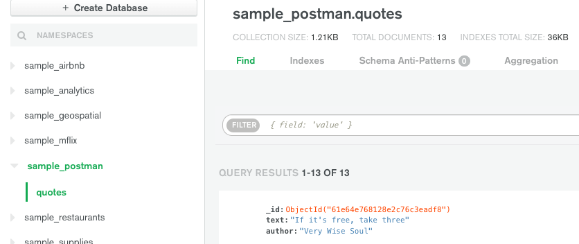

  6. updateMany
  * In your Postman collection, click to __Update multiple Documents__.
  * Click the __Send__ button. This will POST to the [updateMany endpoint](https://docs.atlas.mongodb.com/api/data-api-resources/#update-multiple-documents), updating all documents in sample_postman.quotes that match the query filter. You should have received a result that 2 documents (the remaining "Wise Soul" duplicates) were matched and updated.
      ```
      {"matchedCount":2,"modifiedCount":2}
      ```

  7. replaceOne
  * In your Postman collection, click to __Replace a Single Document__.
  * Update the Body with this JSON, changes are in bold:
    <pre>
    {
      "collection":"{{collection}}",
      "database":"{{database}}",
      "dataSource":"{{dataSource}}",
      "filter": { "author": "<b>Very</b> Wise Soul"},
      "replacement": { 
          "text": "If it's free, take three",
          "author": "Very Very Wise Soul"
      },
      "upsert": false
    }
    </pre>
  * Click the __Send__ button. This will POST to the [replaceOne endpoint](https://docs.atlas.mongodb.com/api/data-api-resources/#replace-a-single-document), overwriting one document from sample_postman.quotes that matches the filter. Similar to the updateOne, you should see only 1 document matched and updated. However, also notice that replaceOne provides the full document that will replace the old, whereas updateOne only modified a specific field and retained the rest of the document unmodified.
    ```
    {"matchedCount":1,"modifiedCount":1}
    ```

  8. aggregate
  * In your Postman collection, click to __Run an Aggregation Pipeline__.
  * Click the __Send__ button. This will POST to the [aggregate endpoint](https://docs.atlas.mongodb.com/api/data-api-resources/#run-an-aggregation-pipeline), retrieving an array of documents resulting from the [MongoDB Aggregate Pipeline](https://docs.mongodb.com/manual/core/aggregation-pipeline/) executed against sample_postman.quotes. This pipeline will group and count the quotes by author, returning an array of the quotes and counts ordered descending on count. You should have received results similar to this:
    ```
    {
      "documents": [
        {
          "_id": "Yogi Berra",
          "count": 2,
          "text": [
            "You can observe a lot just by watching.",
            "Life is a learning experience, only if you learn."
          ]
        },
        {
          "_id": "Byron Pulsifer",
          "count": 2,
          "text": [
            "Fate is in your hands and no one elses",
            "What you give is what you get."
          ]
        },
        {
          "_id": "Very Wise Soul",
          "count": 2,
          "text": [
            "If it's free, take three",
            "If it's free, take three"
          ]
        },
        {
          "_id": "Buddha",
          "count": 1,
          "text": [
            "Peace comes from within. Do not seek it without."
          ]
        },
        {
          "_id": "Johann Wolfgang von Goethe",
          "count": 1,
          "text": [
            "Difficulties increase the nearer we get to the goal."
          ]
        },
        {
          "_id": "Lao Tzu",
          "count": 1,
          "text": [
            "Be the chief but never the lord."
          ]
        },
        {
          "_id": "Abraham Lincoln",
          "count": 1,
          "text": [
            "A house divided against itself cannot stand."
          ]
        },
        {
          "_id": "Margaret Sangster",
          "count": 1,
          "text": [
            "Self-complacency is fatal to progress."
          ]
        },
        {
          "_id": "Very Very Wise Soul",
          "count": 1,
          "text": [
            "If it's free, take three"
          ]
        },
        {
          "_id": "Carl Sandburg",
          "count": 1,
          "text": [
            "Nothing happens unless first we dream."
          ]
        },
        {
          "_id": "Aristotle",
          "count": 1,
          "text": [
            "Well begun is half done."
          ]
        }
      ]
    }
    ```

  9. deleteOne
  * In your Postman collection, click to __Delete a Single Document__.
  * Update the JSON as follows, changes are in bold:
    <pre>
    {
      "collection":"{{collection}}",
      "database":"{{database}}",
      "dataSource":"{{dataSource}}",
      "filter": { "author": "<b>Very Very</b> Wise Soul"}
    }
    </pre>
  * Click the __Send__ button. This will POST to the [deleteOne endpoint](https://docs.atlas.mongodb.com/api/data-api-resources/#delete-a-single-document), deleting only the first document from sample_postman.quotes that matches the query filter. You should return a count of 1 document deleted:
    ```
    {"deletedCount":1}  
    ```

  10. deleteMany
  * In your Postman collection, click to __Delete multiple Documents__.
  * Update the JSON as follows, changes are in bold:
    <pre>
    {
      "collection":"{{collection}}",
      "database":"{{database}}",
      "dataSource":"{{dataSource}}",
      "filter": { "author": "<b>Very</b> Wise Soul"}
    } 
    </pre>
  * Click the __Send__ button. This will POST to the [deleteMany endpoint](https://docs.atlas.mongodb.com/api/data-api-resources/#delete-multiple-documents), deleting all documents from sample_postman.quotes that match the query filter. You should return a count of the remaining 2 "Very Wise Soul" documents that have been deleted.
    ```
    {"deletedCount":2}
    ```

---

## Measurement

* Return to the __Data API__ menu option in Atlas.
* Click to the __Logs__ tab.
* Review the usage metrics at the top of the page. This will report the Data API usage for the current month.
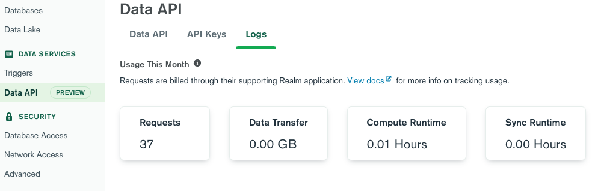
* Review the logs section of the page. The Data API logs all requests and stores the logs for 30 days. Notice how you can view the date of execution, the endpoint requested, the total runtime of the request in milliseconds, and the bytes per millisecond for calculating compute usage.
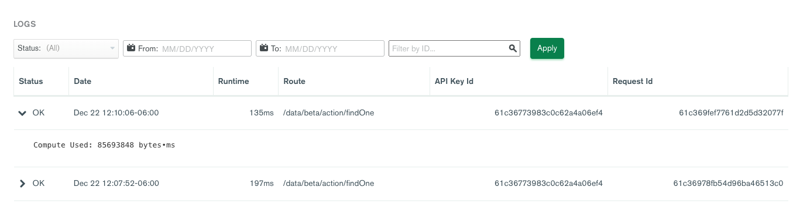