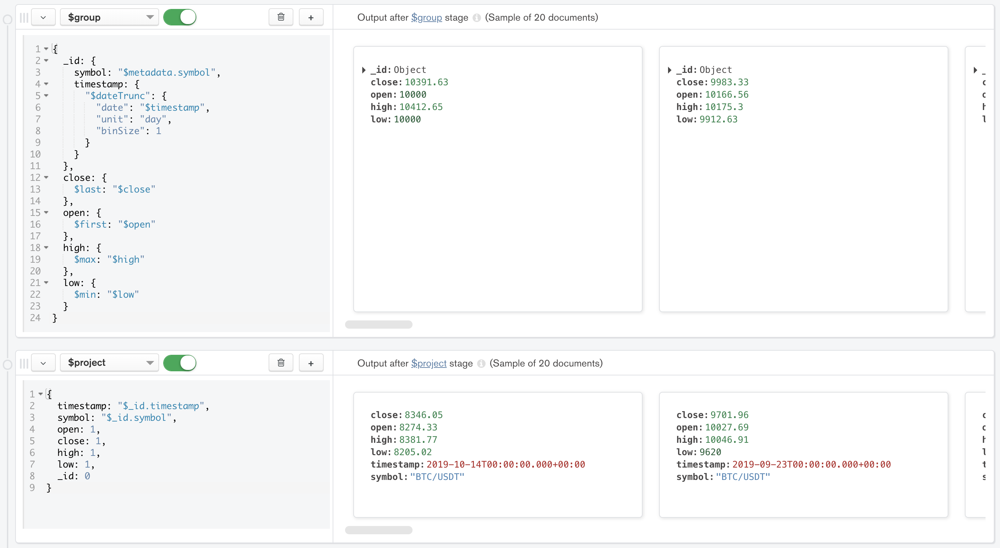

# TIME SERIES

__Ability to natively work with time series data while reduce the index and the storage size.__

__SA Maintainer__: [Philip Eschenbacher](mailto:philip.eschenbacher@mongodb.com), [Timo Lackmann](mailto:timo.lackmann@mongodb.com), [Michael Gerstenberg](mailto:michael.gerstenberg@mongodb.com) <br/>
__Time to setup__: 15 mins <br/>
__Time to execute__: 30 mins <br/>

---
## Description

This proof compares the different ways how MongoDB can handle time series data:

- Raw: each data point gets inserted as a single document
- Bucketing: applying bucketing concept by creating buckets per hour via an application. (in comparison fixed sized buckets can create awkward index sizes if they got rewritten for every new entry e.g. an expanding enddate which is indexed) It's worth mentioning, that the method how buckets are created in this example is very inefficient. In Atlas there are workarounds like creating a second collection and use triggers to create buckets... We want to proof here that it is easy to use TS collections and don't want to show the most efficient way of manual bucketing
- Time-Series: streaming data into a time series collection

We will compare:
- how easy it is to use each approach
- index size
- storage size
- inserting performance (like mentioned before, bucketing can be done much more efficient)

In addition we will create a Chart to visualize data from the time-series collection.

Here are some ideas what else can be shows regarding what is interessting for the customer:
- combine with (enterprise) data from regular collections
- online archiving with Atlas
- ...

In the near future we want to provide data from the tsbs tests to have more data avaialable especially for query performance to share with customers. Colleagues already did most of the job (https://github.com/timescale/tsbs/pull/173). See some results at the bottom of this readme.

---
## Preparation (Configure Atlas Environment)

* Log-on to your [Atlas account](http://cloud.mongodb.com) (using the MongoDB SA preallocated Atlas credits system) and navigate to your SA project
* In the project's Security tab, choose to add a new user called __main_user__, and for __User Privileges__ specify __Read and write to any database__ (make a note of the password you specify)
* Create an __M10__ (or what you need) based 3 node replica-set in a single AWS region of your choice. The execution is split in raw/bucket and TS. For a greater WOW effect you can start on version 4.4 and while execution raw/bucketing upgrade the cluster to 5.0 to demonstrate our upgrade without downtime capabilities. Or you can start directly on version 5, just as you feel comfy.
* In the Security tab, add a new __IP Whitelist__ for your laptop's current IP address
* In the Atlas console, for the database cluster you deployed, click the __Connect button__, select __Connect Your Application__, and for the __Python__ copy the __Connection String Only__ - make a note of this MongoDB URL address to subsequently be used in the _Execution_ section

---
## Execution

1. First of all we create an environment for the execution by typing the following commands into terminal. Skip the git clone if you already did it.

```
$ git clone https://github.com/10gen/pov-proof-exercises.git
$ cd pov-proof-exercises/proofs/51/
$ python3 -m venv .ENV
$ source .ENV/bin/activate
$ pip install pymongo dnspython pandas
```

2. Rename the `config.sample.py` into `config.py` and replace the connection string with your cluster ones.

3. The following script downloads this data set in minute granularity [BTC dataset from Binance](https://www.cryptodatadownload.com/cdd/Binance_BTCUSDT_minute.csv) and save it into the `data_source` folder. Lots of data points, free and understandable. (You can choose different data sets from here: [Datasets from Binance](https://www.cryptodatadownload.com/data/binance/))

```
$ python crypto_00_download_data.py
```

4. Let's import the data set in three different ways into our Atlas cluster. Create the raw and bucketing collection first.

```
$ python crypto_01_create_collections.py
```

After that's done we start importing the raw data.

```
$ python crypto_02_import_raw.py
```

If your cluster is not on version 5 yet, upgrade it now. And then let's start the bucketing.

```
$ python crypto_03_import_buckets.py
```

Attention! This will take approximatly around 12 minutes. So you can prepare this collection and rename it to get insights without waiting. For doing so open compass and execute this commands:

```
> use TSPOV
> db.cryptoBuckets.renameCollection("cryptoBucketsBackup")
```

Finally we import all data into a time series collection. The collection needs to be created beforehand. In the creation script is defined that the metaField is named `metadata`, the timefield is called `timestamp` and the granularity is `minutes`. Make sure that you define these properties for time series collections. Best practice at the moment is to create a compound index with a metadata field you use to query plus the timestamp. This index will be created by the script.

```
$ python crypto_04_create_ts_collection.py
```

After creation we can start the import.

```
$ python crypto_05_import_in_ts.py
```

We directly see the import is much faster than bucketing and a bit faster compared to raw.

5. Now let's analyze the different methods. You can look into the indexes in Compass or get the stats from the collection via the mongo shell.

For timeseries collections the recommendation is to create a compound index of a relevant meta field (like device id) together with timestamp.

```
collection      storage size     index size    feeled insert speed
------------------------------------------------------------------
cryptoRaw       148099072        60297216      very fast
cryptoBuckets   82690048         12451840      quite slow
cryptoTS        55316480         614829        very fast
```

So we can see that the index and storage size for the time series collection is the lowest value and still we have the highest insert speed. The ingest speed is calculated as soon as the import is finished.

That basically means that time series collections combine the benefits of Bucketing (reduced index and storage size) with handling the raw data (simple code and fast) without any downside.

6. Let's work with data and make use of window functions. For that we just import the aggregation pipeline from `agg_crypto.js` into compass. This pipeline generates the moving avg (50/200 day) of the close value. For getting results at the last stage you might need to deactivate the sample mode in the aggregation builder.




7. Finally let's create a nice Visualization with Charts. To do so add your time series collection/cluster as data source in Charts. Then there are different ways to solve that. We choose to apply the aggregation pipeline from before directly on our data source. For that we click at the datasource page on `add pipeline`. After we copy paste our pipeline once more we should see it like that.


After applying the aggregation pipeline we can add the chart on a dashboard or import a `.charts`-file. If you want to import the .charts-file you can do so on the Charts Homescreen. In this file you might need to change the Cluster and collection name on the bottom of the file.


Doing our own chart is as well very simple. Just create a new Dashboard and click create Chart. Follow these steps to create a nice chart:
- select the time series collection as data source
- select Combo (grouped) as Chart Type
- drag and drop the timestamp into the x-Axis and deactivate binning (the aggregation pipeline is doing that for us)
- drag an drop the close into the Columns area and choose MAX
- Drag and Drop the AvgPrice50 and AvgPrice200 into the Lines area
- additionaly you can rename the Axis

After finishing these steps it should look like that. Then you can save it.


---
## Conclusion

After execution we will conclude that time series collections:
- are easy to use without any overhead (nativly and with much less code than bucketing)
- can make use of window functions
- have a great performance for inserting (this is especially important when working with clusters which offers less IOPS like Azure)
- do need much less index size (which makes a huge difference when it comes to sizing)
- using less storage on disk
- show how easy it is to integrate with MongoDB Atlas Charts
- helps reducing dirt!

## Read/Write Performance and one Pitfall

Those are some high level results to give you a feeling about the performance of our timeseries capabilities vs our competitors. Those tests were done with [tsbs](https://github.com/timescale/tsbs) which is a relevant benchmark on MongoDB v5.0.

- Disk Usage / Storage Size: TS collections perform double compared to regular collections. However InfluxDB leads those results but we are better compared to Timescale DB. With version 5.2 a new compression algorithm will be used and then we are really close to best in market.
- Throughput: We are heads on with InfluxDB and TimescaleDB. There is almost a 50% increase compared to regular collections.
- Query Performance: Compared to InfluxDB we have mostly better query performance. BUT be aware of the lastpoint-query which is unfortunately quite common. It is not really performant at the moment. But it will be with v6.0.

More detailed information can be found in this [Slide Deck](https://docs.google.com/presentation/d/1CNmpY-UWYVdHypQRoMLI3ZA5WRGixe41cBDfq3qUK2w/edit#slide=id.gfc0cf74ed9_0_801). Do not share those slides with customers!!

Feel free to do own tests with tsbs.
